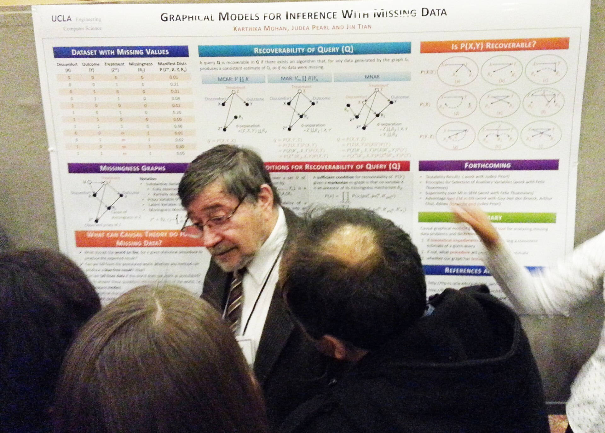

By 1995, a practical paper on “support-vector networks” by Corinna Cortes and Vladimir Vapnik sat in *Machine Learning*. Vapnik’s *The Nature of Statistical Learning Theory* appeared the same year. The tone is not Dartmouth’s. There is no conjecture that every feature of intelligence can be described so a machine can simulate it. There is a margin, a kernel, and a generalization bound.

*Credit: Better Than Bacon. CC BY 2.0. File:Judea Pearl at NIPS 2013 (11781981594).jpg.*

## Graphs of belief

Judea Pearl’s *Probabilistic Reasoning in Intelligent Systems* (1988) gave the field Bayesian networks as a working object: directed graphs, conditional independencies, algorithms that did not require a priest of certainty factors. The expert-system hangover had left a taste for numbers that meant something. Pearl’s later *Causality* (2000) is a different book — interventions, do-calculus — and would wait longer for the machine-learning mainstream to care.

NIPS, still a winter meeting with a ski-adjacent reputation, became a place where statisticians and engineers could share a poster board without joining an AAAI religious order.

## Language as counts

In speech, the hidden Markov model and n-gram language models, already industrial at IBM and at telephone companies, kept beating handwritten linguistic rules on the only metric managers trusted: word error rate. Frederick Jelinek’s groups at IBM are part of that public story; so is the earlier Hearsay work at CMU, which had tried a more “AI” blackboard and then watched statistics take the microphone.

Karen Spärck Jones’s 1972 inverse document frequency, once a library-science result, became a default in search engines. The 1990s web made her weighting scheme a piece of infrastructure.

## Why this decade looks dull in retrospectives

It looks dull because it did not promise a robot butler. It produced spam filters, handwriting recognizers, ranking functions, and a generation of students who learned VC-dimension before they learned Lisp. Yann LeCun’s LeNet-5, in the 1998 *Proceedings of the IEEE*, recognized digits for a part of the U.S. check-reading economy. That is not a winter. It is a job.

The statistical turn also set a trap. Success on i.i.d. test sets licensed the fantasy that the world is a test set. The 2010s would scale the same fantasy to images and then to text. Pearl would keep asking what the numbers were numbers *of*. Most of the field, busy winning bake-offs, did not answer.
