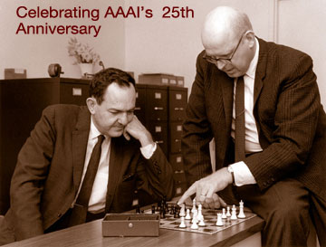

Allen Newell and Herbert Simon stated their wager in public, more than once. A physical symbol system, they argued, has the necessary and sufficient means for general intelligent action. The claim is in their 1976 *Cognitive Science* paper and in the trail of talks that led to it. It is the cleanest sentence the symbolic decades produced. It is also the sentence connectionists would spend the 1980s trying to retire.

*Credit: Paolo Massa upload; Commons public-domain label. File:Herbert A. Simon and Allen Newell Chess Match.jpg. See PHOTO_NOTES.md for provenance caution.*

## Logic Theorist, GPS, and a printer that embarrassed Russell

The Logic Theorist (1956) searched for proofs. Newell, Shaw, and Simon’s General Problem Solver, reported at the 1959 UNESCO information-processing meeting in Paris, tried to lift the same habit — means-ends analysis — out of a single domain. The programs were slow. They were also a demonstration that “heuristic” could be a technical word, not a shrug.

Simon liked to tell the story that *Principia*’s authors had been sent a proof the book did not contain. The anecdote has been polished in retellings; the documented core is simpler. A machine produced a derivation in a formal system human beings had treated as their own garden.

## LISP and the laboratory as a place

John McCarthy’s “Recursive Functions of Symbolic Expressions,” in *CACM* in April 1960, gave the field a language that treated lists as first-class objects and recursion as ordinary. LISP made it cheap to write programs that wrote programs. At MIT and then at SAIL (Stanford Artificial Intelligence Laboratory, 1962), that cheapness became a culture: time-sharing, cons cells, a faith that the next representation would unlock common sense.

McCarthy’s “Programs with Common Sense” (Teddington, 1959) sketched the Advice Taker, a system that would take declarative sentences and deduce what to do. It was a sketch. Decades of knowledge representation grew out of the embarrassment that the sketch was easier to give as a talk than as a running world.

## SHRDLU’s room, and the room’s edge

Terry Winograd’s SHRDLU, 1968–1970, lived in a block world on a display at MIT. It could put a red cube on a blue one and answer “why.” *Understanding Natural Language* (1972) made the demo a book. Visitors remembered the fluency. Winograd later remembered the costs. The fluency was purchased by shrinking the universe until every noun had a procedure.

That is the symbolic bet’s recurring receipt. Search and list structures work when the world has been cut to a size a graduate student can axiomatize. Chess, calculus, a table of blocks. The unaxiomatized kitchen, the unaxiomatized street, wait outside the laboratory door.

Edward Feigenbaum’s answer, a few years later, would be to stop waiting for a general theory and start interviewing chemists. The expert-system summer grows directly out of this squeeze: if common sense is too large, steal a specialist’s sense instead.
