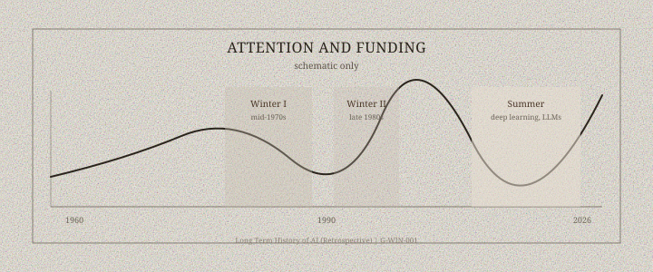

“AI winter” is not a meteorological observation. It is a phrase that laboratories and magazines used, after the fact, to name a cut in money and a collapse of a sales pitch. There were at least two such cuts in the English-speaking public record, and they were not the same storm.

*Figure 1. AI winters and summers — qualitative schematic (G-WIN-001), not to scale — Long Term History of AI (Retrospective).*

## 1966–1974: translation, perceptrons, Lighthill

The ALPAC report of 1966, *Language and Machines*, told U.S. sponsors that machine translation had not earned its keep. The tone is administrative. The effect was a shrinkage of a particular dream: a Russian sentence in, an English sentence out, a Cold War office happy.

Minsky and Papert’s 1969 *Perceptrons* then gave a mathematical chill to a different office. James Lighthill’s 1973 report for the U.K. Science Research Council was blunter about “automatic general-purpose robot” talk. British funding for some AI groups contracted. The BBC filmed a debate. The winter, in this first form, is a loss of patience with general promises after a decade of specific toys.

Work continued. That is the part the word “winter” erases. Nilsson, McCarthy, Feigenbaum, Michie, and others kept laboratories open. Students still wrote theses. The weather was worse in the places that had believed the *New York Times* in 1958.

## 1987–1993: the expert-system market

The second winter is a business story. Lisp-machine companies, commercial rule shells, and a trade press that had treated “knowledge engineering” as a sector discovered that maintenance costs and hardware cycles were not a religion. The Fifth Generation’s closing in 1992 did not help the mood. DARPA’s Strategic Computing Program, ambitious in the mid-1980s, did not produce the autonomous systems on the viewgraphs.

Daniel Crevier’s 1993 history already treats the boom-and-bust as a plot. Pamela McCorduck’s earlier *Machines Who Think* (1979) had been more of a family chronicle, written before the second crash. Read together, they show how quickly a field’s self-story can change tense.

## What the metaphor hides

Winters are local. Japan’s ICOT decade overlaps the American expert-system hangover. Soviet institutes had their own calendars. A graduate student training convolutional nets in 1994 was not frozen; they were unfashionable in some departments and employed in others.

Summers are local too. 2012 was a summer for vision. 2016 for a board game. 2022–2023 for a chat window. Each summer produces a sentence that will sound, in the next winter, like the 1958 Navy story. The useful habit is not cynicism. It is to ask, of every boom: what is the metric, who pays, and what happens to the graduate students when the metric stops moving.
