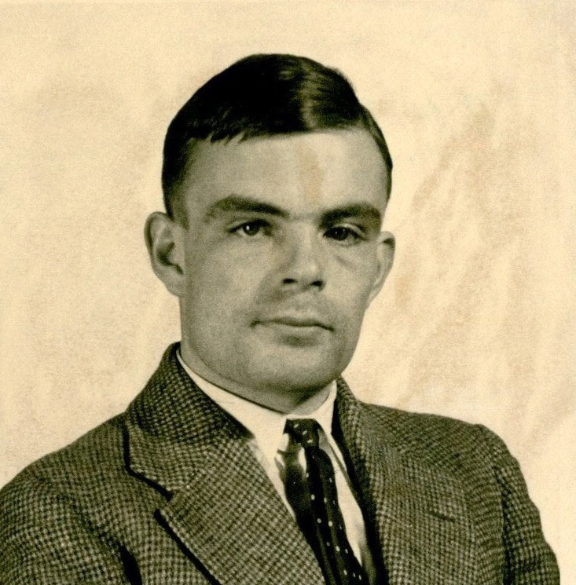

The photograph is a Princeton card from 1936: a young man in a jacket, filed like any other visiting student. Alan Mathison Turing had just published, in the *Proceedings of the London Mathematical Society*, a paper whose title still carries its target: “On Computable Numbers, with an Application to the Entscheidungsproblem.”

*Credit: Unknown photographer; Princeton University Archives. Public domain (Commons: U.S. work, copyright not renewed). File:Alan Turing (1912-1954) in 1936 at Princeton University.jpg.*

## Cambridge to Princeton

Born in London in 1912, Turing was at King’s College, Cambridge, when he defined a machine by a tape, a head, and a table of behaviour. The point was not to build a factory. The point was to give “effective procedure” a mathematical body, then prove that Hilbert’s decision problem for first-order logic has no such procedure. Alonzo Church reached a related incompleteness with the λ-calculus. Turing crossed the Atlantic, took a Princeton Ph.D. under Church in 1938, and wrote on ordinal logics.

The 1936 machine is not a prophecy of a laptop. It is a limit theorem with a physical metaphor good enough that later engineers could mistake the metaphor for a blueprint.

## Hut 8

During the war Turing worked at Bletchley Park, notably on Naval Enigma. The public record, long delayed by classification and then thickened by official histories, shows a mathematician designing bombes, arguing about cribs, and writing reports in a prose that is impatient with ceremony. Colossus, Tommy Flowers’s machine against Lorenz, was a neighboring fact, not Turing’s personal device. The popular collapse of all wartime computing into one man’s biography is a later habit.

After the war he joined the National Physical Laboratory and drafted the ACE. Frustrated by the pace, he went to Manchester, where the Baby and then the Manchester Mark I made stored-program computing a local weather.

## The 1950 paper

“Computing Machinery and Intelligence” appeared in *Mind* in October 1950. It opens with a sentence anyone can check: “I propose to consider the question, ‘Can machines think?’” Turing immediately replaces the question with an imitation game. The paper is not a product specification. It is a philosophical raid: arguments from consciousness, from disability, from informality of behaviour, each met with a reply. He estimates, as a personal view, that in about fifty years it will be possible to program machines to play the game so well that an average interrogator will not have more than 70 percent chance of making the right identification after five minutes. That estimate has been quoted as prophecy, as failure, and as a joke. It is, in the text, a speculation with a number attached.

## The state, and a death

In 1952 Turing was convicted of gross indecency. He accepted chemical castration. He died on 7 June 1954 at his house in Wilmslow. The inquest recorded suicide; some later writers have argued for accident. The documented facts that matter for this series are the conviction, the treatment, and the date. A 2013 royal pardon and subsequent anniversary rituals belong to public memory, not to his laboratory notebooks.

Turing’s name is now an award, a test, and a statue. The 1936 paper and the 1950 essay remain the items that do not need the statues.
