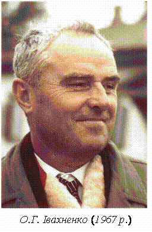

Alexey Grigorevich Ivakhnenko was born in 1913 and died in 2007. He worked in Kyiv, in the Soviet cybernetics ecology, and published a method for growing models that later English-language deep-learning talks sometimes flash on a slide as if it were a hidden first chapter.

*Credit: Ynosa. CC BY-SA 4.0. File:Alexey Ivakhnenko.gif.*

## GMDH

The Group Method of Data Handling, described in *Soviet Automatic Control* in 1968 and in the *IEEE Transactions on Systems, Man, and Cybernetics* in 1971 (“Polynomial Theory of Complex Systems”), builds polynomial models in layers, selecting terms by a criterion, discarding others. It is inductive. It is not backpropagation on a convolutional stack. The family resemblance — depth, data, a refusal to hand-specify every term — is real. The identity is not.

Ivakhnenko’s longer Russian-language corpus sits in cybernetics and control journals. This profile will not pretend to have restaged it from first pages. It will insist that the 1968–1971 English objects exist and are citable.

The 1971 IEEE paper is written for a control audience. Complex systems, it argues, should not wait for a complete theory before a model is grown from data. Polynomials are the language; a selection criterion is the editor. If a term does not earn its keep on a hold-out, it goes. That editorial habit is closer to later regularization than to a 1960s Lisp demo. It is also closer to a forecasting office than to a Dartmouth conjecture.

English-language “deep learning history” slides that show a 1971 block diagram next to a 2012 one are doing rhetorical work. Sometimes the work is honest: layered adaptive models are older than the 2012 contest. Sometimes it is a priority raid. Ivakhnenko does not need the raid. He needs readers who will open *Soviet Automatic Control* and the SMC paper and notice the journals’ names.

## Against a single capital

If the only origin story you have for “deep” is Toronto in 2006 or *Nature* in 1986, Kyiv in 1968 is a useful inconvenience. Gerovitch’s history of Soviet cybernetics is the context. Ivakhnenko is a person in that context, not a mascot for a priority war.

The GIF on Commons is a modest file. It is enough. The method is in the IEEE paper. Readers who want more should learn the journals he actually wrote in, not wait for a keynote to translate him into a saint of deep learning.
