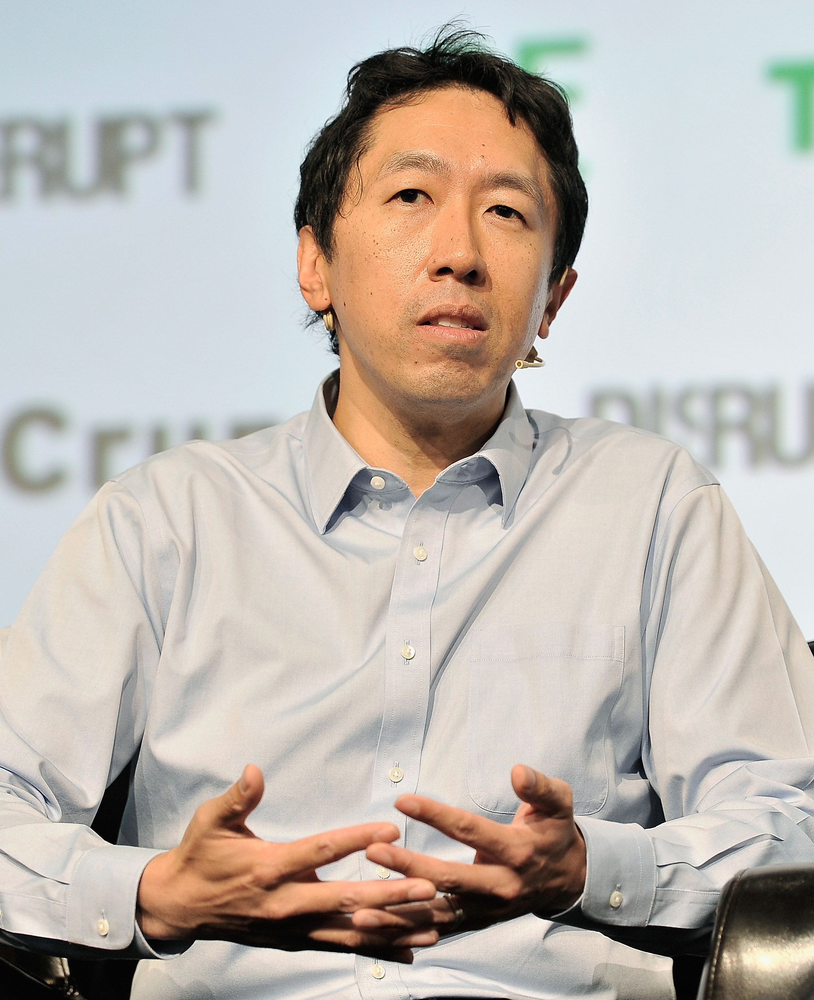

Andrew Ng was born in 1976 in the United Kingdom, grew up partly in Hong Kong and Singapore, and became, for a decade, the name on a Stanford machine-learning course that the rest of the internet took without paying tuition. The 2017 TechCrunch photograph is a licensed press image from a product stage, which is not where the course began.

*Credit: TechCrunch. CC BY 2.0. File:Andrew Ng at TechCrunch Disrupt SF 2017.jpg.*

## CS229, then a wider room

Stanford’s CS229 lecture notes — linear models, SVMs, learning theory, later neural nets — circulated as PDFs long before they were a brand. In 2011–2012, Ng’s machine-learning course on Coursera (a company he co-founded with Daphne Koller) put those notes in front of a population that did not have a Stanford ID. The public numbers on enrollment were large enough to become their own press cycle. A history of AI that ignores teaching will not understand how 2012’s research fashion became 2015’s job listing.

## Google Brain, and a cat

The Google Brain project, which Ng led in its early public phase with Jeff Dean and others, trained large neural nets on YouTube frames. The 2012 paper “Building High-level Features Using Large Scale Unsupervised Learning” (Le, Ranzato, Monga, Bengio, Devin, Chen, Corrado, Dean, Ng) reported a neuron that responded to cats. The cat was a journalist’s gift. The paper is about scale and unsupervised objectives on a cluster. Both facts can sit on the same page.

## Baidu, landing pages, a later style

Ng later led AI efforts at Baidu (public appointments, 2014–2017) and then founded Landing AI and the DeepLearning.AI course sequence. Those are dated corporate facts. This profile will not turn them into a catalogue. The historically sticky objects are the Stanford course, the Coursera opening, and the 2012 unsupervised-learning paper.

He has argued, in public essays, that dataset work and application work are undervalued relative to model architecture. Whether or not one likes the essays, they describe a real citation bias in the 2010s literature. ImageNet already knew that. Ng’s version came from teaching people who had to ship something on Friday.
