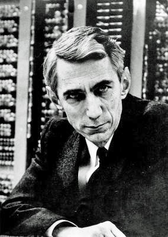

The Oberwolfach photograph shows an older Claude Shannon, the face people use when they need an illustration. The work that made the face famous is younger: a 1937 master’s thesis at MIT, and a 1948 paper in the *Bell System Technical Journal* split across July and October.

*Credit: Konrad Jacobs / Mathematisches Forschungsinstitut Oberwolfach. CC BY-SA 2.0 DE. File:ClaudeShannon MFO3807.jpg.*

## Relays

“A Symbolic Analysis of Relay and Switching Circuits,” published in the *AIEE Transactions* in 1938, showed that Boolean algebra could describe telephone switching. Shannon had been a research assistant on Vannevar Bush’s differential analyzer. He treated a contact as a truth value. The thesis is short, clear, and still startling in its confidence that algebra and hardware are the same subject.

Born in 1916 in Michigan, he did his Ph.D. at MIT on population genetics, then went to the Institute for Advanced Study and to Bell Labs. The Labs, in those years, could hide a theorist among engineers and call it a research program.

## Bits

“A Mathematical Theory of Communication” defined a quantity, information, as a measure of uncertainty about a source. The bit entered ordinary technical speech. So did the idea of a channel with a capacity, and of codes that could approach that capacity. The paper is not about meaning. Shannon said so. Philosophers have been trying to put meaning back in ever since.

During the war he worked on cryptography; some of that work later surfaced in “Communication Theory of Secrecy Systems” (1949). He also wrote, in 1950, “Programming a Computer for Playing Chess,” a *Philosophical Magazine* paper that treats evaluation, quiescence, and the tree as engineering problems. Chess here is a test object, as it would remain for decades.

## Dartmouth, gadgets, later silence

Shannon co-signed the 1955 Dartmouth proposal. He was already famous enough that his name on a Rockefeller document did work. He did not become an AI laboratory director. He built Theseus, a maze-solving mouse, and machines that juggled. He rode a unicycle in Bell Labs hallways — a story so often repeated it has become a kind of institutional furniture.

He died in 2001, after years of illness. The information paper is still assigned. The chess paper is still readable as a program that was not yet a program. In a history of AI he belongs twice: as the man who made “information” a number, and as a signer of the summer that named the field he only partly wanted.
