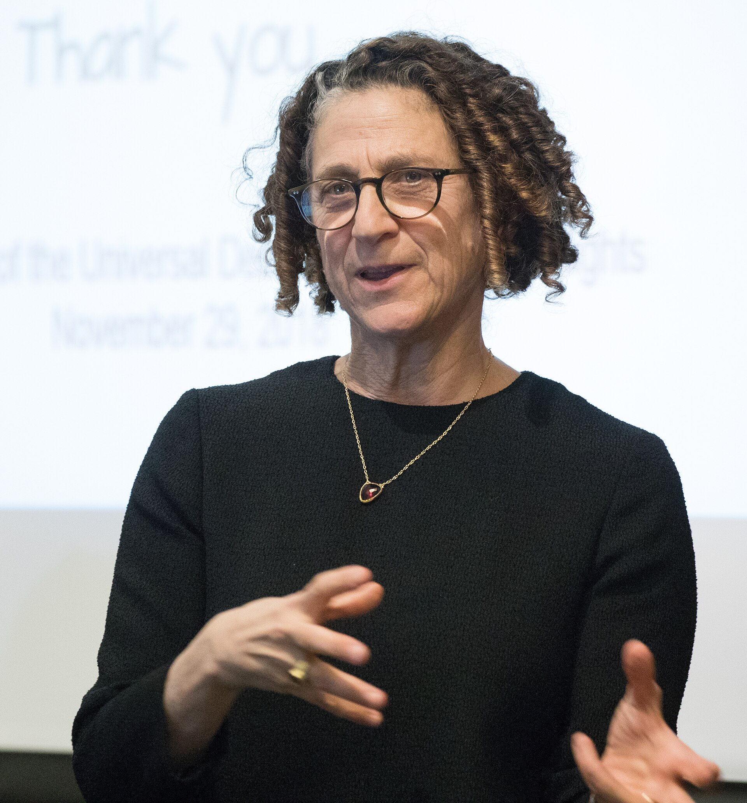

Cynthia Dwork was born in 1958. She is a theorist — Microsoft Research for many years, then Harvard — whose 2006 paper with Frank McSherry, Kobbi Nissim, and Adam Smith gave “privacy” a definition you can break in public.

*Credit: Edmond J. Safra Center for Ethics. CC BY 2.0. File:Cynthia Dwork lectures at Harvard Kennedy School.jpg.*

## A 2006 definition

“Calibrating Noise to Sensitivity in Private Data Analysis” (TCC 2006) is the differential-privacy paper most often taught. The idea, stated without romance: the output of a computation should be nearly as likely whether or not any one person’s record is in the input. You buy that “nearly” with noise. The noise is not a bug. It is the thing you owe.

Later papers and a monograph literature expanded compositions, divergences, and practical deployments. The U.S. Census Bureau’s public discussion of differential privacy for the 2020 census put the definition into a civic argument. People who had never heard of TCC learned that a privacy definition can change a table they use.

She trained at Cornell and began as a distributed-computing theorist — proof-of-work, in an early paper with Moni Naor, is part of that earlier public record — before privacy became the definition people attach to her name. The career is not a conversion narrative. It is a theorist who kept finding civic objects (a census table, a classifier) that needed a definition before they needed a slogan.

## Why she is here

Because a history of AI that ends in language models without a theory of data’s subjects is a history of fluency. Dwork’s work is not a neural net. It is a constraint on what a learning system may reveal. The 2018 lecture photograph is a public ethics-center event. The 2006 paper is the event that earned it.

She has also written, with colleagues, on fairness in classification — another definitional literature. This profile keeps the 2006 privacy paper as the spine so that we do not invent a second career in a paragraph.
