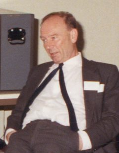

Donald Michie was born in 1923 and died, with his former wife Anne McLaren, in a car crash in 2007. The 1986 photograph is small and a little soft. It is licensed. He looks like a man in the middle of a seminar, which is where he spent a working life.

*Credit: Petermowforth. CC BY-SA 3.0. File:Donald Michie 1986.jpg.*

## Bletchley, then Edinburgh

Michie worked at Bletchley Park during the war — a documented fact in the official and biographical literature, not a rumor. After a period in genetics and in academic wandering, he built, at Edinburgh, one of the United Kingdom’s central AI groups. The *Machine Intelligence* workshop volumes, edited with Bernard Meltzer and others from the mid-1960s, are a British proceedings culture: papers, arguments, a record that is not MIT’s memos.

## MENACE

The Matchbox Educable Noughts and Crosses Engine is the object students still rebuild. Boxes, beads, a learning rule you can see. It predates most of the vocabulary that would later make “reinforcement learning” a textbook chapter. Michie’s *On Machine Intelligence* (1974) collects a style: practical, impatient with metaphysics, fond of a demo.

Edinburgh’s Department of Machine Intelligence and Perception, later reorganized more than once, sat beside linguistics and beside people who had to justify themselves to a Science Research Council that had read Lighthill. The workshop volumes are the surviving weather report: chess, theorem proving, robots that almost moved, arguments about representation that did not wait for California’s permission.

Michie also consulted and wrote for industrial audiences when British AI was supposed to be over. That habit — treat intelligence as something a factory might buy — looks, in hindsight, like the expert-system summer’s cousin. It is also what you do if your funding agency has just published a general survey that doubts your subject.

## After Lighthill

The 1973 Lighthill report hit British groups hard. Michie kept organizing, consulting, and arguing for machine intelligence as an industrial as well as an academic fact. The Turing Institute in Glasgow, in the 1980s, is part of that afterlife. He did not convert Lighthill. He outlasted a season.

A history of AI that treats Britain as a winter and the United States as a climate has not read the Edinburgh volumes. Michie is the shortest correction.
