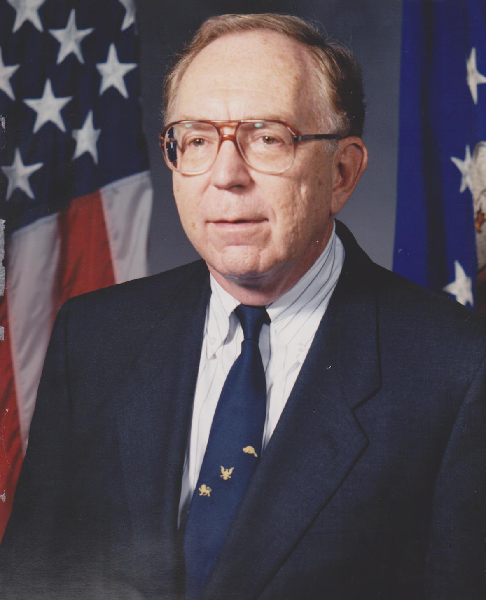

The Air Force portrait is from 1 December 1994: Edward A. Feigenbaum as Chief Scientist of the U.S. Air Force, a government photograph and therefore reprintable without a hunt. He was born in 1936 in New Jersey, studied at Carnegie Tech under Herbert Simon, and spent the decisive laboratory years at Stanford.

*Credit: United States Air Force. Public domain. File:27. Dr. Edward A. Feigenbaum 1994-1997.jpg.*

## DENDRAL

With Joshua Lederberg and Bruce Buchanan he built DENDRAL, a system that proposed molecular structures from mass-spectral data. The papers of the late 1960s and 1970s, and the 1978 *Artificial Intelligence* account of DENDRAL and Meta-DENDRAL, describe a transfer: a chemist’s heuristics, written down, executed. “Knowledge engineering” is the name he gave the transfer. It sounds like a consultancy. It was, first, a set of interviews that had to be true enough to compile.

## A project and a book

The Heuristic Programming Project at Stanford trained people and systems (MYCIN sat in the same ecology). *The Fifth Generation*, with Pamela McCorduck (1983), took his sense of urgency about knowledge systems into a public argument about Japan. The book is a primary source for a mood, and a secondary source to be used with care.

## A prize

The 1994 ACM Turing Award, shared with Raj Reddy, cites the design and construction of large-scale artificial intelligence systems. Feigenbaum’s half of that sentence is DENDRAL and the knowledge-engineering program. Reddy’s is speech and the CMU style of hitting a number.

Feigenbaum’s later Air Force years are public service, not a laboratory result. They do explain why a government portrait exists. The chemistry system is the reason he is in this series. The slogan about knowledge over inference engines is still a useful insult to anyone who thinks a better search trick will replace a missing fact.
