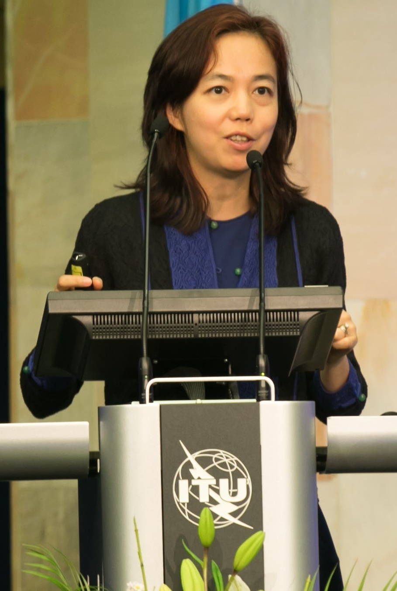

Fei-Fei Li was born in 1976 in Beijing, studied in the United States, and in 2009, with Jia Deng and colleagues, published the ImageNet paper at CVPR. The database used WordNet’s noun hierarchy as a spine and the web as a quarry. The scientific bet was that vision had been starving on small labeled sets.

*Credit: ITU Pictures. CC BY 2.0. File:Fei-Fei Li at AI for Good 2017.jpg.*

## A contest, not a throne

The ImageNet Large Scale Visual Recognition Challenge made the bet a calendar. Li’s public talks have described the labor — students, crowdsourcing, the unglamorous work of making a label stick to a photograph. In 2012 someone else’s laboratory, in Toronto, used the yardstick and moved the error rate. That is how a yardstick is supposed to work. Credit the 2012 authors for the drop. Credit the 2009 authors for the pain.

## Stanford, and a later public role

At Stanford she has led the Stanford Vision Lab and later the Stanford Institute for Human-Centered Artificial Intelligence, whose public events and papers are part of the 2010s–2020s record. She served, in 2017–2018, as a chief scientist of AI/ML at Google Cloud — a dated industry appointment, not a research paper.

She has also, in later interviews and talks, discussed the costs of ImageNet’s images: people who did not sit for science, categories that carry a culture. Those discussions belong next to the 2009 PDF, not instead of it.

## Place

A major-figure list that can hold Rosenblatt and not Li has accepted a cutoff date. ImageNet is one of the few objects in this series that changed what a whole subfield could measure. The 2017 ITU photograph is a public occasion. The 2009 paper is the reason for the occasion.
