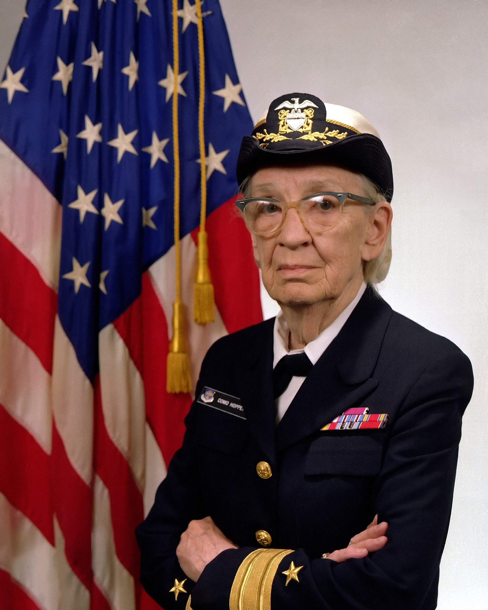

The Navy photograph is from 1984: Commodore Grace M. Hopper in uniform, a public image the service was willing to print. She was born in New York in 1906, earned a Yale Ph.D. in mathematics in 1934, and died in 1992. She belongs in an AI history as computing context, the way von Neumann does: not as a Dartmouth signer, but as someone who changed what it meant to give a machine an order.

*Credit: James S. Davis, U.S. Navy DN-SC-84-05971. Public domain. File:Commodore Grace M. Hopper, USN (covered).jpg.*

## Mark I

Hopper joined the Bureau of Ships computation project at Harvard in 1944 and programmed the IBM Automatic Sequence Controlled Calculator — the Mark I — under Howard Aiken. The wartime work was tables and patience. The later stories about a moth in a relay (the 1947 Mark II logbook, preserved and often exhibited) are a real object and also a pun that escaped its logbook. She used “debugging” in public talks; she did not invent every sense of the word.

## A-0, FLOW-MATIC, COBOL

At Remington Rand in the 1950s she argued for compilers: let the machine translate a human-facing notation into machine code. The A-0 system and then FLOW-MATIC are the documented steps. COBOL, as a language designed by a committee (the CODASYL effort) with Hopper as a principal advocate, is the industrial result. A business instruction that reads like stilted English is still an instruction. The argument was that programmers should not have to live at the level of the drum.

She remained a Navy officer, retired and was recalled, and spent late years on the lecture circuit with a length of wire cut to a nanosecond at the speed of light — a prop, a pedagogy, a piece of showmanship that museums still like.

## Why this series includes her

AI laboratories wrote in languages her generation made conceivable. LISP is not COBOL. The habit of treating a compiler as civilization rather than luxury is a Hopper fact. A retrospective that jumps from Turing’s tape to McCarthy’s cons cell without the compilers in between is skipping the shop floor.

The 1984 portrait is late, official, and licensed as a government work. The younger woman at the Mark I is harder to reprint. The work is in the languages.
