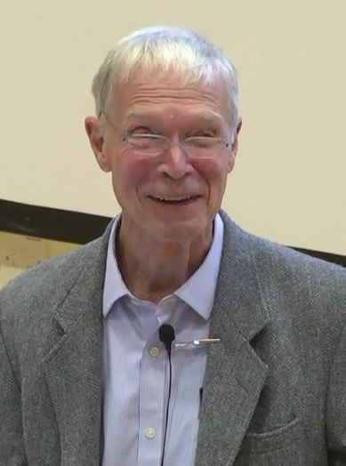

John J. Hopfield was born in 1933. He was already a physicist of reputation — molecules, biological physics — when *PNAS* printed, in 1982, “Neural Networks and Physical Systems with Emergent Collective Computational Abilities.” The paper treats a network as a dynamical system with an energy, and memories as attractors. You can mishear it as poetry. It is a calculation.

*Credit: bhadeshia123. CC BY 3.0. File:John Hopfield 2016.jpg.*

## Caltech, Princeton, a migration

Hopfield’s appointments, over decades, include Princeton and Caltech. The 1982 paper licensed a migration of physicists into “neural” computation: spin glasses as a metaphor with equations, noise as temperature, a seminar culture that did not need Lisp. The 1980s papers on optimization and on analog computation sit in that culture.

He is not a laboratory director of the McCarthy type. He is a person who gave a set of engineers and physicists a shared object.

A 1985 paper with David Tank on analog computation and optimization is the sibling that operations-research people remember. The “Hopfield net” of undergraduate slides is a simplification. The 1982 *PNAS* text is short enough to read in an evening. Read it before the slides.

## 2024

The Royal Swedish Academy of Sciences awarded the 2024 Nobel Prize in Physics to Hopfield and Geoffrey Hinton for foundational discoveries and inventions that enable machine learning with artificial neural networks — the official language of the citation. The prize is a historical event in this series. It is not a claim that a 1982 energy function is a 2023 chatbot.

Hopfield has, in public remarks around the prize, sounded more like a physicist than like a product manager. That is useful. The 1982 paper is still the thing to read. The 2016 lecture still in this file is a man explaining emergence to a room that came to honor David MacKay. The prize arrived later. The paper did not need it to be real.
