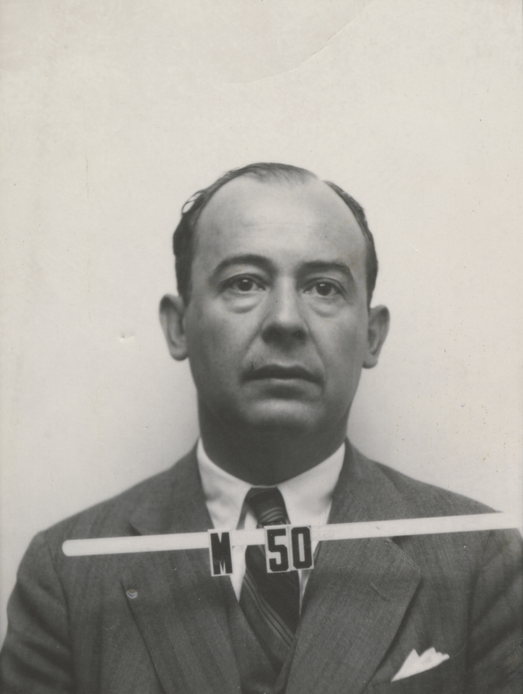

The badge photograph is a wartime object. Los Alamos Laboratory filed John von Neumann among the Manhattan Project’s visiting minds: mathematician, consultant, a man whose identity photo now circulates under laboratory terms that still ask for a notice.

*Credit: Los Alamos Laboratory / LANL. Redistribution permitted with the LANS/DOE notice; see PORTRAIT_SOURCES.md. File:John von Neumann Los Alamos identity badge photo.jpg.*

## Budapest to Princeton

Born in 1903 in Budapest, von Neumann was in the United States by the early 1930s, at the Institute for Advanced Study. *Theory of Games and Economic Behavior*, with Oskar Morgenstern (1944), made “minimax” a word for economists. The computing work is neighboring, not identical: both are about formalizing conflict and procedure.

The *First Draft of a Report on the EDVAC*, dated 30 June 1945 and circulated from the Moore School, describes a stored-program electronic computer in a voice so synthetic that later lawyers and historians spent decades arguing about whose ideas the draft froze. J. Presper Eckert and John Mauchly’s ENIAC team is part of that argument. So is the fact of circulation. A draft that many people photocopied became, for better and worse, “the von Neumann architecture.”

## Why he is in an AI history

He is here for context, as the assignment asked. Cellular automata and the later lectures published as *The Computer and the Brain* (Yale, 1958) show a mathematician at the end of his life comparing organs to machines without becoming an AI-lab director. He discussed reliability, redundancy, analog versus digital, the size of the brain’s “components.” He died in 1957.

The comparison is not a claim that he “invented AI.” McCulloch and Pitts are closer to that particular cartoon. Von Neumann read them; the traffic of ideas in the 1940s was small enough that reading is documented.

## The badge, again

A history that uses a weapons-laboratory photograph owes the reader the setting. Los Alamos was not a cybernetics salon. It was a place that needed numerical weather for explosions. The machines that came out of that need — and out of Aberdeen, and out of the Moore School — are the machines Dartmouth later tried to talk to.

The 1958 lectures are unfinished in the way dying work is unfinished. They remain one of the clearer public attempts, by a designer of the stored-program style, to say what a brain is not.
