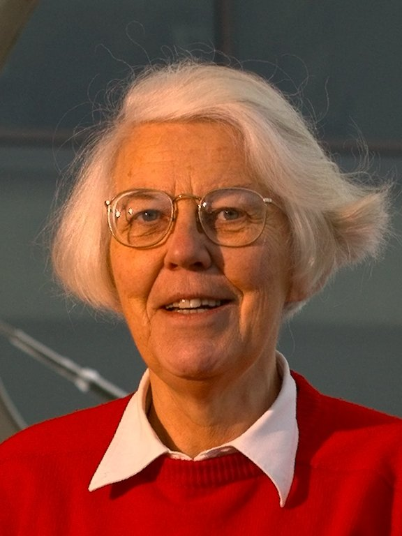

Karen Spärck Jones was born in 1935 and died in 2007. She spent her career at the Cambridge Computer Laboratory, in a field — information retrieval — that computer science sometimes treated as a cousin and that the web later treated as oxygen. The photograph on Commons is credited to Markus Kuhn, with a University of Cambridge attribution.

*Credit: Markus Kuhn; University of Cambridge attribution on Commons. CC BY 2.5. File:Karen Spärck.jpg.*

## 1972

“A Statistical Interpretation of Term Specificity and Its Application in Retrieval,” in the *Journal of Documentation*, 1972, is the inverse-document-frequency paper. A word that appears in few documents is, for ranking, more useful than a word that appears in many. The idea is almost rude in its simplicity. It is also, once you have a collection, computable without a linguist’s permission.

TF–IDF, as the compound later named, became a default in search engines and then a baseline that neural rankers still have to beat. She did not live to see every transformer retrieval paper cite her in the first page’s related work, or fail to.

## Language and a laboratory

Her earlier work on synonymy and on automatic classification, and her later work on summarization and on evaluation, sit in ACL and IR literatures that have their own heroes. She argued, in public lectures, that computing had a habit of ignoring the people who were already in the room. The British Computer Society and Cambridge’s own memorial pages record the sentence often associated with her: computing is too important to be left to men. Treat that as a reported public remark with a paper trail in obituaries, not as a folklore sticker.

## Why she is a major figure here

Because retrieval is how language models now meet the world they did not memorize on purpose. Because 1972 is a dated result that still ships. Because a history of AI that only counts people who said “intelligence” on a grant is a history of a word, not of the work.
