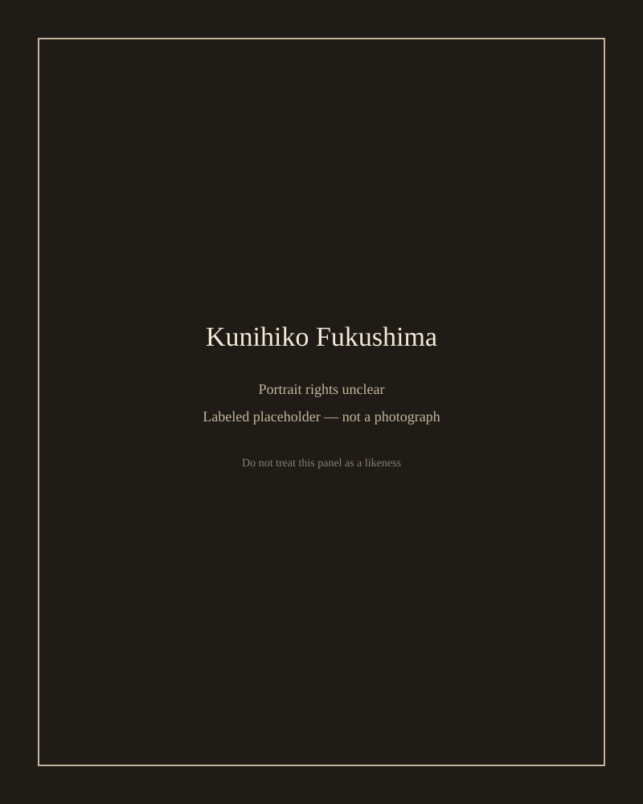

Kunihiko Fukushima published, in *Biological Cybernetics* in 1980, “Neocognitron: A Self-organizing Neural Network Model for a Mechanism of Pattern Recognition Unaffected by Shift in Position.” The title is a research program. The model is a hierarchy of simple and complex cells, in a lineage from Hubel and Wiesel, aimed at vision that does not fall apart when the pattern moves.

*No redistributable likeness with a clear license was available at staging. This panel is not a photograph.*

## NHK, then Osaka

Fukushima’s career, as recorded in the scientific literature and in later interviews, runs through NHK’s broadcasting-science laboratories and later Osaka. The neocognitron papers of the 1970s and 1980s are the objects. They are not ICOT’s Fifth Generation, and they were not written to reassure MITI about Prolog.

## What LeCun and others kept

Yann LeCun has repeatedly cited the neocognitron as prior art for convolutional networks. That citation is in talks and in the historical sections of later papers; it is not a rumor. The 1998 LeNet-5 paper sits on a different training method — gradient descent, a labeled set of digits — and on a different economy. The architectural rhyme (local receptive fields, pooling-like tolerance, depth) is the reason Fukushima belongs in a 2012 story that usually starts too late.

## Placeholder, on purpose

We did not find a Commons file we were willing to treat as a clear redistributable portrait. A generated “1980 Japanese scientist” would be a fake. The 1980 paper has a volume and a page range. Use those.
