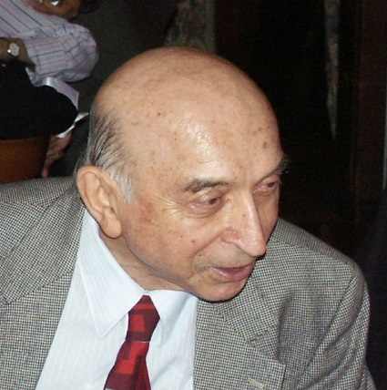

Lotfi A. Zadeh was born in 1921 in Baku, worked in Iran and then in the United States, and died in 2017 in Berkeley. In 1965, in *Information and Control*, he published “Fuzzy Sets”: a membership function that takes values in the unit interval, a way to say “warm” without drawing a single line on the thermometer.

*Credit: BBR100. CC BY-SA 4.0. File:Lotfi Zadeh2005 1.jpg.*

## A paper that annoyed the right people

Classical sets are in or out. Probability, already respectable, measures uncertainty about in or out. Zadeh wanted graded membership as a primitive. Philosophers and probabilists spent years telling him he had misnamed a kind of uncertainty. Engineers, especially in control, took the tool and built washing machines and subway schedules. The Japanese industrial uptake of fuzzy control in the 1980s and 1990s is a matter of public engineering literature. It is not a joke about cameras, though cameras were part of it.

## Berkeley

He spent decades at the University of California, Berkeley, in electrical engineering and computer sciences, and kept a school of students who treated “fuzzy” as a technical adjective. Soft computing, as a later umbrella, tried to group neural nets, genetic algorithms, and fuzzy logic. Umbrellas leak. The 1965 paper does not.

## Place in this series

Zadeh is not a Dartmouth name. He is a reminder that “uncertainty” in the 1960s–1980s had more than one arithmetic. Expert systems invented certainty factors. Pearl built Bayesian graphs. Zadeh offered a third door. A retrospective that only walks the first two doors has accepted someone else’s syllabus.

Azerbaijan and Iran are part of the biography, not color. The public record of his early life is in obituaries and in Berkeley’s own notices. The work that earns the portrait is the 1965 paper and the control systems that followed.
