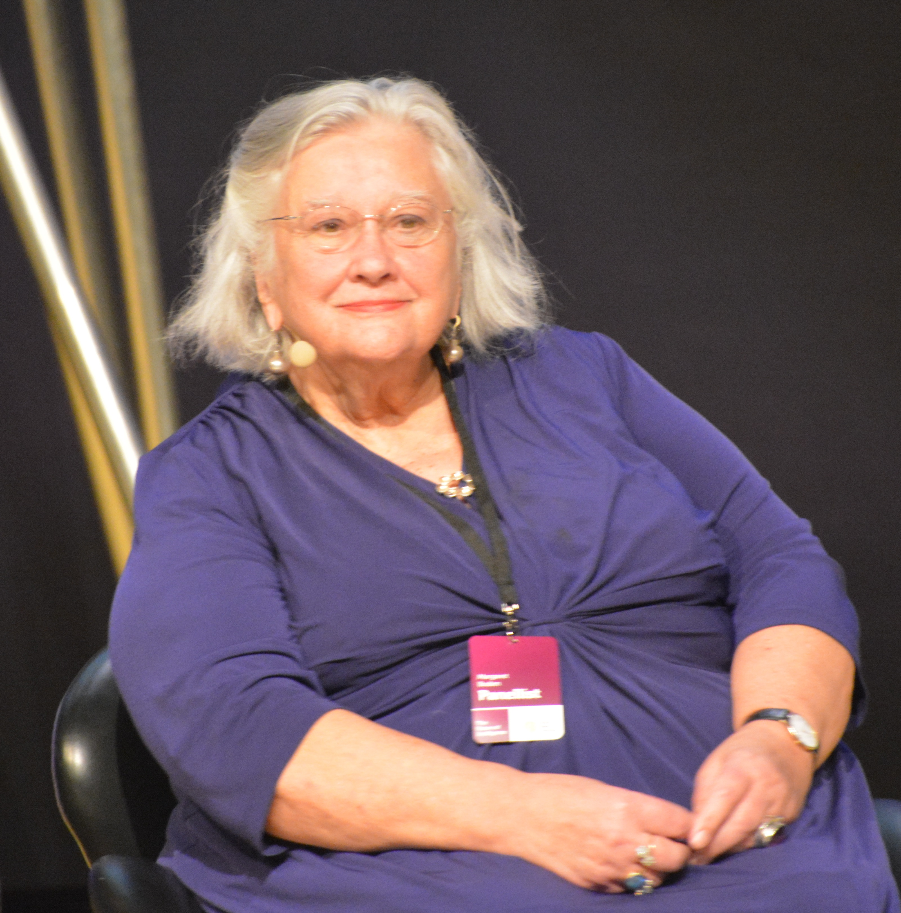

Margaret A. Boden was born in 1936. She trained in medicine, in philosophy (Cambridge), and in the cognitive sciences, and she spent her career at the University of Sussex making “mind” a subject you could write in two volumes without becoming a vendor.

*Credit: Bengt Oberger. CC BY-SA 4.0. File:Margaret Boden 01.JPG.*

## Mind as Machine

*Mind as Machine: A History of Cognitive Science* (Oxford, 2006) is the book this series keeps nearest after the primary papers. It is not a popularization. It is a map of AI, psychology, linguistics, and neuroscience as they actually entangled, with room for cybernetics and for the arguments Dreyfus started. A retrospective that did not name her would be raiding a library she already catalogued.

Her earlier *Artificial Intelligence and Natural Man* (1977) and the later essays on creativity (*The Creative Mind*, 1990) treat machines as tests of theories of mind, not as replacements for the subject.

Sussex, in her decades there, was a place where philosophy and informatics could share a corridor. The School of Cognitive and Computing Sciences, as it was later named, is part of the British public record of the field: not Edinburgh’s Michie group, not MIT’s memos, a third dialect. Boden’s lectures treated ELIZA, SHRDLU, and the perceptron book as objects a philosopher was allowed to handle without joining a laboratory faction.

*The Creative Mind* is specific about what it will not do. It will not tell you that a program “is creative” because a journalist was surprised. It distinguishes combinational, exploratory, and transformational creativity — a taxonomy she used in later papers — and then asks which of those a given program could even in principle instantiate. Readers who want a warmer story dislike the taxonomy. That is the point of a taxonomy.

## Why a historian is a major figure

Because the field’s memory is otherwise a sequence of keynotes. Boden’s pages hold people the keynotes drop. They also refuse the single-father story. If this series has a methodological ancestor in secondary literature, it is her two volumes and McCorduck’s earlier chronicle, used as maps, not as prose to sand down and reuse.

The 2015 photograph is a late public image. The 2006 book is the portrait that matters.
