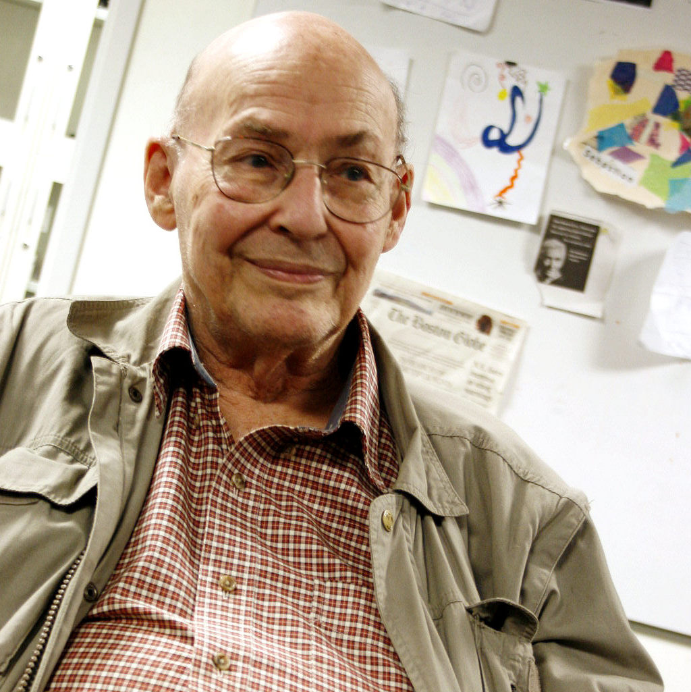

Marvin Minsky was born in New York in 1927 and died in Boston in 2016. The photograph in this file is late: an OLPC event, 2008, a man whose laboratory had already become a story other people told. The early objects are stranger. SNARC, built with Dean Edmonds at Princeton in 1951, was a stochastic neural analog computer — a machine for a rat’s maze, in hardware that looked like a dare.

*Credit: Original uploader Sethwoodworth, en.wikipedia. CC BY 3.0. File:Marvin Minsky at OLPCb.jpg.*

## A laboratory

With John McCarthy he created the MIT AI Laboratory at the end of the 1950s. The lab’s memos are a style: short, ambitious, sometimes unfinished on purpose. Minsky’s students and colleagues — Papert, Winograd, a long list the lab’s own histories keep — treated intelligence as a set of mechanisms you might actually assemble.

The ACM Turing Award in 1969 cites his role in creating, shaping, promoting, and advancing the field of artificial intelligence. Official citations are a genre. This one is not wrong.

## A book that cooled a fashion

*Perceptrons*, with Seymour Papert (1969), is the brake. The mathematics of single-layer machines; the social effect of a negative result at a moment when money was already restless. Minsky did not stop being interested in minds. He stopped being willing to let a Navy press release define a neuron.

## Society of Mind

The 1986 book *The Society of Mind* is popular science with a researcher’s stubbornness. Intelligence as agencies, many small processes, no single homunculus. It is not a system you can download. It is a picture that later multi-agent slogans keep rediscovering, usually without the 1986 diagrams.

Minsky’s public conversation could be sweeping. The documented work is more particular: a 1951 machine, a 1955 signature on a Rockefeller proposal, a 1969 book of theorems, a 1986 book of agencies, a laboratory that trained people who then disagreed with him. That is a career, not a mascot.
