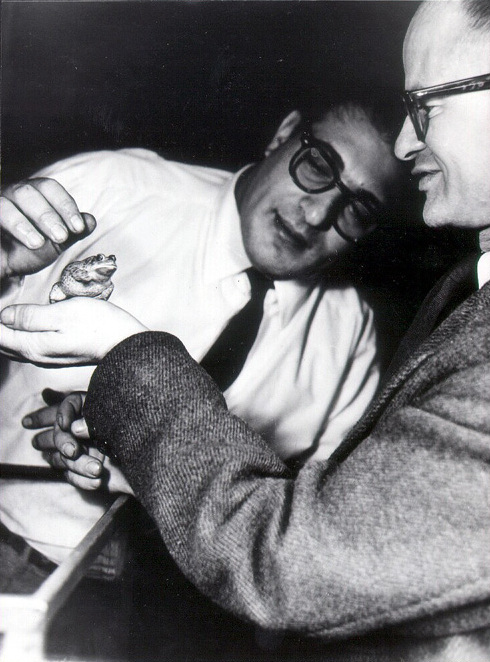
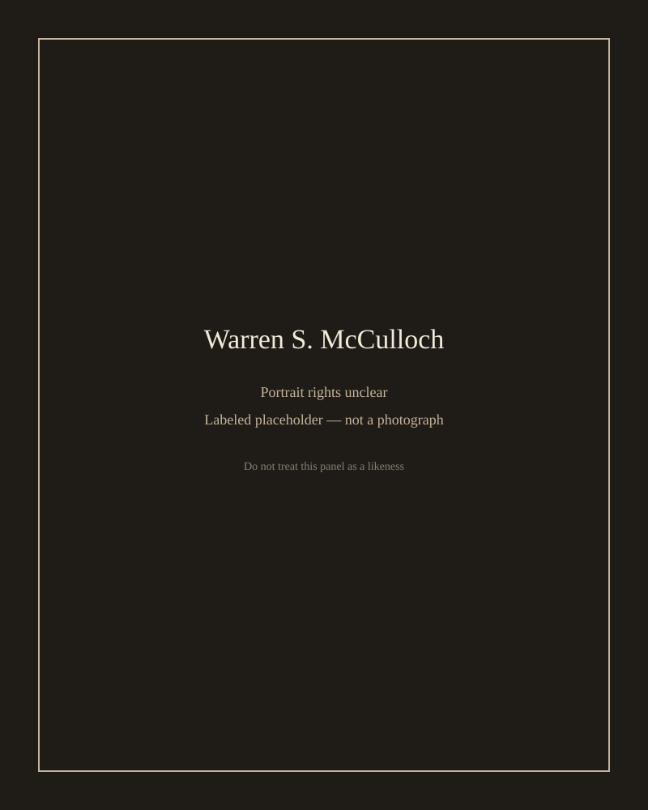

In 1943 the *Bulletin of Mathematical Biophysics* printed “A Logical Calculus of the Ideas Immanent in Nervous Activity,” by Warren S. McCulloch and Walter Pitts. The paper treats a neuron as a device that fires or does not, with a threshold and a set of inhibitory vetoes. Networks of such devices, they argued, can compute the same class of functions as a Turing machine’s logical skeleton.

That is a lot of philosophy to hang on a binary cartoon. They knew it was a cartoon. They wanted the cartoon anyway, because it made “mind” look like a switching problem.

*Credit: Iapx86, family album upload. CC BY-SA 3.0. File:Lettvin Pitts.jpg. This is not a portrait of McCulloch.*

*No redistributable solo likeness with a clear license was available at staging. This panel is not a photograph.*

## Two lives that do not fit a press kit

McCulloch (1898–1969) was a neurophysiologist and psychiatrist, Yale and then Chicago and the Illinois Neuropsychiatric Institute, later MIT. He chaired Macy sessions with a style people remembered as theatrical. He wrote as if the brain owed him an explanation in logic.

Pitts (1923–1969) is harder to source without legend. The documented core: a young logician-mathematician, associated with Carnap’s orbit in Chicago, then McCulloch’s collaborator, then MIT, then a withdrawal from the community that had used his name. He died in 1969. Romantic biographies have filled the gaps with scenes that do not always have a footnote. This profile leaves those scenes out.

## The frog, sixteen years later

“What the Frog’s Eye Tells the Frog’s Brain” (1959), with Lettvin and Maturana, is a different kind of paper: experiment, electrodes, a claim about what fibers already compute. It is one of the great public corrections to the 1943 digital dream. The same four people — two of them the 1943 authors — helped write the correction.

The 1943 calculus still sits at the front of neural-network textbooks, usually as a one-page ancestor. Read as a 1943 document, it is ruder and more ambitious than a textbook ancestor. It says that a nervous system is a logical machine. The 1959 frog says the logic is already at the edge of the eye. Both papers are in the bibliography. Neither is a portrait.
