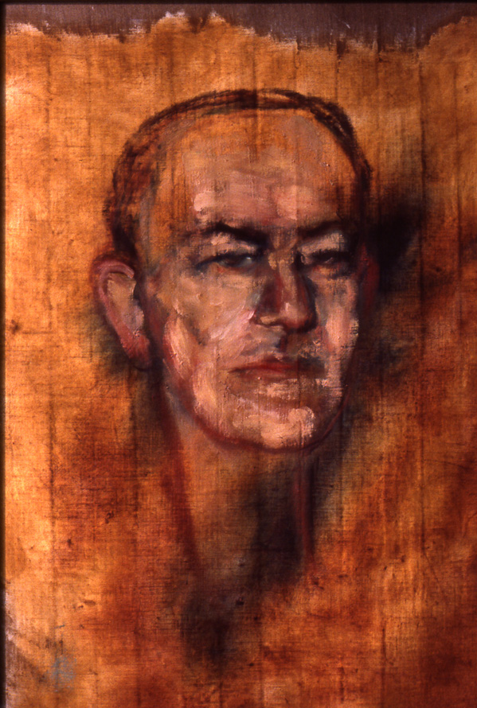

A Commons file often captioned as Newell and Simon at chess in 1958 is, in the copy we inspected, an AAAI twenty-fifth-anniversary graphic with type burned into the frame. This series will not treat that file as a period photograph. Herbert A. Simon appears here in a 1986 painted likeness. Allen Newell has a labeled placeholder. They used chess as an instrument, and they used logic, printers, and a running argument that a mind is a physical symbol system.

*Credit: Richard Rappaport. CC BY 3.0. File:Herbert simon tan d.jpg. A painting, not a photograph.*

*No clean redistributable photograph was kept after the anniversary graphic was retired. This panel is not a photograph.*

## RAND and Carnegie

Newell (1927–1992) and Simon (1916–2001) did their decisive early work at the RAND Corporation and at the Carnegie Institute of Technology, later Carnegie Mellon. The Logic Theorist (1956) and the General Problem Solver (Paris UNESCO meeting, 1959), with J. C. Shaw, are the programs. Means-ends analysis is the habit.

Simon already had a social-science career. *Administrative Behavior* (1947) and the later economics of bounded rationality are not side projects. They are the same man refusing the fiction of a perfectly optimizing agent. The 1978 Nobel Memorial Prize in Economic Sciences cites his research on decision-making in economic organizations. The AI programs are the laboratory version of that refusal: search, not omniscience.

## A hypothesis

The physical symbol system hypothesis, stated in their 1976 *Cognitive Science* paper “Computer Science as Empirical Inquiry: Symbols and Search,” is the clean wager. Necessary and sufficient means for general intelligent action. Connectionists heard a hostage-taking. They heard, perhaps, what was there.

The 1975 ACM Turing Award went to both men for basic contributions to artificial intelligence, the psychology of human cognition, and list processing. Again the citation is a genre. Again it is not wrong.

## Two deaths, one campus

Newell died in 1992. Simon died in 2001. Carnegie Mellon still lives inside their furniture: a computer-science building’s worth of habits about protocol, protocol’s cousin bureaucracy, and the idea that a protocol can be a theory.

The papers do not need the anniversary graphic. If you need a single pair for the symbolic decades, this is the pair, not because they were alone, but because they wrote the hypothesis down.
