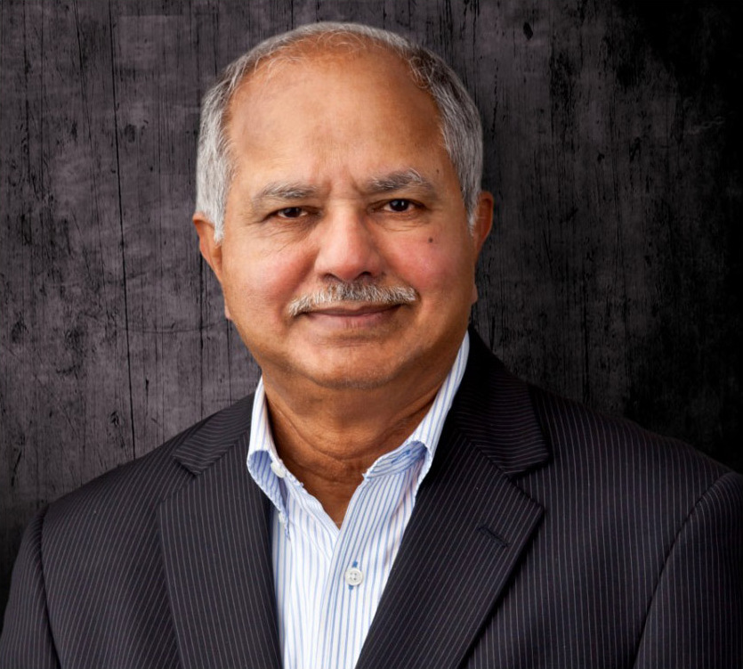

Dabbala Rajagopal “Raj” Reddy was born in 1937 in India, studied in Australia and at Stanford, and built a career at Carnegie Mellon that made speech and robotics look like problems you could put a number on. The 2011 Hyderabad photograph is a later public image, licensed.

*Credit: Vishnugsr. CC BY-SA 3.0. File:ProfReddys Photo Cropped.jpg.*

## Hearsay and a review

The Hearsay-II system, with Victor Lesser and colleagues, is a 1970s blackboard: knowledge sources posting hypotheses about what was just said. Reddy’s 1976 *IEEE* review of speech recognition is the map. DARPA’s Speech Understanding Research program is the clock. Harpy’s 1,000-word result is the kind of number an agency can file.

He did not treat the number as the thing itself. He treated it as a way to keep a laboratory honest.

He took a Stanford Ph.D. under John McCarthy, a documented lineage that did not make him a Lisp-laboratory copy. Speech forced different compromises: time, noise, a vocabulary that could be counted. The CMU systems of the 1970s are closer to a radio engineer’s patience than to Advice Taker prose.

Reddy’s later students and colleagues — the Robotics Institute’s public history names many — inherited the habit of a demo that can fail on camera. Navlab vans and later DARPA-challenge teams are that habit at highway speed.

## A prize shared

The 1994 ACM Turing Award, with Edward Feigenbaum, cites large-scale artificial intelligence systems. Reddy’s half is speech, robotics, the CMU habit of building things that can fail in public. The Robotics Institute at CMU, which he helped shape, is an institutional fact.

## India, and a wider roster

Reddy’s later public work on technology and society in India is documented in university pages and interviews. This series includes him not as geographic decoration but because the spoken-word problem is central and because the laboratory that hit DARPA’s numbers was his kind of laboratory.

A history of AI that cannot hear is a history of desks. Reddy’s group tried to hear, in a room, with a budget, and wrote down how far they got.
