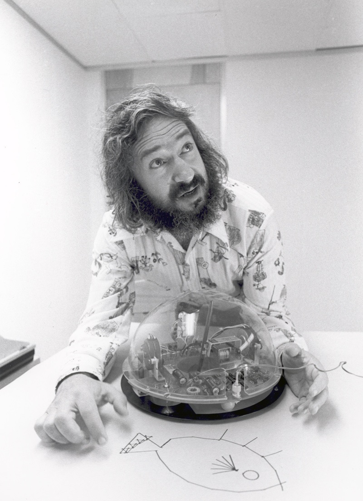

Seymour Papert was born in Pretoria in 1928 and died in 2016. The photograph on Commons comes from a Creative Commons textbook scan — not a studio sitting, a reuse. It is enough to place a face next to two facts that do not usually travel together: he co-authored *Perceptrons*, and he built a language for children.

*Credit: Matematicamente.it. CC BY-SA 3.0. File:Seymour Papert.jpg.*

## From Geneva to MIT

Papert worked with Jean Piaget in Geneva before joining MIT. The Piagetian mark is not a sticker. Constructionism, as Papert later named his own pedagogical bet, treats learning as the building of public objects — a program, a turtle’s path — not as the receiving of a rule.

Logo, developed with colleagues including Wallace Feurzeig at BBN and then at MIT, gave children a turtle and a set of words. The turtle is famous. The deeper claim is about debugging as a way to think. *Mindstorms* (1980) is the book that carried the claim out of the lab school.

## The 1969 mathematics

With Marvin Minsky he wrote *Perceptrons*. The book is sometimes filed only under “AI winter.” It is also a geometry book: what can a certain class of machines know about a figure? Papert the educator and Papert the mathematician are not two careers. Both are about what a representation makes easy.

## A later life, and a limit

A 2006 motorcycle accident in Hanoi injured him badly. The public obituaries in 2016 treated him as an education figure first. An AI retrospective should not steal him from that. It should add the 1969 theorems and the MIT AI Lab years, then return the turtle.

If this series needs a reminder that “learning” is a word with children in it, not only a word with gradients, Papert is the reminder.
