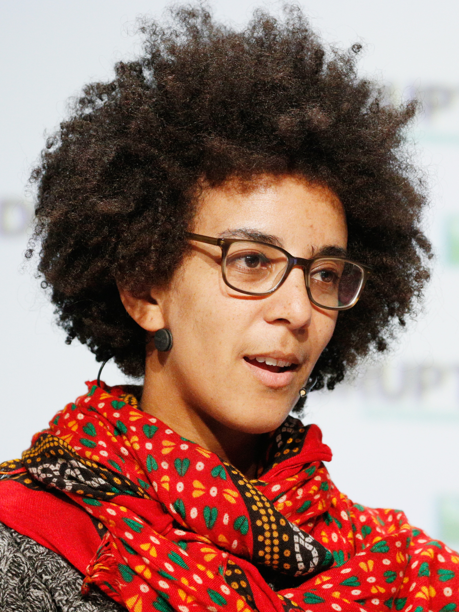

Timnit Gebru was born in 1982 in Addis Ababa and took a Stanford Ph.D. in computer vision. The 2018 TechCrunch photograph is a licensed press image from before the paper that would make her a public argument as well as a researcher.

*Credit: TechCrunch. CC BY 2.0. File:Timnit Gebru crop.jpg.*

## Datasheets

“Datasheets for Datasets,” with Jamie Morgenstern, Briana Vecchione, Jennifer Wortman Vaughan, Hanna Wallach, Hal Daumé III, and Kate Crawford (workshop 2018; *Communications of the ACM*, 2021), asks a practical thing: write down where a dataset came from, how it was labeled, who might be harmed by it, and what it should not be used for. The genre is closer to an engineering form than to a manifesto. That is why it can be taught.

Her earlier vision work includes papers on public images of people and on the politics of training data — documented in the computer-vision literature, not only in later news.

## Stochastic Parrots

“On the Dangers of Stochastic Parrots: Can Language Models Be Too Big?” (FAccT 2021), with Emily M. Bender, Angelina McMillan-Major, and Shmargaret Shmitchell, is a conference paper about scale, cost, labor, and the impression of meaning. Google’s conflict with Gebru over that paper is a matter of public journalism from December 2020. Personnel stories are not scientific results. The paper, accepted and published, is.

## How this series uses her

As a major figure in the public ethics of datasets and language models, 2018–2021, not as a mascot for a platform war. DAIR, the institute she later directed, is a public organization with a website and papers. Cite those as they appear. Do not invent a docket.

The 2018 photograph predates the 2021 volume. That is useful. The work was already underway when the news arrived.
