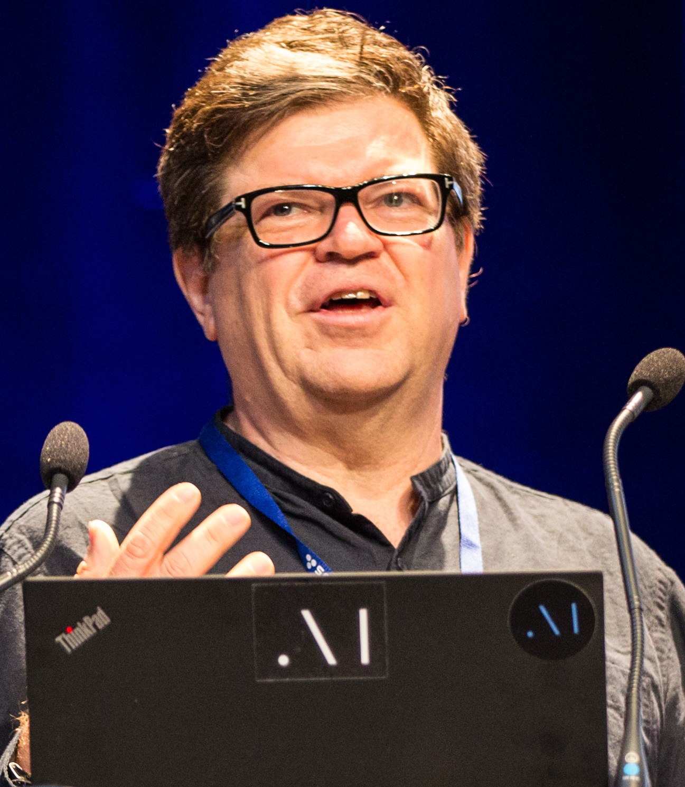

Yann LeCun was born in 1960 in France. The 2018 photograph, by Jérémy Barande at École polytechnique, shows a public scientist in the years after the Turing Award, which is not when the work happened. The work happened earlier, on digits.

*Credit: Jérémy Barande / École polytechnique. CC BY-SA 2.0. File:Yann LeCun - 2018 (cropped).jpg.*

## Bell Labs

After a Ph.D. in Paris (1987) and a postdoc with Hinton in Toronto, LeCun went to AT&T Bell Laboratories. Convolutional networks, trained by gradient descent, read handwritten characters. “Gradient-Based Learning Applied to Document Recognition,” with Léon Bottou, Yoshua Bengio, and Patrick Haffner (*Proceedings of the IEEE*, 1998), describes LeNet-5 and a system that entered the check-reading economy. That is a historical job, not a metaphor.

He has been explicit, in talks, about Fukushima’s neocognitron as architectural prior art. Credit that citation.

Handwritten-digit databases — including the MNIST set derived from NIST data, which LeCun’s group helped put into circulation as a benchmark — made convolutional nets a homework problem. A homework problem is a political object. It decides what a master’s student thinks “solved” looks like.

## NYU and FAIR

At New York University he built a research group; at Facebook AI Research (later Meta), from 2013, he built an industrial lab whose papers are part of the public record. Self-supervised learning, as a later slogan of his, is a research program with papers, not a vibe. The 2018 Turing Award, with Bengio and Hinton, is the official braid of the three careers.

## A public style

LeCun argues on the open internet in a way many Turing Award winners do not. Those arguments are dated posts, not papers. This series uses the 1998 article and the convolutional lineage as the profile’s spine. The posts will be someone else’s archive.

A machine that reads a ZIP code is a small thing. It is also the thing that made “vision as a stack of learned filters” an industrial fact before ImageNet made it a contest.
