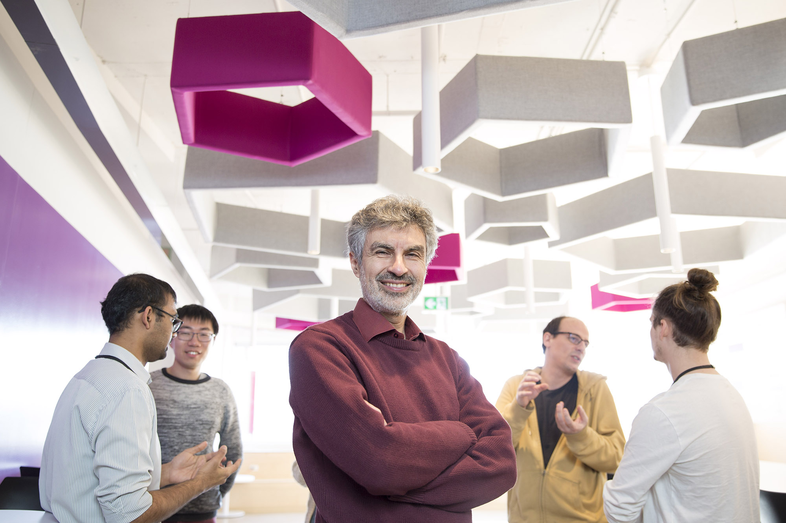

Yoshua Bengio was born in 1964 in Paris and built his laboratory in Montréal. The 2019 photograph by Maryse Boyce is a licensed studio-quality image of a man whose 2003 journal paper had already treated language as a neural prediction problem, years before that sentence was a company.

*Credit: Maryse Boyce. CC BY 4.0. File:Yoshua Bengio 2019.jpg.*

## A neural probabilistic language model

“A Neural Probabilistic Language Model,” with Réjean Ducharme, Pascal Vincent, and Christian Jauvin (*JMLR*, 2003), learns distributed representations of words and a probability for the next one. It is not GPT-3. It is the idea, in a journal, with a compute budget of its decade.

Bengio’s group spent the 2000s and early 2010s on deep nets, on difficulties of training, on attention in translation (the 2014–2015 papers with Dzmitry Bahdanau and Kyunghyun Cho). Montréal, as Mila, became a node that English-language histories can no longer skip in favor of a single California.

He studied at McGill, spent time at MIT and AT&T Bell Labs — the 1998 LeNet-5 paper carries his name next to LeCun’s — and then made Montréal a place students moved to, not through. CIFAR’s Neural Computation and Adaptive Perception program, later Learning in Machines and Brains, paid for some of that weather. Public CIFAR pages record the chairs and the meetings. They are a funding fact, not a myth of solitude.

## An award, then a change of emphasis

The 2018 Turing Award, with Hinton and LeCun, is the official recognition of the deep-learning trio. In 2023–2025 Bengio’s public writing and talks turned harder toward risks of future systems and toward institutions for safety research. Those texts are public. This profile records the turn as a dated public fact, not as a new laboratory result to be invented here.

## Why Montréal matters

National strategies, Canadian CIFAR funding, and a francophone research culture are part of the documented setting. A retrospective that treats deep learning as a Toronto–Silicon Valley axis has dropped a city. Bengio’s 2003 paper is the simplest proof of the drop.
