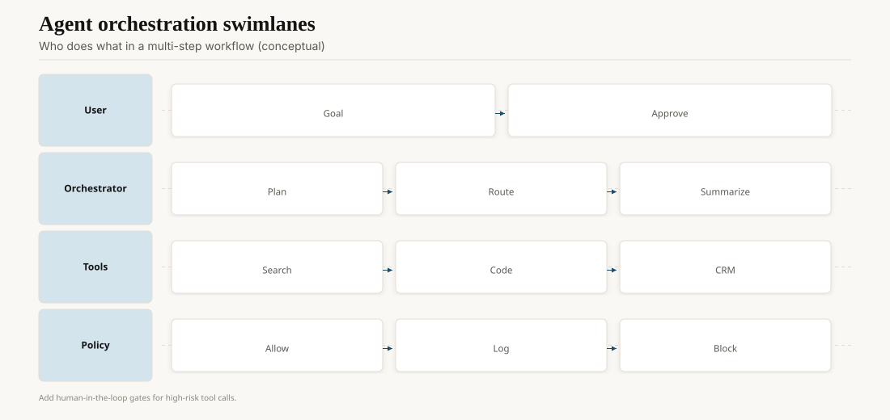
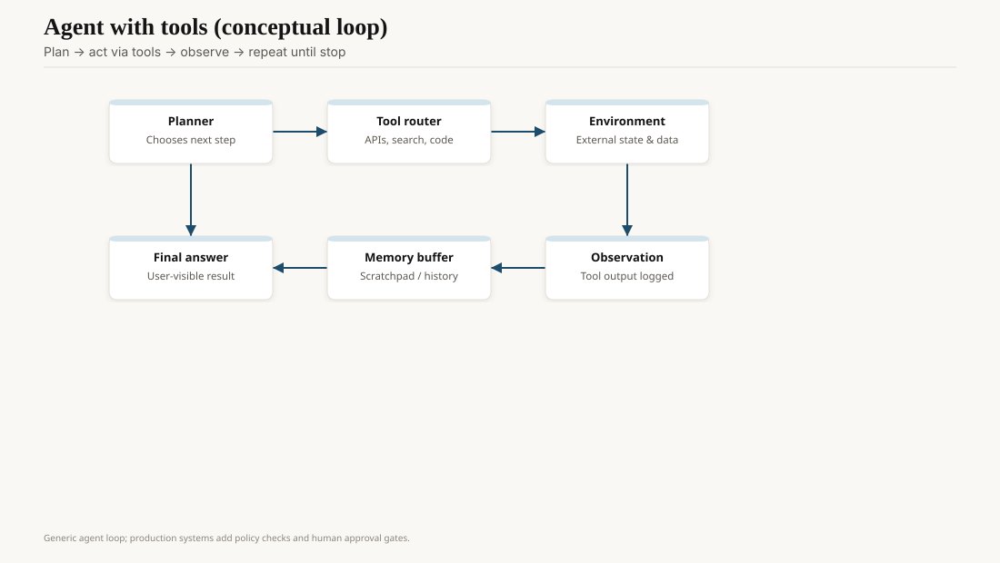

On 29 June 2021, Nat Friedman wrote that GitHub was putting an "AI pair programmer" inside Visual Studio Code. The preview suggested whole lines and whole functions from the file you were already in. The model was OpenAI Codex. The product name, Copilot, stuck harder than the model name.

A week later, on 7 July, Chen et al. posted *Evaluating Large Language Models Trained on Code*. Codex was a GPT-style model fine-tuned on public GitHub. On a new set they called HumanEval — 164 Python problems with unit tests — the model solved 28.8% with one sample. GPT-3, on the same docstring-to-code task, solved 0%. Sample 100 times and pick a pass, and Codex reached 70.2%. That second number is the one product people should have tattooed on a monitor. Coding models get better if you let them try again against a test.

<!-- ai-blog-figures:begin -->
<figure class="blog-figure">
  
  <figcaption><strong>Figure 1.</strong> Agent products split planning, tool execution, and policy across coordinated lanes.</figcaption>
</figure>

<figure class="blog-figure">
  
  <figcaption><strong>Figure 2.</strong> Agents plan, call tools, observe results, and iterate until a final answer.</figcaption>
</figure>

<!-- ai-blog-figures:end -->
## Autocomplete was the right first product

Copilot did not open a pull request. It sat in the editor and offered gray text. Accept, reject, keep typing. That constraint hid a lot of failure. A wrong helper in a 400-line file is cheaper than a wrong agent that force-pushes `main`.

GitHub and OpenAI trained on public repos. The 2021 paper discusses the obvious mess: license collisions, memorized snippets, insecure patterns copied forward, economic effects on junior work. GitHub's early public line was that verbatim regurgitation was rare (they cited about 0.1% in contemporary coverage). Rare is not none. The lawsuits came later. The engineering fact in 2021 was simpler: the best data for "write the next line of Python" was the public history of people writing Python.

Copilot went generally available on 21 June 2022, paid. A year from preview to SKU is fast for an editor vendor. It is also why a generation of engineers learned the model as a ghost in VS Code, not as an API they called. Microsoft then spent 2023–25 cloning that ghost into Bing, Office, and Azure. Same instinct: put the model where the work already is.

## HumanEval's quiet damage

HumanEval was a gift. It was also a trap. Functional correctness beats "does this look like code," which is what BLEU-style metrics had been doing. But 164 problems, in a style that soon leaked into every tutorial, became the thing labs optimized. Interview-shaped Python is not your monolith. It is not your build system. It is not the six files you have to touch to change a tax rule.

pass@k — the probability that at least one of k samples passes — taught vendors to sample. It did not teach them to *stop*. A model that throws 50 patches at CI until one is green can look brilliant on a chart and expensive in a bill. 2024–26 coding agents still live in that tension.

By 2024 the named benches had multiplied: MBPP, SWE-bench, LiveCodeBench, repo-level tasks that actually require navigation. Scores jumped. So did contamination arguments. If you take nothing else from this piece, take this: a coding eval without a time cut and a hidden test suite is a press release.

## From gray text to an agent that has a checkout

The line from 2021 to 2026 is not a new architecture. It is permission.

- 2021: suggest a function.
- 2023: chat in the IDE, then "apply."
- 2024: multi-file edits, terminal commands, test runners.
- 2025–26: an agent that clones, branches, runs, and opens the PR.

OpenAI's GPT-5 developer post (7 August 2025) explicitly sold the model on "coding and agentic tasks," with `gpt-5`, `gpt-5-mini`, and `gpt-5-nano` in the API and a default seat in Codex CLI. Anthropic, Google, and the open-weight code models (Code Llama in August 2023, later Qwen and DeepSeek coder lines) were already in that market. Cursor, Windsurf, Devin-class tools, and a pile of "autonomous engineer" demos are the product surface. Most of them fail in the same place: long-horizon state. The model loses the plot after the third tool call. The ones that work keep a tight loop — small diff, test, read the failure, next diff — which is Codex-era pass@k with a repo attached.

Security people were right to twitch. An agent with `bash` is a confused junior with your credentials. Sandboxes, allowlists, and "never the production kubecontext" are the actual product. The model is the noisy planner inside them.

## Named stops on the way

Copilot X (GitHub Universe, November 2022) added chat and PR summaries — the same week ChatGPT landed, which is not a coincidence. Amazon CodeWhisperer (preview 2022, GA April 2023) and later Q Developer were the AWS-shaped copy. Google's later IDE work sat inside Gemini. The editor was the battleground because that is where the cursor already was.

Devin (Cognition, March 2024 demo) sold an "autonomous software engineer." The demo was a good film. Independent attempts to use it on real tickets were mixed, which is the correct 2024 review of every agent that claims a job title. SWE-bench (Jimenez et al., 2023–24) gave the field a less fake target: resolve a real GitHub issue. Scores started in the single digits and climbed. Climbing a bench is not the same as owning a production repo. It is better than HumanEval alone.

Open-weight code models (Code Llama, 24 August 2023; StarCoder; later Qwen2.5-Coder and DeepSeek Coder) made the Copilot-shaped ghost something you could host. Enterprises that would not send source to a third-party API suddenly had a choice that was not "ban the tool."

## What changed for the job

Juniors who only accept gray text do not learn to read. Seniors who refuse all gray text waste time. The boring equilibrium, visible by 2024 in any serious team, is: the human owns the spec and the tests; the model drafts; CI is the judge. Teams that skipped the tests discovered that a fluent patch can be a confident wrong patch.

Compensation arguments are still mostly anecdotes. Some shops shrunk staff. More shops kept staff and raised the expected output. That is not a morality play. It is what happens when a factor of production gets cheaper and quality control does not.

## Opinion

Copilot's 2021 bet was correct: the editor is the right home for a coding model. The 2025 bet — give the model the repo and a terminal — is only correct if you keep the 2021 humility. Autocomplete assumed the human was still steering. Agents forget that. When they work, they work because someone rebuilt HumanEval around the team's real tests, not because the model "understands the codebase."

If you are buying this stuff in 2026, buy the loop (diff, test, permission, log). The model name on the invoice will change again in six months.
