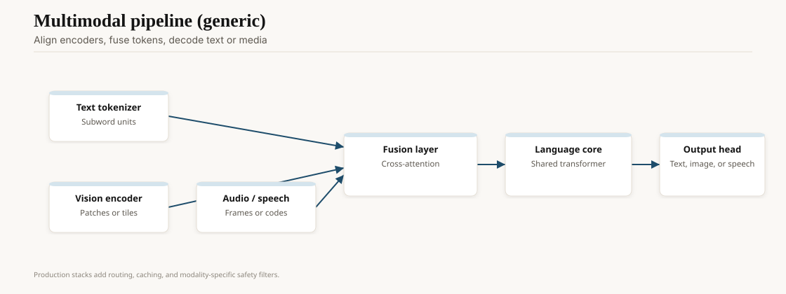

On 5 January 2021, OpenAI showed DALL·E: a 12-billion-parameter transformer that turned a caption into a picture. The name was a bad pun. The demo was not. "An armchair in the shape of an avocado" stopped being a joke about dataset trivia and became a product category.

DALL·E was not yet the diffusion stack the world standardized on. It was a discrete VAE plus a transformer over image tokens, in the GPT family. The public saw samples, not weights. Researchers saw a research blog and a later paper. The pattern matched GPT-3: capability first, access later, files never.

<!-- ai-blog-figures:begin -->
<figure class="blog-figure">
  
  <figcaption><strong>Figure 1.</strong> Multimodal products align encoders, fuse in a shared core, then decode to text or media.</figcaption>
</figure>

<figure class="blog-figure">
  
  <figcaption><strong>Figure 2.</strong> How buyers talked about “good enough” shifted by era — not interchangeable benchmark scores.</figcaption>
</figure>

<!-- ai-blog-figures:end -->

## The method that actually spread

The math that took over arrived from another door. Ho, Jain, and Abbeel published *Denoising Diffusion Probabilistic Models* in 2020 (arXiv 19 June 2020). Train a network to invert a gradual noising process. At sample time, start from noise and denoise. The idea had older roots (Sohl-Dickstein et al. 2015). 2020–21 made it work at image scale.

Latent diffusion is the engineering cut that mattered for civilians. Rombach, Blattmann, and the CompVis group (arXiv 20 December 2021; CVPR 2022) ran the diffusion process in a compressed latent space instead of pixel space. Same quality band, far less VRAM. That paper is why a 2022 hobbyist could run a serious image model on a single consumer GPU.

OpenAI's DALL·E 2 (6 April 2022) used a diffusion decoder on CLIP latents and looked, to users, like "DALL·E, but sharper." Google's Imagen (paper May 2022) went text-encoder-heavy and photoreal. Midjourney, operating as a Discord bot, made the whole thing a social product: you typed, a grid appeared, you upscaled, you fought about the watermark. None of those were open.

## 22 August 2022

Stable Diffusion's public weights are the image-side equivalent of Llama's later shock, and they arrived first. CompVis, Stability AI, and LAION put a latent diffusion checkpoint on GitHub and Hugging Face that people could actually run. Licenses and safety filters were argued about over dinner. By the next week, fine-tunes, DreamBooth faces, and NSFW forks were everywhere.

This is the part closed vendors still under-tell. Once the U-Net and the VAE are a file, the "product" is a config: your LoRA, your ControlNet, your A1111 flags. The 2022–23 explosion of ControlNet (Zhang et al., pose and edge conditioning) and of community UIs did more for daily use than any single closed sampler. It also dumped the safety problem onto whoever hosted the Gradio space.

LAION-5B, the data under a lot of this, was a research crawl with the usual wreckage: copyrighted stills, medical photos, scraped personal images. European regulators and artists noticed. Labs that had treated "the dataset is the dataset" as a weather report had to start answering lawyers.

## After the August drop

SDXL (Stability, July 2023) was the first community default that did not look like 2022. Fine-tunes multiplied anyway; the checkpoint was a starting point, not a brand. Midjourney v5 (March 2023) and v6 (December 2023) kept the Discord-native users who never wanted a GPU. Adobe Firefly (beta March 2023, then Creative Cloud) tried to sell "commercially safe" as the feature, which is a license story more than a sampler story.

DALL·E 3 (October 2023, inside ChatGPT) closed a loop: a language model writes a better caption, a diffusion model paints it. Users who could not prompt suddenly could, because they were prompting in English to GPT-4, not in the ugly dialect of 2022 tokens. That composition — LLM as art director — is now ordinary.

Getty Images sued Stability AI in London and the US (2023). Artists sued the usual hosts. Those cases sit next to the Times filing in the copyright piece. They belong here only as a reminder: the August 2022 file was also a dataset event.

## What changed for people who make pictures

Working illustrators gained a sketching assistant and a competitor on the same Tuesday. Concept art cycles compressed. Stock photography took a hit that looks, in 2026, structural. The cliché of "six-fingered hands" faded as samplers and fine-tunes improved; the cliché of "a house style that is actually 40 LoRAs" did not.

Credit and consent did not keep up. Some platforms added opt-out crawls. Some artists watermarked in ways models learned to imitate. Adobe bet on Firefly plus Content Credentials (see the authenticity piece in this pack) and a training set it claimed was licensed. That bet is a business model, not a settled ethic. It is also one of the few adult answers in a market that otherwise trained first and sent notes later.

Video arrived as a sequel, not a replacement: Runway, Pika, OpenAI's Sora demos (February 2024), then a 2025–26 pile of open and closed video diffusion. Same political economy. Same data fight. Longer clips, worse lies.

## What did not get solved

Prompting a picture is still a bad interface for "make the product shot from Tuesday, but the label is green." ControlNets and image-to-image help. They do not give you InDesign. People who need layout, brand, and legal sign-off still live in a hybrid: generate, then do real work.

Attribution is still weak. A style can be copied without a file being copied. Courts will spend the rest of the decade deciding whether that sentence is a defense or a confession. This pack will not pretend to know the holding.

## Opinion

DALL·E proved demand. Stable Diffusion proved that demand does not stay behind an API if the research is one paper away from a 4 GB checkpoint. Text models took an extra year (Llama, February 2023) to learn the same lesson. Image people already knew.

If you ship visual AI in 2026, the 2022 question is still the question: do you own a sampler, or do you own a workflow with licenses, logs, and a human who will put their name on the frame? The first is a demo. The second is a company.
