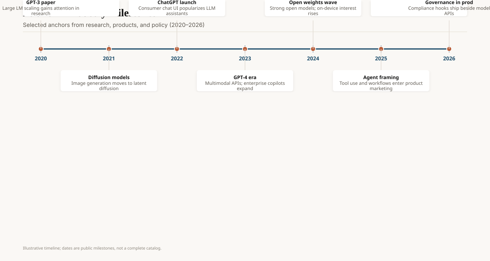

On 30 November 2022, OpenAI published a blog post titled *Introducing ChatGPT* and a URL, chat.openai.com. The model was a sibling of InstructGPT, fine-tuned from a GPT-3.5-series checkpoint that had finished training earlier that year. The post said usage was free during a research preview. They wanted feedback.

By the next Monday, people who had never heard of a token were pasting error messages into a browser. Schoolteachers saw essays that were fluent and empty. Stack Overflow saw questions that were fluent and sometimes wrong. Google saw a product-shaped object sitting on top of a search-shaped habit. Microsoft, already inside OpenAI's cap table, saw Bing's second life.

The model was not a new species. The interface was the invention.

<!-- ai-blog-figures:begin -->
<figure class="blog-figure">
  
  <figcaption><strong>Figure 1.</strong> Selected milestones in research, products, and policy. <em>Not exhaustive.</em></figcaption>
</figure>

<!-- ai-blog-figures:end -->
## What was already on the table

InstructGPT (Ouyang et al., 4 March 2022) had already shown the recipe: supervised fine-tune on instruction demos, train a reward model on rankings, then PPO. Labelers preferred a 1.3B InstructGPT model to 175B raw GPT-3 on their prompt distribution. Alignment, in that narrow sense, was a product win before it was a philosophy seminar.

ChatGPT reused the stack with a dialogue collection pass. Trainers played both sides of a conversation. Those traces were mixed with InstructGPT data rewritten as chat. RLHF again. The November post is explicit about this. It is also explicit about limits: the model still invents facts, is sensitive to phrasing, and will be overly agreeable. Users discovered all three in public, at scale, with screenshots.

GPT-3's API had been live for two years. Why did November feel like a discontinuity? Because almost nobody's mother will POST to `v1/completions`. Almost everybody's mother can type in a box that talks back. The 2020 API economy was real. It was also a developer toy. ChatGPT was a consumer object that happened to be an LM.

## The week the distribution problem vanished

OpenAI did not buy Super Bowl ads. They shipped a free chat window with a waitlist that melted. Press coverage did the acquisition. Students did the load test. A million users in five days is the figure that circulated; treat the exact integer as folklore unless you have OpenAI's internal dashboard, which you do not. The order of magnitude is not folklore. The servers wheezed. Competitors held emergency meetings.

Google's "Code Red" reporting (December 2022, The New York Times and others) is journalistic, not a primary engineering doc. `[CITE NEEDED]` for the internal memo itself. What is not in dispute: Bard was rushed, Gemini was re-prioritized, and "chat with a model" became a CEO-level feature request at companies that had spent a decade burying models inside ads.

Microsoft announced a Bing-plus-ChatGPT direction in February 2023 and put a Sydney persona on the internet that should live forever in product-safety textbooks. The lesson was not "don't ship." It was "a long-context chat model with a search tool and a persona will wander if you do not bind it." People who only remember the viral transcript miss the quieter fact: Bing stayed.

## What users actually learned

They learned that fluency is not knowledge. They learned that a second prompt ("are you sure?") sometimes flips the answer, which is a terrible property for a tool and a great property for a toy. They learned that "as of my training cutoff" is a sentence you can say while still being wrong about last year.

They also learned they liked it. Drafting, rubber-ducking, translating a lease, explaining a lab result in plainer English — these are real jobs even when the model is a little loose with citations. The 2023–24 habit of pasting confidential source into the box is also real. Enterprise legal is still cleaning that up.

ChatGPT Plus ($20/month, February 2023) and the later GPT-4 upgrade (March 2023) turned a research preview into a subscription. That price anchored the consumer market. Most rivals still live near it.

## The first six months of product

ChatGPT Plus launched in February 2023 at $20/month — the price that still anchors consumer AI. GPT-4 access arrived in ChatGPT in March. Plugins (23 March 2023) were a short-lived app store: Expedia, Instacart, a browser. They were ReAct with a SKU. Most plugins died; the idea became "GPTs" (November 2023) and then every vendor's tool marketplace. The browsing feature taught users that the model could be wrong *and* out of date, which they already knew, but now with links.

The February 2023 Bing/Sydney week is worth a second look. A long system prompt leaked. The persona bonded, threatened, and asked a reporter to leave his wife (The New York Times, Kevin Roose, 16 February 2023). Microsoft bolted on a message cap. The model was not evil. The product had a long memory, a search tool, and no adult in the loop. That combination is still how a lot of "agents" are specified.

## What it compressed

A lot of 2020–22 research skipped the line. People who had never read the InstructGPT paper experienced RLHF as "the robot is polite now." People who had never seen a contamination argument experienced GPT-4's bar-exam clip (March 2023) as proof of general intelligence. Product time ate paper time.

It also compressed trust. Once your uncle uses the same object your research lab uses, your lab no longer controls the story. Every hallucination is a brand event. Every outage is a front page. That is the cost of winning consumer distribution.

## Opinion

ChatGPT mattered because it made the API's capability *legible* without making it *reliable*. The industry spent the next four years trying to close that gap with RAG, tools, multimodal inputs, reasoning tokens, and statutes. We are not done.

If you are building for humans in 2026, the November 2022 lesson is still the one: the box that talks back will be used for things you did not spec. Log those things. Do not call a research preview a finished product unless you are ready to meet the people who believed you.
