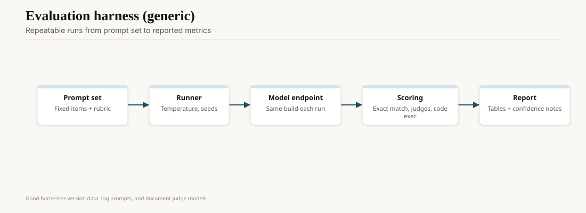
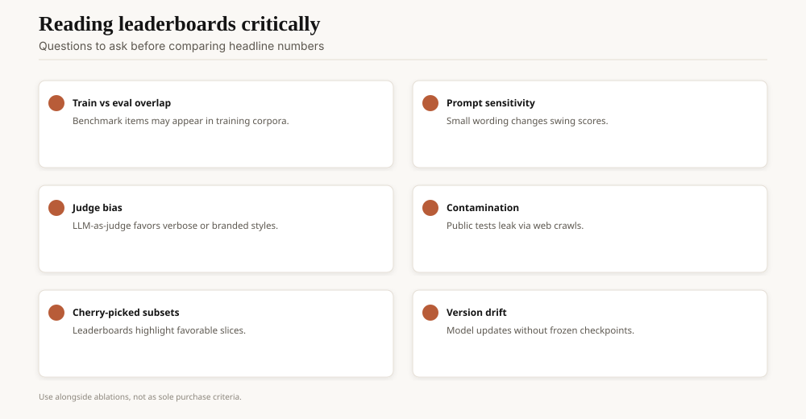
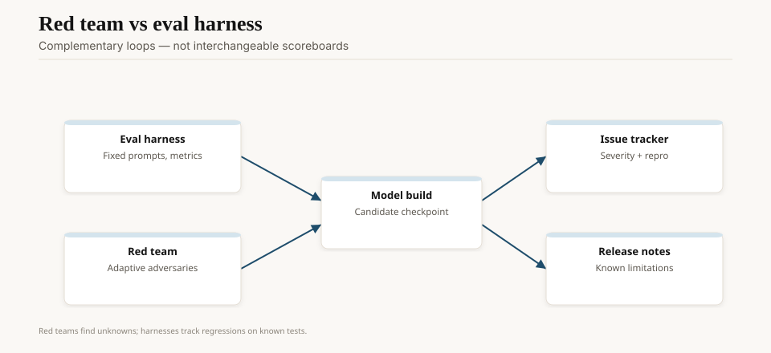

On 3 May 2023, LMSYS posted *Chatbot Arena: Benchmarking LLMs in the Wild with Elo Ratings*. The live experiment had started in the last week of April: two anonymous models, one prompt, a human vote, a chess-style rating. The first public table had Vicuna-13B at the top of a short list of open chat models. Closed giants were not yet the whole story. The method was.

A year earlier, HELM (Liang et al., 16 November 2022) had tried to be the grown-up: many scenarios, many metrics, a documented prompt, a refusal to reduce a model to one number. Both projects were correct. Both were immediately gamed. That is the crisis. Not that evals exist. That we used them as if they were physics.

<!-- ai-blog-figures:begin -->
<figure class="blog-figure">
  
  <figcaption><strong>Figure 1.</strong> Reproducible evals version prompts, fix decoding, score outputs, and publish provenance.</figcaption>
</figure>

<figure class="blog-figure">
  
  <figcaption><strong>Figure 2.</strong> Ask about contamination, prompt sensitivity, judge bias, and checkpoint versioning.</figcaption>
</figure>

<figure class="blog-figure">
  
  <figcaption><strong>Figure 3.</strong> Red teams hunt unknown failures; harnesses guard against regressions on known tests.</figcaption>
</figure>

<!-- ai-blog-figures:end -->

## The benches we inherited

GLUE and SuperGLUE died as status symbols the week GPT-3 few-shot them. MMLU, HumanEval, GSM8K, MATH, Big-Bench — the 2021–23 kit — assumed a frozen test set and a model that had not seen it. Web-scale training makes that assumption a wish. The GPT-3 paper already said so. People kept publishing single-number leaderboards anyway, because boards are easy to print.

Contamination is not a moral failing. It is a data-pipeline fact. If the test sat on GitHub or in a PDF the crawler liked, it is in the mixture unless you filtered it. Few labs publish the filter. When they do, they publish a method, not a proof. Decontamination by n-gram overlap catches the lazy copies and misses the paraphrases.

HumanEval (Chen et al., 2021) at least graded by unit tests. MMLU grades by multiple choice, which a model can hack with format priors. GSM8K grew a cottage industry of prompt templates. Once a number is on a launch graph, it is no longer a measurement. It is a target.

## HELM's honesty, Arena's gravity

HELM's contribution was procedural: say what you measured, on which version, with which prompt, and report more than accuracy — calibration, noise resistance, fairness, efficiency. Reading a HELM card is slower than reading a tweet. That is the point. The project also showed how fast the model catalog moves; a careful eval of last quarter's names is a history paper.

Chatbot Arena's contribution was political. Users care about "which one do I like," and pairwise blind votes capture a slice of that. Elo updates continuously. New models enter without a 200-page report. LMSYS (later the arena's institutional descendants and the lmarena / arena.ai surface) became the unofficial consumer leaderboard. Vendors started optimizing for it. Of course they did.

Zheng et al. 2023 (*Judging LLM-as-a-Judge*) added the other 2023 idea: let a strong model grade the rest, on MT-Bench. Cheap. Correlated with humans, sometimes. Biased toward verbose, confident, slightly sycophantic answers — the exact failure mode you do not want in a medical or legal tool. "LLM-as-judge" is a budget. It is not a court.

## How the crisis showed up in products

A 2024 assistant could be state-of-the-art on MMLU and still invent a citation in your domain. A coding model could be high on HumanEval and fail your repo because your repo is not 164 Python puzzles. A vision-language model could ace a slide deck and misread a utility bill.

Teams that shipped anyway built *private* evals: fifty real tickets, a hidden holdout, a weekly canary. Teams that did not ship slideware. The difference is not philosophy. It is whether you have prompts you refuse to publish.

Style bias is the ugly sibling of contamination. Arena voters — anonymous, self-selected, often power users — are not your bank's customers. A model that writes punchy Markdown with a bullet surplus will climb. A model that says "I don't know" will fall. If your safety goal is refusal, your marketing goal is Elo, and you have one checkpoint, you will lose one of those goals.

## A note on BIG-bench and the moving target

BIG-bench (Srivastava et al., 2022) tried to crowd-source hard tasks before models ate them. BIG-bench Hard became a launch-slide staple, then a contamination suspect. GSM8K (Cobbe et al., 2021) had the same arc: useful, then overfit, then replaced in conversation by hidden or live math sets. LiveCodeBench's date-cut problems are one answer: only score problems released after the model's training cutoff. Arena's answer is different: stop pretending the test is secret and just ask humans which reply they prefer.

Both answers leak. Humans can be identified as a distribution. New GitHub problems can still rhyme with old ones. You are managing leak, not eliminating it.

## What improved, 2024–26

LiveCodeBench and other date-cut coding sets. SWE-bench and the painful discovery that "resolve the GitHub issue" is a different sport. Vendor-reported "human eval" with disclosed rubrics (rare, valuable). Contamination studies that treat overlap as a first-class figure. Reasoning models (o1-preview, 12 September 2024; DeepSeek-R1, January 2025) forced people to say whether they were scoring the *final answer* or the *trace*, and whether the trace was even shown.

What did not improve: the launch-day graph. GPT-5's 7 August 2025 post still leads with a bouquet of benches. Read them. Then ask for the eval you own.

Private evals have a failure mode too. Teams pick the fifty tickets they already handle well, freeze that, and call it science. Include the tickets that embarrassed you last quarter. If the set cannot fail, it cannot measure.

## Opinion

The evaluation crisis is a governance failure dressed as a metrics problem. We wanted a single number that would let a VP pick a vendor. Nature declined.

Build a small, ugly, private set from your real work. Freeze it. Re-run it on every model bump. Use Arena and HELM as context, not as a purchase order. Anyone who tells you their public score *is* your risk is selling you their slide.
