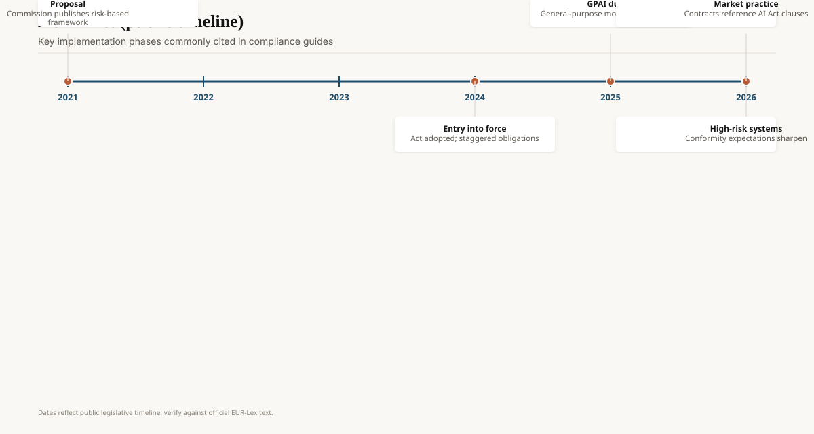
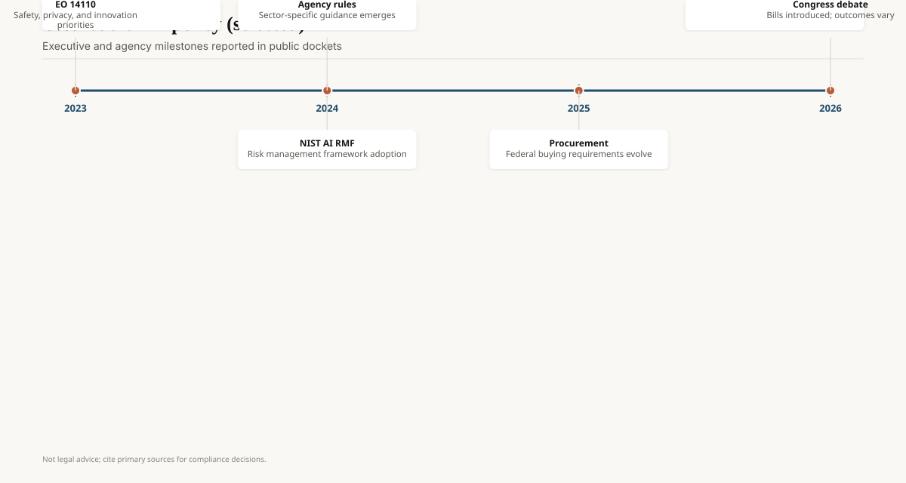

On 26 January 2023, NIST published the AI Risk Management Framework 1.0 (NIST AI 100-1). It is voluntary. It is also the closest thing the United States has had, through two administrations, to a shared vocabulary: map, measure, manage, govern. If your US "AI governance" deck does not mention it, the deck is cosplay.

On 1 August 2024, Regulation (EU) 2024/1689 — the AI Act — entered into force. That is a different animal. It is law. It applies on a staggered calendar set out in Article 113, and the Commission's own service desk now warns that a Digital Omnibus on AI has moved some later dates. If you ship in Europe, you read the regulation and the current timeline, not a 2024 explainer thread.

<!-- ai-blog-figures:begin -->
<figure class="blog-figure">
  
  <figcaption><strong>Figure 1.</strong> Compliance paths depend on risk tier and sector — confirm with counsel, not this schematic.</figcaption>
</figure>

<figure class="blog-figure">
  
  <figcaption><strong>Figure 2.</strong> Staggered EU obligations as commonly summarized — verify against EUR-Lex.</figcaption>
</figure>

<figure class="blog-figure">
  
  <figcaption><strong>Figure 3.</strong> Selected federal milestones. <em>Not legal advice.</em></figcaption>
</figure>

<!-- ai-blog-figures:end -->

## NIST, the document people can actually use

AI 100-1 is short by regulatory standards and dense with lists. It does not certify you. It does not pre-approve a model. It gives organizations a way to talk about risk without pretending a single accuracy number is a control. In July 2024 NIST added AI 600-1, a generative-AI profile, which is the version most product teams should start from if they ship chat, image, or agents.

Because it is voluntary, NIST survives electoral whiplash better than an executive order. A new White House can ignore it. Your bank's examiner might not.

## The US order that existed, then did not

Executive Order 14110 (30 October 2023) directed federal agencies on "safe, secure, and trustworthy" AI: reporting for large training runs, agency use, equity language, a pile of deliverables. It was the Biden-era spine of US federal AI policy.

Executive Order 14179 (23 January 2025), *Removing Barriers to American Leadership in Artificial Intelligence*, revoked 14110. The Federal Register text (31 January 2025) tells agencies to review actions taken under 14110 and suspend, revise, or rescind those that conflict with the new policy.

Executive Order 14365 (11 December 2025; Federal Register 16 December 2025, 90 FR 58499), *Ensuring a National Policy Framework for Artificial Intelligence*, is the later instrument people mean when they say "Washington wants to federalize AI." Read the text. It stands up a DOJ litigation task force, tells Commerce to inventory "onerous" state laws, points the FCC and FTC at disclosure and deception proceedings, and asks for a *legislative* recommendation that would preempt conflicting state AI statutes. It does not itself repeal Colorado or California. An order is not a statute. Treat 14179's revocation of 14110 as the 2025 load-bearing fact, and 14365 as a process order — not as a preemption fairy tale.

Read that sequence as institutional instability, not as "the US has no AI rules." The FTC, EEOC, FDA, sectoral statutes, state laws (Colorado, California, and others), and procurement language still apply. What you no longer have is a single 2023-style White House checklist that everyone pretended was a statute.

## The AI Act, in dates you can defend

Primary text: Regulation (EU) 2024/1689. Official Journal publication mid-July 2024; entry into force 1 August 2024.

The Commission's implementation timeline (service desk, retrieved September 2026) lists:

| Date | What the Commission currently says applies |
| --- | --- |
| 1 Aug 2024 | Entry into force |
| 2 Feb 2025 | General provisions, AI literacy, **prohibitions** |
| 2 Aug 2025 | **GPAI** model duties; national authorities and EU governance standing up |
| 2 Aug 2026 | Majority of remaining rules; transparency (Article 50) in the Commission's telling; enforcement widening |
| 2 Dec 2026 | Additional prohibition / Article 50(2) transition notes under the Digital Omnibus amendments |
| 2027–2028 | Sandboxes; later high-risk dates for Annex III and Annex I product-embedded systems, as amended |

Two warnings. First, **Digital Omnibus amendments** exist in the Commission's own timeline. Do not ship a 2024 blog's date table without checking. Second, this pack is not legal advice. "High-risk" is a defined status (Annex III uses, safety components of Annex I products), not a vibe. GPAI has its own chapter. A chatbot that writes marketing copy and a system that screens candidates are not the same object.

Prohibitions (social scoring of the banned kind, certain real-time remote biometric uses in public, unacceptably manipulative systems — read the articles, do not rely on press shorthand) started first for a reason. The Act is a product-safety law that also covers general-purpose models. That hybrid is why US labs hired Brussels counsel.

## GPAI, in one paragraph

The Act's general-purpose AI chapter is why frontier labs opened Brussels offices. If you put a model on the Union market that can be adapted to many tasks, you pick up documentation, transparency, and (for models that meet the systemic-risk threshold) extra duties. The Commission's GPAI Code of Practice — final text received 10 July 2025; Commission and AI Board adequacy opinion 1 August 2025 — is the voluntary companion (Transparency, Copyright, and a Safety and Security chapter for systemic-risk models). Signing it is a demonstration path, not a substitute for Article 53 and neighbors. Pull the current chapter PDFs from the Commission's Code page before you tell a customer you "signed it." The signatory list moves.

High-risk (Annex III) is a different door: employment, education, credit, biometric categorization of the regulated kind, essential services. Most chat toys are not high-risk. A resume screener is. If your startup is "GPT plus hiring," you are not a chatbot company for the purposes of this statute.

## What a product team should actually do

If you have European users or a European establishment, you already have a date problem. 2 August 2026 is not a future movie. It is this quarter's calendar as of this pack's writing (14 September 2026). Transparency for synthetic content, GPAI documentation, and high-risk quality-management talk are not "legal's job in 2027."

If you are US-only, NIST plus sectoral law plus whatever your state did this year is the stack. Do not tell a customer you are "EO 14110 compliant." That order is revoked.

If you sell to both, stop maintaining two stories. Maintain two *control lists* and one set of evals that can feed both.

State law in the US is the sleeper. Colorado's 2024 statute and its 2026 rewrite (see the states draft), California's transparency and training-data bills, and EO 14365's *talk* of preemption mean a single "we follow NIST" slide will not satisfy a state AG. Track the state you actually have customers in. The Federal Register page for 14365 is the citation; the order still does not finish the job.

## Opinion

The grown-up read is: Europe wrote a statute with a clock; America wrote orders that can be unsigned; NIST wrote a language that outlived both. Build to the statute where it applies, to NIST where you need a shared vocabulary, and to your sector where a real enforcer already has a phone number.

Anyone still briefing 14110 as current US law in late 2026 is not following the Federal Register.
