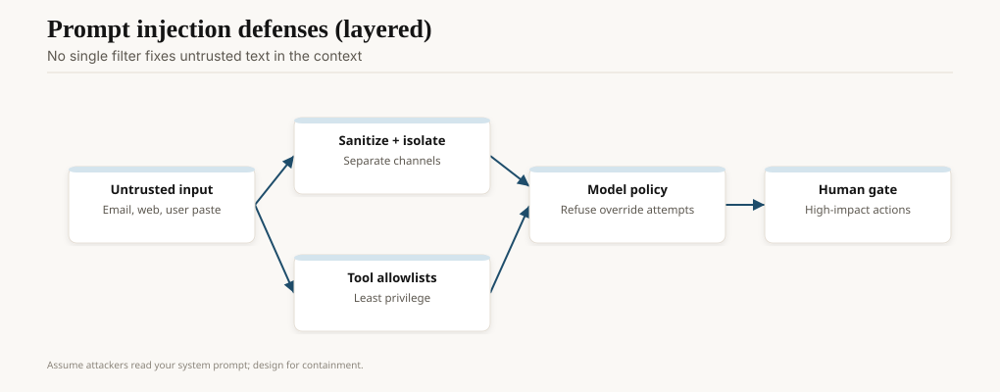

In 2022 the Coalition for Content Provenance and Authenticity published a technical specification for what it now calls Content Credentials: a signed manifest that can travel with a file and say who captured it, what edited it, and whether a generator was in the path. Adobe, Microsoft, the BBC, later Google, and a list of newsrooms and camera makers sat on the coalition. This is not a startup pitch. It is a standards fight.

The 2024 election year in several countries turned the fight into a consumer problem. A clipped audio, a face on a body, a still that was never a photograph. Most of the damage was old-fashioned cheapfakes: crop, caption, speed-up. The new tools made the expensive fakes cheaper. The authenticity stack we have is incomplete on purpose. It tells you a story about a file. It does not tell you whether the story in the file is true.

<!-- ai-blog-figures:begin -->
<figure class="blog-figure">
  
  <figcaption><strong>Figure 1.</strong> Multimodal products align encoders, fuse in a shared core, then decode to text or media.</figcaption>
</figure>

<figure class="blog-figure">
  
  <figcaption><strong>Figure 2.</strong> Untrusted text in context requires isolation, tool limits, policy, and human gates — not one filter.</figcaption>
</figure>

<!-- ai-blog-figures:end -->

## Credentials, not oracles

C2PA's model is cryptographic: a manifest, assertions, a signature, a trust list. If the signature verifies and you trust the signer, you can believe the *provenance claims* (this JPEG was exported from this tool, on this date, with this generator tag). You cannot believe the press conference.

Specs moved: 1.3 (April 2023), 1.4 (November 2023), 2.0 (January 2024), 2.1 (September 2024, security hardening), 2.2 (May 2025), 2.3 (December 2025). If you implement, implement from spec.c2pa.org, not from a 2023 blog.

Limits, which the spec people will tell you if you let them:

- Metadata can be stripped. Screenshots strip it for free.
- A valid credential can be issued by a liar with a key.
- "No credential" will be the common case for years. Absence is not guilt.

So the UX cannot be a green check that means "true." The UX is "this file still has a signed history from Nikon / BBC / OpenAI" versus "this file has no history we can read." Newsrooms that treat the check as a truth badge will get fooled by a well-signed fake.

## Watermarks, the other half

SynthID (Google DeepMind, 2023 onward) embeds a signal *in the pixels or the tokens*, not only in the header. Images, audio, text, video — the toolkit grew. A Nature paper and a Transformers implementation exist for the text variant. Detection is probabilistic: watermarked, not, or uncertain. OpenAI's help pages now say they attach both C2PA and SynthID on supported images, and SynthID on supported audio.

Watermarks survive some edits and fail others. They are not DRM. They are a forensic hint. A motivated attacker can degrade them. A lazy distributor will leave them. Most political harm is lazy. That is the case for doing the work anyway.

The EU AI Act's transparency duties for synthetic content (Article 50, in the Commission's 2026 telling) will force a lot of generators to emit *some* machine-readable signal. Credentials and watermarks are how vendors will try to comply without ruining the file. Watch the 2 December 2026 transition notes on the Commission's timeline if you already shipped unlabeled image APIs.

## Cheapfakes still win

The 2024 cycle's most-shared political clips were often real video with a false caption, or a real audio cut to a false start. A C2PA manifest on a camera-original file does not fix a tweet that never included the file. Design for the *distribution* format (a screenshot of a screenshot) or you are securing a museum while the fight is in the parking lot.

Voice-cloning scams against families and against finance desks showed up in FBI and similar public warnings through 2023–25. The mitigation that works is procedural: a passphrase, a second channel, a rule that money does not move on a voice. The mitigation that does not work is "our staff would notice." They will not, on a bad day, on a cell phone.

## What 2024–26 actually taught

The worst incidents were not Hollywood-grade faces. They were familiar voices on WhatsApp ("Mom, I need bail"), celebrity porn, and campaign clips that outran a correction by six hours. The defense that worked was institutional speed: a newsroom with a known number, a platform that labeled *when it knew*, a police department that would not comment on an unverified audio.

The defense that did not work was "the public will learn to spot them." They will not. Fluency is the product.

Platforms added labels, then removed some of them when engagement dipped, then added them back under regulator heat. That sentence will stay true. Do not build a civic strategy on a platform's settings page.

## For people who ship generators

- Attach a credential. Say you generated it. Do not say the depicted event happened.
- Keep a watermark if your modality has one that survives your own compression path. Test that path.
- Do not generate photoreal likenesses of private people without a consent story. This is ethics and, in some jurisdictions, law.
- If you build a detector, publish the false-positive rate on non-AI news photos. A detector that flags every CNN still is a rumor machine.

For people who ship news or civic products: credentials are an input to a desk, not a replacement for one. A newsroom workflow that works: credential check, reverse-image / audio hash, a phone call to a human who should know, then publish. Skip the phone call and you have a plugin, not a desk.

## Opinion

Authenticity infrastructure is worth building and easy to oversell. C2PA and SynthID are how a 2026 product shows its work. They are not how a society decides what happened.

If you need one sentence for a design doc: *provenance is a signed story about a file; truth is a human argument about the world.* Keep those nouns apart on the screen.
