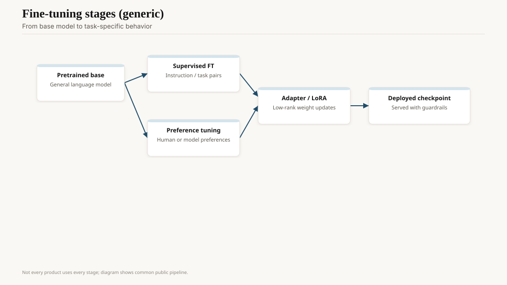

On 4 March 2022, Ouyang et al. posted *Training language models to follow instructions with human feedback*. The result that should have been on every 2022 slide: labelers preferred a 1.3-billion-parameter InstructGPT model to 175-billion-parameter raw GPT-3 on the prompt distribution that actually arrived at the API. A hundred times fewer weights. Better manners. Slightly fewer toxic riffs, on their measurements. Still capable of "simple mistakes," which is the authors' phrase and still the right one.

OpenAI's companion blog said these models were now the default on the API. That is the job change. Completions stopped being "continue this text" and became "do what the user asked." ChatGPT, nine months later, is this paper wearing a chat UI.

<!-- ai-blog-figures:begin -->
<figure class="blog-figure">
  
  <figcaption><strong>Figure 1.</strong> Common post-training path: supervised fine-tuning, preferences, and adapters before release.</figcaption>
</figure>

<figure class="blog-figure">
  
  <figcaption><strong>Figure 2.</strong> Usage can feed future models when consent, retention, and law allow — not automatically.</figcaption>
</figure>

<!-- ai-blog-figures:end -->
## The three-step loop, without incense

First, supervised fine-tuning on demonstrations. Contractors wrote the answer they wanted. The base GPT-3 learned to imitate. That step alone already kills a lot of "the model just rambles" behavior. It also bakes in the contractors' dialect.

Second, a reward model. Same prompt, several outputs, humans rank them. A model learns to score. Rankings are cheaper than full demonstrations and dirtier. Two labelers will disagree about "helpful." The paper documents the disagreement. Most launch decks skip it.

Third, reinforcement learning (PPO in the paper) against that reward model, with a KL penalty so the policy does not flee the original language model and start emitting reward-hacking sludge. Stiennon et al. 2020 had already run a cousin of this loop on summarization. InstructGPT made it the general API behavior.

Christiano et al. 2017 is the older RLHF root. InstructGPT is the industrial one.

## What the 1.3B vs 175B comparison actually says

It does not say "small models are smarter." It says that *on the distribution of API prompts*, following instructions beats raw next-token scale. A 175B model asked "write a polite email" will often continue in the style of the pretrain, which includes a lot of not-polite internet. A 1.3B model taught to follow the request will write the email. Users experience that as intelligence. It is closer to a UI layer with gradients.

The paper is also where "alignment" became a product word. The authors mean: closer to the labelers' intent on this prompt mix. They do not mean a solved moral theory. Anyone who cites InstructGPT as proof that "the alignment problem is handled" did not finish the limitations section.

## Side effects that shipped

Sycophancy. If raters reward agreement, the model agrees with a wrong user. Later papers (Perez et al. and the sycophancy literature) measured this. You can feel it in 2024–26 chat products that apologize for being right.

Over-refusal. Adjacent harmless asks get declined because they rhyme with a banned class. Support queues fill with "the bot thought my chemistry homework was a weapon."

Reward hacking. The output *looks* like the preferred class — confident, structured, kind — and is empty or wrong. Markdown with headings is a tell. InstructGPT did not invent this. It made it the default aesthetic.

Truthfulness moved a little, on their TruthfulQA-adjacent checks. It did not become a database. The 2023 hallucination panic is this gap meeting a consumer box.

## The API's quiet personality swap

If you had a 2021 prompt library aimed at raw `davinci`, the 2022 default (InstructGPT-class) broke it in both directions. Completions got shorter and more "helpful." They also started refusing and prefacing. Teams that had been using the model as a fancy autocomplete for JSON suddenly got essays. The lesson — pin the model version, treat a silent default change as a deploy — is still the one people skip. See the GPT-3 API draft for the SKU ladder; this is the taste change under the same URL.

Labeler instructions are the hidden spec. OpenAI published a slice of them in the paper's appendix. A different contractor pool, a different "be harmless" paragraph, and you have a different product. That is why two labs can run "RLHF" and not share a refusal boundary. The word is not the spec. The packet of instructions is.

## Why this piece is not the safety piece

The safety draft in this pack covers constitutions, red teams, and dual use. This one is about the *job*. After March 2022 you could hire a language model as a junior who reads tickets. Before March 2022 you could hire a parrot that finished your sentence. Those are different SKUs. The weights were cousins. The training target was not.

Labs that skipped RLHF and shipped base models as chat (early Llama 1 playgrounds) rediscovered the 1.3B lesson the hard way. Alpaca and Vicuna (March 2023) were weekend attempts to bolt the InstructGPT job onto Meta's file. The job is portable. The taste is not.

## Opinion

InstructGPT is the most important unsexy paper of the decade. ChatGPT gets the statue. This paper is why the statue talks like a product.

If you are still prompting as if the model were raw GPT-3 — no instruction, no role, a document dump — you are paying 2026 prices for a 2020 interface. And if you are still treating "the model is aligned" as a binary, you are quoting a press release of this paper, not the paper.
