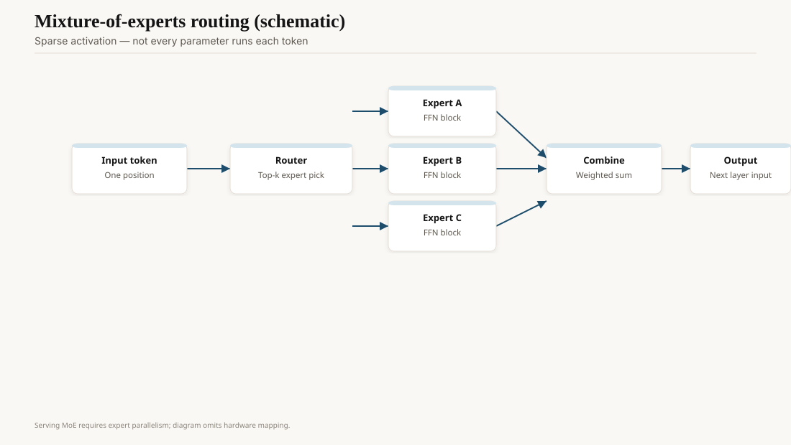
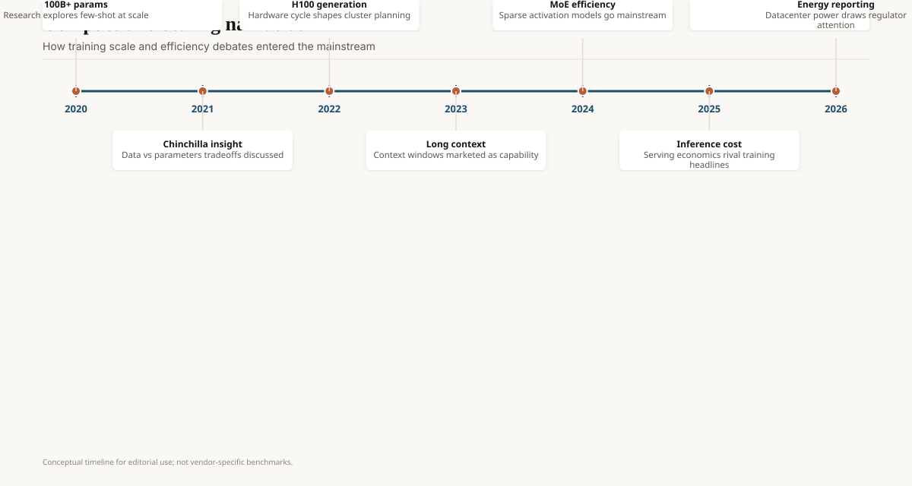

On 11 January 2021, Fedus, Zoph, and Shazeer posted *Switch Transformers*. The idea is older (Shazeer's 2017 mixture-of-experts work). The 2021 paper made it a trillion-parameter language-model story: replace a dense feed-forward with a set of experts, route each token to one, keep FLOPs per token closer to a smaller dense model. They reported a 1.6T-parameter Switch-C trained on a TPU pod. Most of the industry treated this as a Google curiosity. Dense GPT-3-class models were the SKU.

On 11 December 2023, Mistral shipped Mixtral 8×7B. Same idea, a file you could serve, Apache-shaped openness, quality that embarrassed denser 70B-class chat models on a slice of public checks. Sparse MoE left the paper and entered `vLLM`.

<!-- ai-blog-figures:begin -->
<figure class="blog-figure">
  
  <figcaption><strong>Figure 1.</strong> MoE models activate a fraction of parameters per token; serving needs expert-aware infrastructure.</figcaption>
</figure>

<figure class="blog-figure">
  
  <figcaption><strong>Figure 2.</strong> Training scale, hardware cycles, and serving economics entered mainstream discourse.</figcaption>
</figure>

<!-- ai-blog-figures:end -->

## What sparse actually buys

You pay memory for parameters you do not fire on every token. A 47B Mixtral (8 experts × 7B, two experts per token in their write-up) has a dense-compute footprint closer to a 13B. Serving that well is an engineering problem: expert parallelism, load balance, the tail expert that everyone routes to. A naive implementation is slower than the dense model you were avoiding.

Training is its own mess. Auxiliary losses to balance experts. Dropped tokens. Instability. Labs that talk about MoE as "free scale" have not paged the expert that never got traffic.

GLaM (Google, 2021), ST-MoE, and the Grok-1 leak (xAI, March 2024, a 314B MoE) sit on the same family tree. DeepSeek-V3 (December 2024) and R1 (20 January 2025) made a 671B-total / tens-of-billions-active recipe a geopolitical event, because the reported train cost was low relative to the closed-lab vibe. Llama 4 Scout and Maverick (5 April 2025) were Meta's first natively multimodal MoE Llamas, 17B active in the public telling. The dense-vs-sparse argument at the frontier is, as of this pack, mostly over. Sparse won the *catalog*. Dense still wins the 8B you put on a phone.

## A serving picture, with numbers you can argue

Take Mixtral's public shape: 8 experts, 2 active, 7B-class each. Decode cost tracks the active path plus the router plus the attention, which is still dense across the sequence. Memory cost tracks *all* experts unless you offload. That is why a 24GB card that runs a 13B dense may not run an 8×7B at a decent batch, even though "active FLOPs" look 13B-ish. People who only read the blog's FLOP line learned this on a Saturday.

DeepSeek's MLA (multi-head latent attention) and related V3 tricks are an attempt to shrink the KV side while keeping the expert side fat. If you serve R1, you are serving a systems paper, not a dense 70B with a hat. Read the paper's serving notes or you will undersize the cache.

## Why 2021 did not ship and 2023 did

Software. Hugging Face, vLLM, and a generation of people who had just learned to serve Llama 2 were ready to serve a routed 8×7B. CUDA graphs and paged attention made the expert hop less fatal. Mistral's license was something a startup counsel could accept. Google's Switch models were not a Hugging Face card you could `pip` into a product.

Also: the dense 70B had become the expensive default. A sparse model that *felt* like a 70B and cost like a 13B at decode was a CFO event. That, not the 2021 academic graphs, is why Mixtral cloned.

## Failure modes

**Router collapse.** One expert eats the world. You have a dense model with extra RAM.

**Quality holes.** Some domains route badly. Your eval set does not include them. A customer does.

**Quantization.** 4-bit MoE is not 4-bit dense. Expert outliers break naive GPTQ-style pipelines. If you eval bf16 and ship a GGUF, you shipped a different router.

**Ops.** More parameters on disk means longer cold starts and fatter images. Edge MoE is a punchline unless you distill.

## 2025–26, without the brochure

Every frontier lab's public story now has a sparse chapter or a reason they stayed dense. OpenAI and Anthropic have not given you the block diagram. Assume they have an internal cousin of this idea or a reason it lost. Do not invent one.

For builders: pick MoE when your serving stack already knows how to route and your traffic is high enough that the memory premium pays back. Pick dense when you need a 7B on a laptop and a stack your intern can debug at 2 a.m.

## Opinion

Switch was the paper. Mixtral was the product proof. DeepSeek and Llama 4 made sparse the default at the top of the open catalog. The interesting number is not "total parameters." It is active parameters per token, plus whether your router is still alive after quantization.

If a vendor only prints the big number, they are selling you Switch-era press. Ask for the active count and the serving traces.
