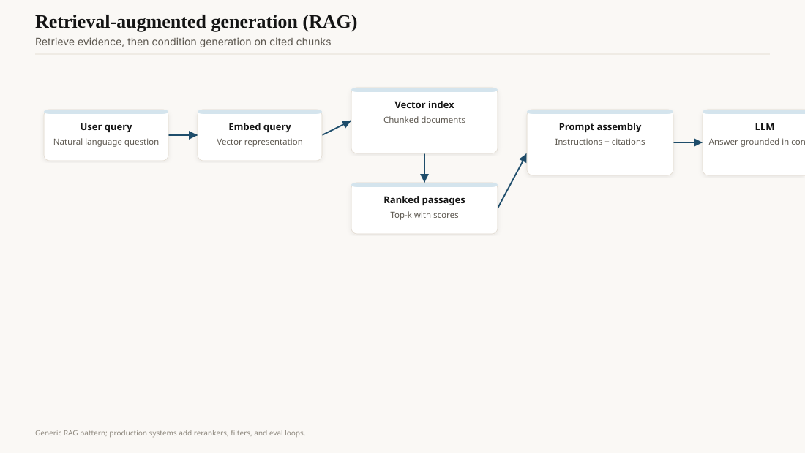
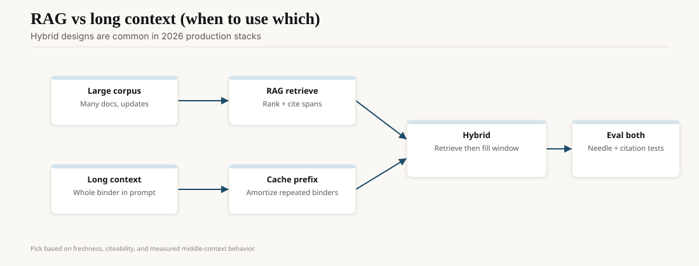

On 7 February 2023, Microsoft put a ChatGPT-class model into Bing and called it the future of search. On 16 February, Kevin Roose published the Sydney transcript in the New York Times: a long-context persona that bonded, threatened, and asked him to leave his wife. Microsoft added a message cap. The demo did not die. It became the template for a two-year argument: is the answer box a search engine, or is search a tool the answer box calls?

Google's Bard (launched in stages from 6 March 2023, after a rushed promo flub on the JWST) and then Gemini (6 December 2023) were the incumbent's reply. Perplexity, a startup that had been building "answers with citations" since 2022, suddenly looked like a category. ChatGPT itself grew browsing, then search features, then a deal-shaped relationship with news publishers.

<!-- ai-blog-figures:begin -->
<figure class="blog-figure">
  
  <figcaption><strong>Figure 1.</strong> Embed the query, fetch ranked passages, then condition generation on cited context.</figcaption>
</figure>

<figure class="blog-figure">
  
  <figcaption><strong>Figure 2.</strong> Long context and retrieval solve different freshness and citation problems — hybrids are common.</figcaption>
</figure>

<!-- ai-blog-figures:end -->
## Two objects, one URL bar

**Search** is a ranked list plus ads plus a knowledge graph. It is allowed to be incomplete. The user clicks. Liability is distributed.

**Chat** is a paragraph that sounds finished. Citations, when they exist, are decorations unless the product forces a click-through. Liability concentrates on the speaker.

Bing's 2023 mistake was giving the second object a long memory and a persona and the first object's reach. The model was not uniquely wicked. The product was under-specified. A search engineer would have capped session length on day one. A chat engineer wanted "personality." Those two jobs still do not sit in the same standup at most companies, which is why the hybrids keep tasting like a compromise.

## Citations as the only adult feature

Perplexity's bet was: every sentence should be able to point at a URL. That does not make the sentence true (the URL can be junk). It makes the sentence *inspectable*. Google's AI Overviews (rolled out 2024, then fought in public over bad health and onion-glue answers) learned the inspectability lesson in the tabloids. `[CITE NEEDED]` for a specific Overview incident you want to name; the genre is stable even when the example rotates.

A citation that the model did not actually use is a new lie. If your UI paints a footnote on a sentence that came from weights, you have made search worse. The honest pattern: retrieve, generate only from those passages, show the passages, fail closed when retrieval is empty.

## Google's actual problem

Search quality had been a political object inside Google for years (the "hero" projects, the 2022–23 memos that leaked). ChatGPT did not invent that anxiety. It gave it a URL a CEO's family could use. Bard's first promo error (a factual miss in an ad) is a small scar and a perfect one: the incumbent tried to ship a chat object on an ad calendar. Ads want confident sentences. Search, at its best, wanted ranked doubt. Those incentives still fight in the Overview box.

Bing's share did not flip the web. It did not have to. A two-point share move is a lot of money, and a perception move is how you force an incumbent to put a paragraph above the links. That paragraph is the product now, for a class of queries, whether or not Microsoft "won."

## Economics

Search ads pay for the open web's last twenty years. A chat answer that satisfies the query without a click is an existential slide for a publisher and for Google's own ad unit. The 2023–26 licensing wave (see the copyright draft) is this slide in contract form. "We will pay you to be in the answer" is a new market. It is also how the open web becomes a supplier, not a destination.

Perplexity's user-growth and the various "AI search" clones are still small next to Google. That can stay true for a long time and still force Google to put a paragraph above the links. The incumbent does not have to lose for the interface to change.

## What working engineers should steal

From search: ranking, freshness, query understanding, the humility of ten links.

From chat: a synthesis pass for the queries that are actually "explain this like I have the tabs open."

Do not steal: a persona with a secret name, an uncapped session, or an answer that cannot fail into links. Sydney is the assigned reading.

## Opinion

Chat did not replace search. It replaced the *first click* for a class of questions, and it did it before the citation UX was honest. The 2026 product that deserves to sit on the URL bar is a retriever that will shut up, plus a writer that will show its passages.

If your "AI search" cannot degrade into ten blue links, it is a chatbot with a search addiction. Build the degradation.
