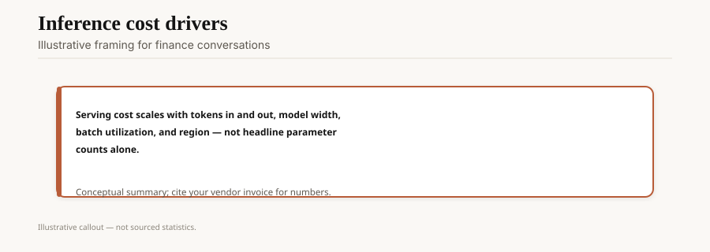
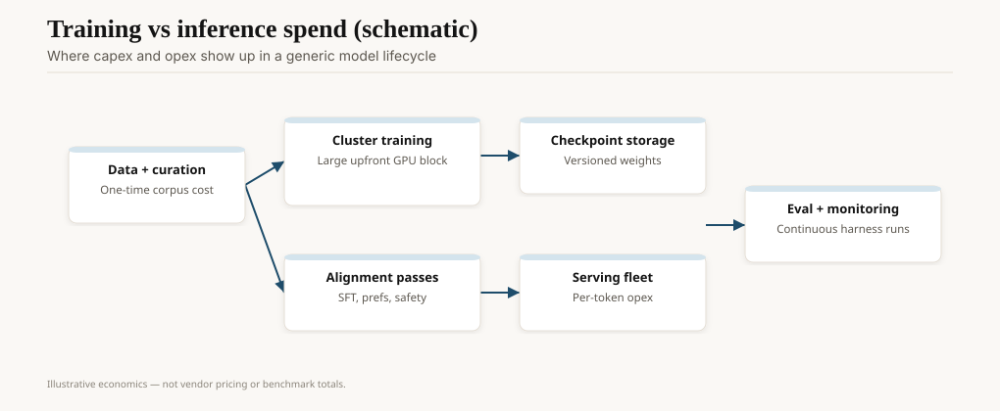
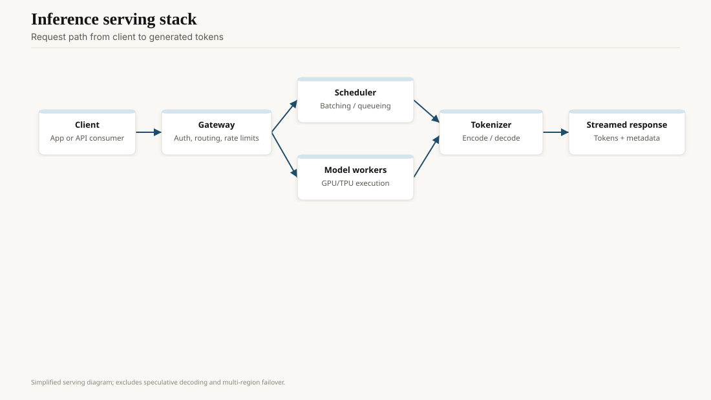

When GPT-4 launched on 14 March 2023, the 8K model was $0.03 per 1K input tokens and $0.06 per 1K output. That is $30 / $60 per million, in the units the industry later standardized on. GPT-3 davinci, in the 2020–21 era, had been sold per thousand in a way that made a chatty prompt a finance surprise. On 6 November 2023, DevDay, GPT-4 Turbo arrived cheaper and with 128K context. By 7 August 2025, OpenAI's GPT-5 developer post listed $1.25 / $10 per million for `gpt-5`, with mini and nano an order of magnitude down. The exact rows will move again. The direction did not.

This is not a price list. It is why 2024–26 applications exist that would have been a Series A burn in 2023.

<!-- ai-blog-figures:begin -->
<figure class="blog-figure">
  
  <figcaption><strong>Figure 1.</strong> Inference bills track tokens, width, utilization, and region more than parameter counts alone. <em>Illustrative.</em></figcaption>
</figure>

<figure class="blog-figure">
  
  <figcaption><strong>Figure 2.</strong> Training capex and serving opex dominate different parts of the lifecycle. <em>Illustrative.</em></figcaption>
</figure>

<figure class="blog-figure">
  
  <figcaption><strong>Figure 3.</strong> Client request through gateway, scheduler, and workers to streamed tokens.</figcaption>
</figure>

<!-- ai-blog-figures:end -->

## Why the meter fell

**Utilization.** A reserved H100 doing 20% duty at decode is a luxury. Continuous batching (Orca, vLLM 2023) and prefix cache made the same iron do more tokens per second. NVIDIA's software and the open serving stack fought over those kernels. See the GPU draft and the tooling draft.

**Smaller models on the path.** Phi-3, Llama 3 8B, GPT-4o-mini, nano SKUs. Most tokens are cheap tokens. A router that sends "rewrite this sentence" to a frontier Opus-class model is a management failure.

**Competition.** Gemini, Claude, Llama-on-Groq-or-Fireworks, DeepSeek's 2025 API prices. A monopoly meter does not fall this fast. An oligopoly meter does, especially after R1.

**Distillation.** Teacher logs become a student. The student is what you serve at $0.10/M. The legal and quality fights sit in the copyright and open-weights drafts.

What did not fall as fast: *output* tokens on reasoning models. o1-class traces are long. $10/M output plus a hidden chain is how a "simple" question becomes a dollar. GPT-5's "knows when to think" is a pricing feature as much as a quality feature.

## The unit everyone still gets wrong

Input vs output. Cached vs uncached. Image tokens vs text. Audio minutes vs text. A 2024 invoice that looks like "we spent $12K on GPT-4o" is usually: fat PDFs stuffed into context, a retry loop, a logging bug that sent the same 80K prefix a thousand times, and one actual feature. Prompt caching (Anthropic, OpenAI, Google, 2024–25) is the adult control. If you do not have a cache hit rate on the dashboard, you do not have FinOps.

Also: the seat vs the meter. Microsoft 365 Copilot at $30/user/month (November 2023 GA) is a bet that the average seat's tokens are cheaper than $30. For a lawyer who pastes binders, maybe not. For a person who summarizes three threads a day, the seat is the expensive object. See the ROI draft.

## A worked invoice, invented but honest

A team stuffs a 60K-token policy binder into every ticket (no cache). 2,000 tickets a day. That is 120M input tokens/day before the reply. At $1.25/M (a 2025-class frontier input price) you are in the hundreds of dollars a day on *input you already paid for yesterday*. Cache the binder, retrieve three chunks, and the same feature is a rounding error. The model name did not change. The path did.

Reasoning SKUs invert this. Fifty tickets a day × 8K output-of-thought × $10/M is still small. Five thousand tickets × the same is not. Put the reasoner behind a classifier. The classifier is the cheapest model you have that is allowed to say "this is a refund policy question, not a proof."

## What cheap tokens enabled

Agents that retry. Computer-use loops that take forty screenshots. RAG that stuffs twenty chunks instead of three. Consumer apps with a free tier that is not a lie.

What cheap tokens did *not* enable: a pass on evals. A wrong answer at $0.001 is still a wrong answer, and it will be produced more often because you stopped being afraid of the retry.

## 2026 habit

Write a budget per request class: classify, draft, reason, act. Cap the reasoner. Log cache hits. Put a human price on the action path (refund, send, merge) that is not the token price.

If your only graph is "dollars this month," you will cut the wrong model. Cut the path that stuffs the binder twice.

## Opinion

The 2020 API taught the industry to charge for uncertainty by the token. The 2023–25 price collapse taught it that uncertainty can be cheap. Cheap uncertainty is how you get sloppy agents.

Price is a safety control. A $2 think is a pause. A $0.002 think is a firehose. Design the pause on purpose.
