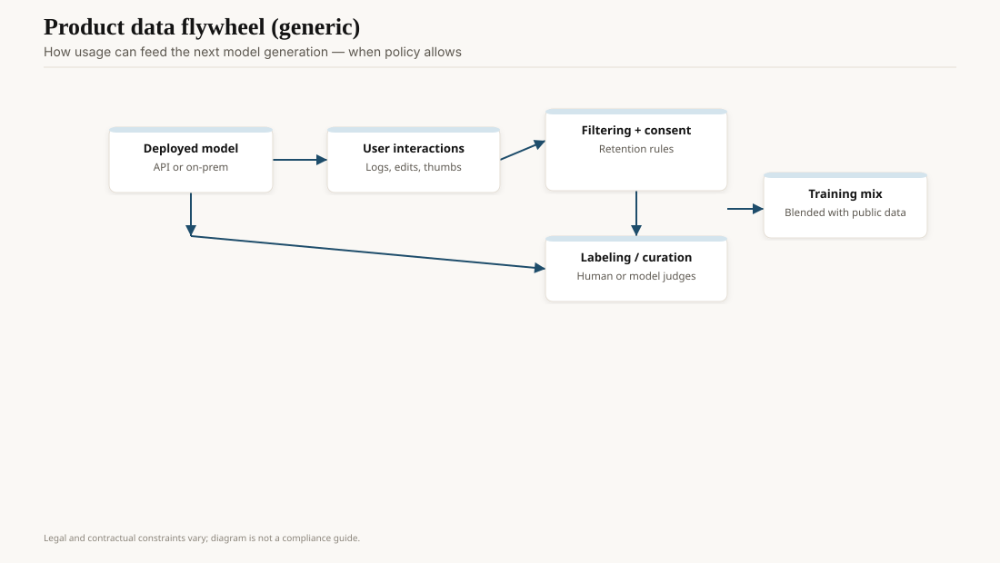
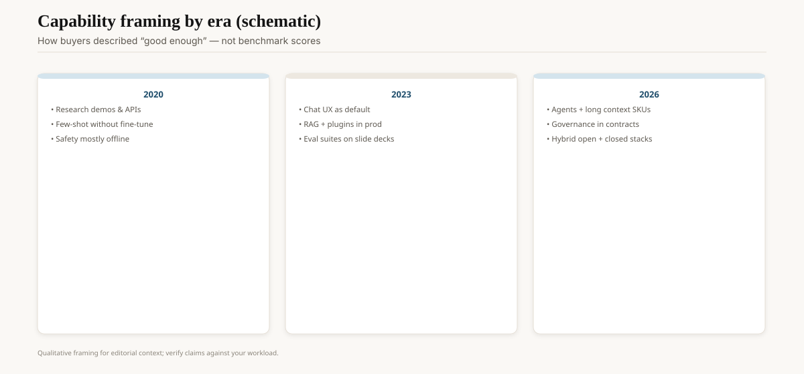

On 30 November 2020, CASP14 announced that DeepMind's AlphaFold 2 had landed in an accuracy band structural biologists had treated as a decade away. The Nature paper (Jumper et al., 15 July 2021) and the subsequent dump of predicted structures (AlphaFold DB, with EMBL-EBI) are the artifacts. A protein's amino-acid sequence in, a 3D fold out, with a per-residue confidence (pLDDT) that honest users actually look at. This is the same 2020 as GPT-3. It is not the same industry, and pretending it is has wasted a lot of keynotes.

AlphaFold 3 (Abramson et al., Nature, 8 May 2024) widened the object: complexes, nucleic acids, some ligands, a diffusion-ish module, a more political access model (a web server, not a full open dump of the new system on day one). Isomorphic Labs sat next to DeepMind as the drug-discovery corporate story. Chemists argued about pose quality. They were right to argue. A confident wrong dock is worse than no dock.

<!-- ai-blog-figures:begin -->
<figure class="blog-figure">
  
  <figcaption><strong>Figure 1.</strong> Usage can feed future models when consent, retention, and law allow — not automatically.</figcaption>
</figure>

<figure class="blog-figure">
  
  <figcaption><strong>Figure 2.</strong> How buyers talked about “good enough” shifted by era — not interchangeable benchmark scores.</figcaption>
</figure>

<!-- ai-blog-figures:end -->

## Why this is in an "AI industry" pack

Because executives keep saying "look, science" while shipping a chat box. AF2 is a *narrow*, *evaluated*, *confidence-scored* system trained on a curated scientific corpus (PDB) with a community bake-off (CASP) that predates the vendor. That is the opposite of a general chatbot. If you want a moral from 2020, take this one: **the wins that aged were the ones with a metric the field already trusted.**

Other scientific cousins, shorter, because each is a field: AlphaGo/AlphaZero as the 2016–18 celebrity (outside this pack's start date, but the lab culture). GNoME (materials, 2023) and the subsequent replication-and-skepticism cycle. GraphCast and the 2023–25 weather-model papers (DeepMind / ECMWF collaborations). Single-cell foundation models. Clinic LLMs that should not be in a clinic. The last one belongs under hallucinations and regulation, not under "we solved biology."

## CASP, the eval the chat world refused

CASP is a biennial experiment with *hidden* targets. Groups submit folds before the structures are public. That is the opposite of a contaminated MMLU. It is closer to a live coding bench with a time cut. When AF2 won, the field could not say "it memorized the PDB copy of this target" for the hard cases — not in the cheap way. (Template use and homologs are a longer technical argument; the headline still holds.)

Chat evals keep promising a CASP and delivering a leaderboard with a downloadable test set. Steal the hidden-target habit if you steal nothing else.

## What AF2 changed on the bench

Graduate students stopped waiting six months for a crystal on some targets. They started a design cycle with a predicted fold and then *checked*. Cryo-EM and crystallography did not die. They moved later in the pipeline. People who treated a pLDDT of 40 as a structure learned expensive lessons. The confidence head is the product.

Therapeutics is slower than a Nature cover. A fold is not a drug. A dock is not a candidate. A candidate is not a trial. Anyone who tells a board "AlphaFold 3 means we skip chemistry" is raising on a misunderstanding.

## Access politics

AF2's parameters and the database were unusually open for a lab that also sells. AF3's initial server-only posture (May 2024) produced a community revolt. DeepMind later posted inference code and weights under terms that are not "do what you want on your cluster." If you depend on a local AF3, read the current GitHub license and the Nature paper's availability statement the week you depend on it — those pages move. Scientific AI has a publication-vs-product tension that chat APIs solved by never publishing. Biology noticed, because the field's norm is "I can run it on my cluster."

## Clinic LLMs, a boundary

A radiology-report draft and a protein fold are both "science-adjacent AI" on a slide and nowhere else. The fold has CASP. The report has a patient, a regulator, and a hallucination defect (see that draft). Do not staff them with the same launch checklist. FDA-ish software-as-medical-device paths exist for a reason. This pack will not walk them. It will say: if your output can change a body, you are not in the ChatGPT product genre even if you call the same API.

## How not to write this as hype

Do not say AF2 "solved protein folding" without the CASP-conditions asterisk (single chains, the target distribution, the failures on complexes and disordered regions). Do not mash AF3 into a GPT-4o paragraph. Do not use "AI discovered a drug" unless you can name the trial.

Do say: a transformer-shaped model, a clean eval, a confidence score, a dump people used. That pattern is portable. Chat products keep refusing to copy it.

## Opinion

The scientific decade and the chat decade shared a year and a lab brand (DeepMind / Google). They did not share a defect culture. CASP is why AF2 is in textbooks. Arena is why chat models are in ads.

If you are building a scientific tool in 2026, steal CASP's meanness, not ChatGPT's fluency. Put the error bar on the page. If you cannot, you are not doing science. You are doing a reel.
