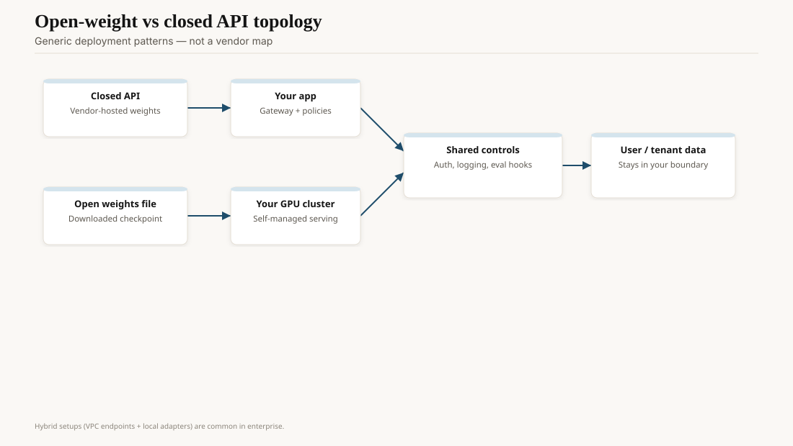
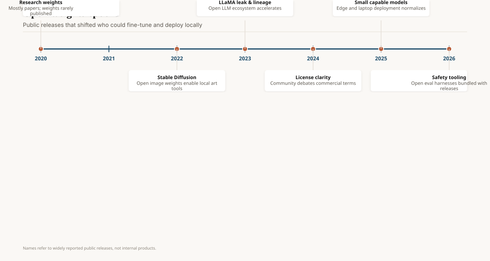

In March 2023, Georgi Gerganov released `llama.cpp`: a C/C++ port that ran Llama-class models on a Mac CPU, then on Apple silicon, then everywhere, with quantization that made a 7B fit in RAM that a PyTorch bf16 run would not. The same year, Kwon et al. posted vLLM (*Efficient Memory Management for Large Language Model Serving*, 12 September 2023; OSDI-era follow-through): paged attention, a KV-cache story that made GPU serving stop wasting half the card on fragmentation. Hugging Face's `transformers` (2018–) and `diffusers` plus the Hub were already the distribution layer. Together these objects are why "open weights" is a product sentence and not a torrent joke.

Llama 2 (18 July 2023) is the file. This draft is the wrench.

<!-- ai-blog-figures:begin -->
<figure class="blog-figure">
  
  <figcaption><strong>Figure 1.</strong> Open weights shift spend to your hardware; closed APIs shift it to vendor meters — controls can be shared.</figcaption>
</figure>

<figure class="blog-figure">
  
  <figcaption><strong>Figure 2.</strong> Public weight releases expanded who could fine-tune and deploy outside hosted APIs.</figcaption>
</figure>

<!-- ai-blog-figures:end -->

## Three layers, not a religion

**Cards and files.** The Hub, GGUF, safetensors, a model card that may or may not tell you the license. Ollama later wrapped `llama.cpp` for people who did not want a flag list. Together they turned a research dump into `pull` / `run`. Quality of cards varies from "reproducible" to "a selfie." The channel is still how most people meet a weight.

**Train / adapt.** LoRA (Hu et al., 17 June 2021) and QLoRA (Dettmers et al., 2023) made a single-GPU finetune a weekend. Axolotl, Unsloth, TRL, Lightning — pick your wrapper. The adapter economy has its own piece in this pack. The tooling fact: without PEFT-style libraries, Llama 2 is a paperweight for anyone who is not Meta.

**Serve.** vLLM, TGI (Hugging Face), TensorRT-LLM, SGLang, llama.cpp's server, MLX. Continuous batching and prefix cache are the 2024–26 cost story (see token economics). A lab that "has a model" and no serving story has a demo.

LangChain and LlamaIndex sit beside these, not above them. They compose. They also hide. If your team cannot draw the retrieve-generate loop without a framework class name, the framework is not helping.

## A note on kernels, not brands

FlashAttention (Dao et al., 2022; FA2 in 2023) is why long sequences on NVIDIA stopped being a memory brick. Most of the serving stacks above call it or a cousin. Speculative decoding (Leviathan et al., 2023, and the later Medusa/EAGLE line) is why a 70B can feel less slow when a 7B drafts ahead. These are not product names. They are the reason a price list moved. If your vendor cannot say whether they use paged KV and a speculator, you are paying 2022 rates for 2025 iron.

ONNX Runtime, TensorRT, and the "export once" dream still die on a custom mask or a MoE router. Portable is a direction, not a checkbox.

## Why 2023 was the tooling year

Weights arrived (Llama, then Mistral, then the heap). Consumer GPUs and Macs were already on desks. CUDA was a caste system. `llama.cpp` broke the caste for *local* use. vLLM broke the waste for *hosted* use. Neither required a new foundation model. Both changed the number of companies that could exist.

NVIDIA noticed. So did every cloud "model garden." The gardens are fine. They are not a substitute for being able to leave. The open serving stack is how you leave.

## Failure modes of the stack

**Quantization as a silent model change.** 4-bit GGUF is not the bf16 you eval'd. Run the canary on the file you serve.

**License laundering.** A Hub upload does not rewrite Llama's community license. Counsel who treat `git lfs` as public domain will meet a letter.

**Supply-chain.** A popular GGUF from an anonymous account is a weights-and-code trust problem. Pin hashes. This is ordinary artifact hygiene. People skip it because the file is large and the demo is tonight.

**Framework churn.** The 2023–24 AgentExecutor graveyard is real. Prefer boring loops. See the RAG/agents draft.

## Hub hygiene, in practice

Pin a revision. Verify the SHA of the safetensors. Prefer uploads from the lab's org over a random GGUF. If you must use a community quant, reproduce it once from the official bf16 and never again trust a stranger's 4-bit. This is how you avoid a weights-supply incident that looks like a model-quality incident.

Document the license next to the serving config. A later hire will not read the card. They will read the Helm values.

## 2026, still the same wrenches

MLX on Apple, ExecuTorch on phones, a better kernel every quarter. The names will change. The job will not: get a file onto silicon, keep the KV cache from exploding, emit tokens at a price that matches the product.

## Opinion

Labs get statues. Tooling gets GitHub stars and a shrug. The shrug is wrong. Llama without `llama.cpp` and vLLM is a press release. With them it is a market.

If you are "building in AI" and you cannot name your serving stack, you are building a slide. Name it. Pin it. Measure tokens per second on the hardware you actually pay for.
