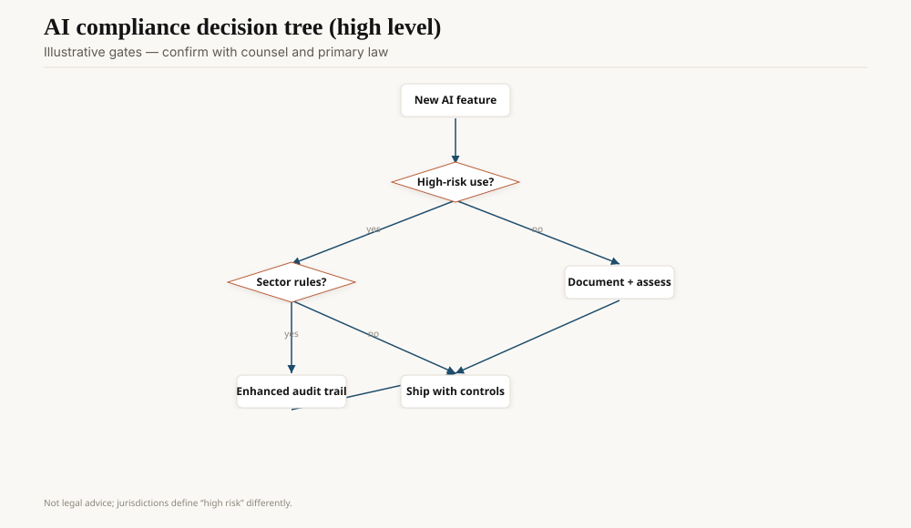
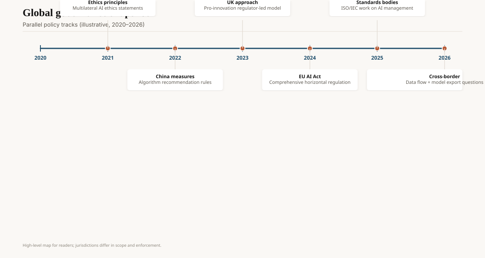

On 17 May 2024, Colorado's governor signed SB24-205, a consumer-protection-shaped law on "high-risk" AI systems: disclosures, reasonable care, a duty around algorithmic discrimination in covered decisions (employment, credit, housing, and neighbors). The effective date was written as 1 February 2026, with the usual amendment chatter after. Pull the current C.R.S. cite before you brief a customer. `[CITE NEEDED]` if the legislature moved the date again.

On 29 September 2024, California Governor Gavin Newsom vetoed SB 1047 (Wiener), the frontier-model bill that would have tied duties to training-compute thresholds and a "covered model" definition the labs hated. The veto message is public: he wanted a risk-and-deployment approach, not a size-only approach, and said California would keep going by other means. Later 2025 California bills (transparency, training-data, companion laws — the numbers rotate) should be taken from LegInfo the week you publish. This draft treats the veto as the load-bearing 2024 fact.

On 23 January 2025, EO 14179 revoked EO 14110. The federal "one checklist" story ended. States did not get the memo that they should stop. See the EU/NIST draft for the federal and European objects. This one is the fifty-state remainder.

<!-- ai-blog-figures:begin -->
<figure class="blog-figure">
  
  <figcaption><strong>Figure 1.</strong> Compliance paths depend on risk tier and sector — confirm with counsel, not this schematic.</figcaption>
</figure>

<figure class="blog-figure">
  
  <figcaption><strong>Figure 2.</strong> Parallel policy tracks explain fragmented cross-border obligations.</figcaption>
</figure>

<!-- ai-blog-figures:end -->
## Three US objects, not one

**Sectoral federal.** FTC, EEOC, HUD, FDA, CFPB, state AGs using existing fraud and discrimination law. This predates ChatGPT. A biased lending model was already a problem in 2019.

**Voluntary federal.** NIST AI RMF 1.0 (26 January 2023) and the 2024 generative profile. Still the shared vocabulary after the order vanished.

**State statutes.** Colorado's high-risk duty. California's privacy+AI stack (CPPA, existing CCPA/CPRA, the vetoed 1047, whatever replaced the mood). New York City's Local Law 144 (automated employment decision tools, 2023 enforcement) as an earlier municipal cousin. Texas, Utah, and others with disclosure-and-chatbot-label bills. Illinois biometric law as the old scary one. **[CITE NEEDED]** before you list a 2026 state as "done" — sessions keep moving.

Preemption talk (secondary summaries of late-2025 federal orders) is a live political fight. Do not tell a customer the states have been federalized unless you have the *current* Federal Register and a lawyer.

## NYC Local Law 144, the municipal cousin

New York City's AEDT rule (Local Law 144, enforcement 2023) required bias audits for certain automated employment tools. Vendors sold "144-compliant" PDFs that were sometimes a single regression on a convenience sample. The lesson is older than AI: a mandated audit without a mean auditor is a sticker. If Colorado-class laws produce the same sticker market, the statute still has value as a discovery hook when something goes wrong. It does not have value as a magic shield.

If you sell hiring support, you already needed this paragraph. The model did not create disparate impact law. It made the impact easier to scale.

## SB 1047, what the fight was about

Compute thresholds are easy to write and easy to route around (distill, mixture-of-experts active-params, train abroad). Deployment-risk thresholds are hard to write and closer to how harm happens (a 3B in a hiring loop vs a 400B that writes poems). Newsom's veto picked the second criticism. Labs that celebrated should notice he did not say "do nothing." He said "not this bill."

Colorado picked the deployment door: high-risk *uses*, not FLOPs. That is closer to the EU Annex III instinct. It is also closer to something a product lawyer can map onto a feature list.

## What a product team does on Monday

Inventory the *decisions* the model touches: hire, fire, credit, housing, insurance, medical, education admissions. Those rows are where US law already has teeth, AI-specific or not.

Label chatbots that a reasonable person might think are human. Several states already wanted that. The EU's Article 50 is the adult version.

Keep a NIST-shaped packet (map, measure, manage, govern) that you can hand to a Colorado or California reviewer without rewriting the science.

Do not stamp "EO 14110 compliant" on a 2026 SOC2 appendix.

## Opinion

US AI law in 2026 is a patchwork because the federal spine was an order and the order died. The serious duties are old (discrimination, fraud, biometrics) plus a few new state experiments. Colorado is the one to read if you sell a decision. California is the one to watch if you train a frontier model. NIST is the one to speak if you need a shared language.

A single federal fairy tale is not available. Write the matrix.
