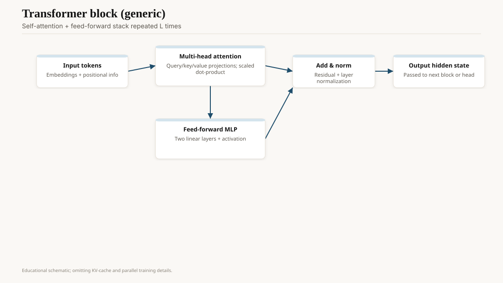
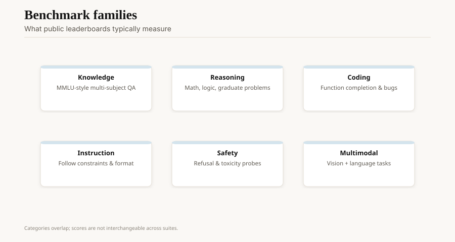
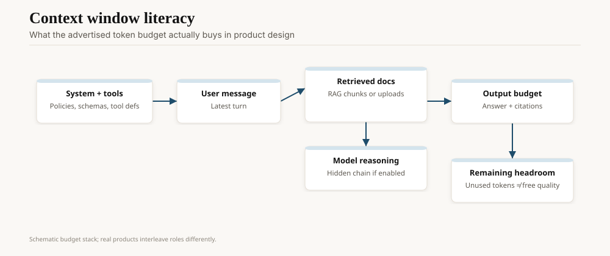

# Staged figure embeds (copy into drafts)

Paths assume the draft file sits in `content/ai-industry-blog/drafts/`. Each block includes a captioned `<figure>`.

---

## Timelines

### Industry milestones

```html
<figure class="blog-figure">
  
  <figcaption><strong>Figure.</strong> A selective timeline of research, product, and policy anchors that shaped the generative-AI era. <em>Not a complete catalog.</em></figcaption>
</figure>
```

### Compute and scaling

```html
<figure class="blog-figure">
  
  <figcaption><strong>Figure.</strong> How training scale, hardware cycles, and serving economics entered mainstream industry discourse.</figcaption>
</figure>
```

### Open-weights epochs

```html
<figure class="blog-figure">
  
  <figcaption><strong>Figure.</strong> Public releases that expanded who could fine-tune and deploy models outside hosted APIs.</figcaption>
</figure>
```

---

## Architecture

### Transformer block

```html
<figure class="blog-figure">
  
  <figcaption><strong>Figure.</strong> A textbook-style transformer block: attention, residuals, and feed-forward layers stacked depth-wise.</figcaption>
</figure>
```

### RAG pipeline

```html
<figure class="blog-figure">
  
  <figcaption><strong>Figure.</strong> Retrieval-augmented generation: embed the query, fetch ranked passages, then condition the language model on cited context.</figcaption>
</figure>
```

### Fine-tuning stages

```html
<figure class="blog-figure">
  
  <figcaption><strong>Figure.</strong> Common post-training path: supervised fine-tuning, preference alignment, and parameter-efficient adapters before release.</figcaption>
</figure>
```

### Inference stack

```html
<figure class="blog-figure">
  
  <figcaption><strong>Figure.</strong> Simplified inference path from client request through gateway, scheduler, and model workers to streamed tokens.</figcaption>
</figure>
```

### Agent tool loop

```html
<figure class="blog-figure">
  
  <figcaption><strong>Figure.</strong> Conceptual agent loop: plan, call tools, observe results, update memory, repeat until a final answer is produced.</figcaption>
</figure>
```

---

## Evaluation

### Benchmark families

```html
<figure class="blog-figure">
  
  <figcaption><strong>Figure.</strong> Leaderboard suites cluster into knowledge, reasoning, coding, instruction-following, safety, and multimodal tasks — scores are not interchangeable.</figcaption>
</figure>
```

### Eval harness

```html
<figure class="blog-figure">
  
  <figcaption><strong>Figure.</strong> A reproducible eval harness versions prompts, fixes decoding settings, scores outputs, and publishes metrics with provenance.</figcaption>
</figure>
```

### Leaderboard caveats

```html
<figure class="blog-figure">
  
  <figcaption><strong>Figure.</strong> Before trusting a headline score, ask about contamination, prompt sensitivity, judge bias, and checkpoint versioning.</figcaption>
</figure>
```

---

## Regulation

### EU AI Act

```html
<figure class="blog-figure">
  
  <figcaption><strong>Figure.</strong> Staggered EU AI Act obligations as commonly summarized in compliance guides — confirm dates against EUR-Lex.</figcaption>
</figure>
```

### U.S. federal (selected)

```html
<figure class="blog-figure">
  
  <figcaption><strong>Figure.</strong> Selected U.S. federal milestones (executive orders, frameworks, procurement). <em>Not legal advice.</em></figcaption>
</figure>
```

### Global snapshot

```html
<figure class="blog-figure">
  
  <figcaption><strong>Figure.</strong> Parallel policy tracks across regions illustrate why cross-border AI products face fragmented obligations.</figcaption>
</figure>
```

---

## Wave 2 (infographics — see `GRAPHICS_INDEX.md`)

Copy-paste blocks for all wave-2 slugs match `staged/asset_catalog_wave2.json`. Example — context window literacy:

```html
<figure class="blog-figure">
  
  <figcaption><strong>Figure.</strong> Advertised context is a budget across roles — not a single block of usable reasoning space.</figcaption>
</figure>
```

Automated embed for pack drafts: `python3 content/ai-industry-blog/scripts/embed_wave2_figures.py`.
