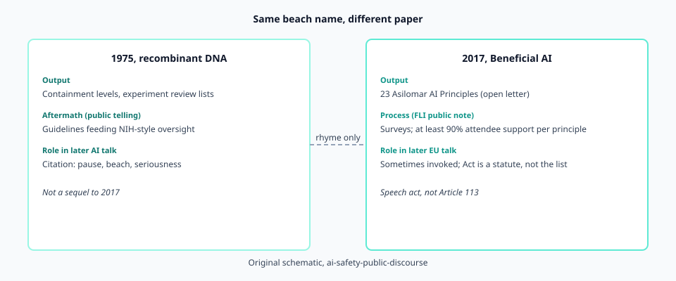
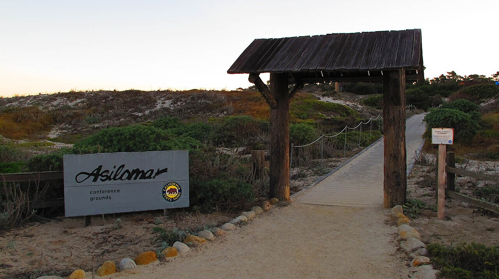

# Two Asilomars, one beach name

<figure id="fig-dual-asilomar" itemscope itemtype="https://schema.org/ImageObject">
  
  <figcaption itemprop="caption"><strong>Figure 1.</strong> Same conference grounds; different objects and different kinds of aftermath.</figcaption>
</figure>

<figure id="fig-asilomar-grounds" itemscope itemtype="https://schema.org/ImageObject">
  
  <figcaption itemprop="caption"><strong>Figure 2.</strong> Asilomar Conference Grounds entrance (venue, not a document). Photo: <a href="https://commons.wikimedia.org/wiki/File:Entrance_to_the_Asilomar_Conference_Grounds.jpg">Ed Bierman</a>, <a href="https://creativecommons.org/licenses/by/2.0/">CC BY 2.0</a>, via Wikimedia Commons.</figcaption>
</figure>

People who write about AI safety like the word **Asilomar**. It sounds like a place where serious people went, once, and came back with rules. The trouble is that the name now points at two different public meetings, forty-two years apart, with two different objects and two different kinds of aftermath.

The first meeting, in February 1975, was about recombinant DNA. Molecular biologists, lawyers, and a few journalists gathered at the Asilomar Conference Grounds on the Monterey Peninsula. Paul Berg and colleagues had already paused certain experiments. The conference is remembered, in the public telling, as scientists inventing a pause and then a set of containment guidelines that later fed U.S. National Institutes of Health policy. Whether that memory is too flattering is a historian's fight. The public fact is simpler: 1975 Asilomar became a **citation**. Later fields that felt they were holding something powerful reached for the story.

The second meeting ran 5–8 January 2017 (some contemporaneous notes say attendees gathered from the 3rd). The Future of Life Institute called it Beneficial AI 2017. It was held at the same conference grounds. The product that left the room was not a laboratory containment manual. It was a list of **twenty-three principles**, later published as an open letter, each principle having been run through attendee surveys until — in FLI's own 18 January 2017 write-up — it had support from at least ninety percent of conference participants.

Same pines. Different paper.

## Why the rhyme was useful

FLI did not hide the rhyme. The choice of site did rhetorical work that a hotel in San Jose would not have done. It said: we know the last time a research community tried to write its own traffic rules in public. It also borrowed gravity. Recombinant DNA had already produced insulin and a thousand biosafety manuals. Artificial intelligence in January 2017 had produced impressive pattern-matchers and a lot of unease. The location asked the reader to treat the unease as cousin to an older, more settled caution.

That is a public-relations fact, not a scientific result. A reader can notice the rhyme without signing it.

## What did not transfer

1975 produced practices that could be inspected: physical containment levels, lists of experiments that required extra review, a path into federal guidance. 2017 produced sentences. "AI systems should be safe and secure throughout their operational lifetime, and verifiably so where applicable and feasible." That is Principle 6. It is not a BSL number. It does not tell a graduate student which experiment to skip on Monday.

The later EU AI Act is sometimes described, loosely, as "what Asilomar wanted." That is backwards. The Act is a product-safety and fundamental-rights statute with a risk pyramid, a list of prohibited practices, and a long annex. Asilomar 2017 is a signed list. If a recital somewhere nods at principles, that is a later legal drafting choice. It is not the 2017 meeting secretly legislating.

## How to hold both meetings at once

Keep three index cards.

**Card 1:** 1975, recombinant DNA, guidelines that entered a regulatory bloodstream.

**Card 2:** 2017, Beneficial AI, twenty-three principles, an open letter, a culture of "we met and agreed in public."

**Card 3:** the citation practice. Every time a 2015–2024 essay says "like Asilomar," ask which one, and whether the writer wants the *pause*, the *guidelines*, the *beach*, or just the *mood*.

The rest of this era's drafts stay mostly on Card 2, with Card 1 in the room as the ghost the organizers invited.

---

**Stage:** draft. **Claim type:** public-record recap. This piece does not propose a new method, a new policy instrument, or a new research result.
