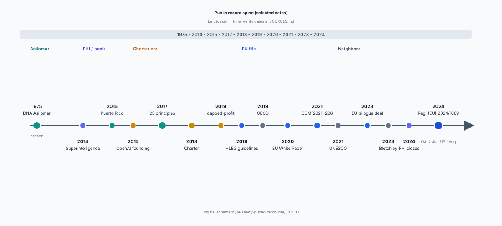

# A few media frames that taught the public a plot

<figure id="fig-spine-vs-frames" itemscope itemtype="https://schema.org/ImageObject">
  
  <figcaption itemprop="caption"><strong>Figure 1.</strong> Frames compress; the public record does not. Use the spine to name which document a headline is skipping.</figcaption>
</figure>

Primary pages are this set's heroes. Media frames still taught more people. Naming the common frames keeps you from mistaking them for the documents.

## The prophet frame

A scientist or entrepreneur "warns the world." Hawking, Musk, Hinton, sometimes Bostrom as a character rather than as an author. The frame needs a face and a verb. It does not need Article 113. After 2014 this frame did most of the popular work. It made Dialect B feel like news.

## The race frame

Two labs, two states, a clock. Draft 9 covered the metaphor's life inside principle lists. In headlines the nuance died. Race frame is why a reader can recite "U.S. vs China" without being able to recite a prohibited practice.

## The hypocrisy frame

2015 nonprofit, 2019 cap, later product launches. The frame is a consistency argument with a punch line. Sometimes the punch is earned. Sometimes it replaces a reading of the Charter's actual headings. Hao's 2020 feature is a sophisticated relative of this frame; late-night television is a blunt one.

## The Brussels-as-nanny frame

The Act as a ban on innovation. This frame travels well in English-language tech press. It rarely walks through annexes. A sibling frame, more common in European progressive press, is Brussels-as-savior. Both are morale. Neither is EUR-Lex.

## The "ethics vs safety" frame

A 2010s–2020s intra-researchers fight rendered as two teams. Real people often worked both sides. The frame helped funders and journalists sort quotes. It also taught a mass audience that the word *ethics* meant "bias" and the word *safety* meant "extinction," which is a dialect prejudice, not a dictionary.

## How to use frames without becoming one

When you recognize a frame, write its name at the top of the clipping. Then ask what primary page, if any, the frame is attached to. A prophet piece attached to a real interview is still a frame, but it has a source. A race piece with no document is weather.

## A seventh habit: the anniversary frame

"Ten years after *Superintelligence*," "fifty years after Asilomar," "one year after the pause letter." Anniversary pieces recycle the other frames with a calendar hook. They are useful as reception evidence and dangerous as history, because they imply a single clock. This folder's four spines do not share a birthday.

This draft will not offer a new frame. Seven is already too many if you start to think they are laws of media. They are recurring habits in the 2014–2024 English-language pile this set sampled. If a clipping does not fit, do not force it. Forcing is how a method becomes a gimmick.

---

**Stage:** draft. **Claim type:** public-record recap. This piece does not propose a new method, a new policy instrument, or a new research result.
