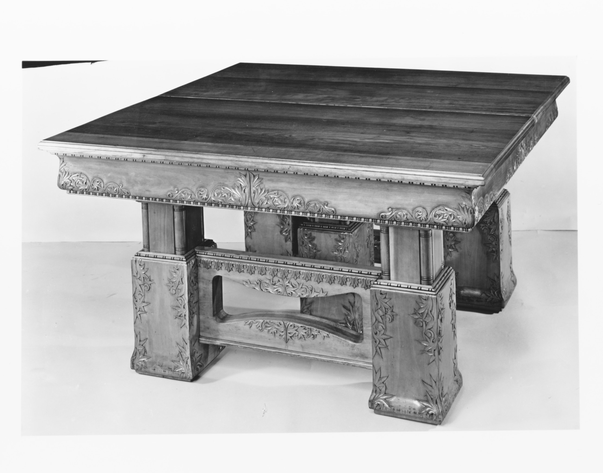

# Southern hardwoods at table

<figure class="bbf-figure bbf-figure--plate">
  
  <figcaption>
    <strong>Oak dining table</strong>, c. 1900 — Oak and walnut dining tables in the southern hardwood tradition Bradley Brand works.
    The Metropolitan Museum of Art, Open Access. CC0 1.0.
  </figcaption>
</figure>
A dining table in the Southern hardwood belt does not have to be mahogany. White oak and red oak, black walnut, cherry, pecan, hickory, pine, cypress — the forest that paid mills and furniture factories from the Carolinas to Arkansas is a dining forest. Charleston used mahogany because it was a port. The Piedmont and the interior used what grew. This page is that interior. Bradley Brand works Arkansas hardwoods; the series uses that shop as a way to look at oak, walnut, and pecan at dinner, not as a catalog.

The furniture-history pillar asked for Southern vernacular and for a woods cluster that is photographed, not invented. What follows is history and a shopping literacy, not a line of chairs.

## What the region already made

Hunt boards and servers in walnut and cherry. The hunt-board name is a twentieth-century dealer’s romance — horsemen, moonlight, a 1932 *Magazine Antiques* story — already covered in the vernacular essay. Keep the furniture: tall serving tables, bottle drawers, yellow-pine secondaries, a dining culture that is not always a Charleston marble room. Drop the horse.

Kentucky cherry tables. Arkansas and Missouri oak in later factory and farm tables. Pecan as a twentieth-century show wood doing mahogany’s and then teak’s job in “colonial” and “Danish” suites from Southern factories. Hickory in chairs more than in wide tops — it moves, it is hard, it is a tool-handle wood that sometimes became a dining rail.

Cypress in the Delta and the Lowcountry, not as a fine dining leaf usually, but as the hidden wood and the porch cousin. The 2027 pillar calendar allows a softwood/porch month; this page will not fake a cypress dining suite.

Thomas Day’s walnut and mahogany in Milton, North Carolina, is the named shop. Marshall and Leimenstoll’s monograph is the pin. Most Southern dining tables are unnamed. That is not a lack of quality. It is a lack of labels. A Piedmont walnut drop-leaf with yellow-pine rails and no signature is a more common object than a Day sideboard. Read it the way the method essay says: underside first.

## Oak, walnut, pecan — the handbook, not the romance

The USDA Forest Products Laboratory *Wood Handbook* (FPL-GTR-190 and later revisions) is the numbered source for what these woods do. Quote the tables when you need a percentage. What follows is dining-room behavior, not a substitute for the handbook’s pages.

White oak (*Quercus alba*) and red oak (*Q. rubra* and kin) are the table woods that last. White oak is ring-porous, ray-flecked when quartersawn, the cooper’s wood, the Mission wood, more patient outdoors than red oak because of tyloses in the pores. Quartersawn white oak is a dining-room show: fleck that a gray wash fights and a fume loves. Flatsawn red oak is the farm table that cups. Tangential shrinkage on oak is not a shop defect. It is the handbook. A wide glue-up in a house with winter heat will open a joint if the shop glued a wet board or locked a flatsawn panel with a film and no room to move. That is not a defect of Arkansas. That is a board.

Black walnut (*Juglans nigra*) is the Queen Anne wood, the Reconstruction sideboard, the studio slab, the interior tree that still pays a sawyer. The handbook treats it as a moderate mover next to oak — still a mover. Color is chocolate to purple-brown; sapwood is pale and a shop must decide whether to keep it. A pale walnut dining table is either sapwood-heavy, new, or kept in the dark. Steam-bent walnut and crotch walnut are different pictures. A dining top of straight walnut is a quieter piety than a crotch Empire disc.

Cherry (*Prunus serotina*) darkens in a year of light. A pale cherry dining table is either new or kept in the dark. Southern cherry is a real shop wood; “cherry finish” on a catalog pecan suite is a dye.

Pecan (*Carya illinoinensis*) is the honest local luxury in a Texas-to-Arkansas belt. Ring-porous, hard, a hickory cousin, used as a show wood in twentieth-century Southern factories when mahogany was a price and teak was a fashion. It is not teak. Do not finish it to look like teak unless the client has asked for a lie. Grain can be wild. A pecan dining table from a 1960s High Point suite and a pecan slab from a later shop are the same species in different costumes.

Hickory (other *Carya*) is harder still. Chairs, spokes, handles. A hickory dining top is possible and contrary. It will move. It will wear a finish. It will not dent like pine.

Pine is the hall top, the cheap Revival, the distressed 2010s. It dents at dinner. Some households want that. A shop that only offers pine as “country” is selling a finish, not a forest. Yellow pine as a secondary — rails, drawer sides, a dustboard — is a Southern passport. The method essay already said so.

## Factory South

North Carolina’s later factories (the 1950s formal suite) used local and imported woods under a film finish. Thomasville, Henredon, Drexel, and peers are the volume names on the formal-fifties page. Arkansas and Mississippi mills sent lumber north and made furniture too. A “Southern dining table” of 1955 may be pecan veneer over a core, made in a town that also made upholstery. Grand Rapids is not the only factory pole. The pillar’s factory-versus-one-off month can stand two cities.

Pecan and “fruitwood” finishes on factory suites are a clock. So is a printed grain over particleboard in a later “oak” suite. The IKEA essay owns the foil. The factory South owns the pecan print that wanted to be mahogany and then wanted to be teak. Look at the edge. A veneer has a thickness. A print has a surface.

Labor in those factories is factory labor: finishing rooms, upholstery, a workforce the catalogs do not photograph. `[CITE NEEDED: a cited workforce study for a named Carolina or Arkansas furniture town in a sample year.]` This page will not invent a headcount. The dining table at the end is cheap or mid-priced because those rooms existed.

## A shop table now

A one-off oak or walnut dining table made in Arkansas in the 2020s sits at the end of this series’ line: hall leaf, Federal resident, factory suit, slab, island. It can be a resident in a room that still has a door, or a sculpture in a great room. It should have a secondary wood that matches the shop’s climate, a joint that can move, a finish that can take a plate. It should not claim 1740. It can claim the forest.

Photograph the wood if you publish a woods page. The pillar map is strict: no species page without a photograph this week. This history page can speak without a new slab picture because it is a spine, not a SKU. When a table exists and is photographed, the caption should name species, cut, finish, and the room it is for. No commission paragraph. The object is enough.

Cut matters as much as species. Quartersawn, riftsawn, flatsawn — the style guide wants those as one word after the first explanation. A quartersawn white-oak dining table in a closed room will behave better than a flatsawn red-oak plank next to a sliding glass door. Breadboards, slotted screws, a finish that can be renewed: those are the shop answers to the handbook’s shrinkage tables. A film that is a plastic skin on a wide flatsawn top is a bet against winter.

## How to look

If you are looking at a Southern table — old or new — do the underside test. Name the secondary. Yellow pine is a clue, not a proof; pine traveled. Name the primary. Walnut, cherry, oak, pecan, a mahogany that came through a port. Then name the joint. A rule joint and pintles: older brief, or a Revival of one. A pedestal and glue blocks: Federal into Empire. A steel trestle: 2010s. Cams: a box. Butterflies: a studio claim you still have to prove.

Then ask whether the room is a dining room or a hall again. The hardwood does not care. It has been all of those rooms. White oak that was a Federal farm leaf can be a 2026 resident without a hunt, without a fox, without a fake distress. Cherry that was a Kentucky drop-leaf can sit in a great room if someone oils it. Pecan that was a 1968 factory suite can be an honest period room if no one calls it Danish.

Bradley Brand’s Arkansas bench is one shop in that continuity: hardwood, a climate, a table that should admit the year it was made. One sentence is enough. The rest is dinner.

A table that can take a plate, in a room that may or may not still have Biddle’s name on the door, is the only Southern dining claim this page will stand on. The forest was here before the room was invented. It is here after the wall comes down. Name the tree. Read the underside. Pass the dishes.

## Sources

- Hurst and Prown; MESDA; Marshall and Leimenstoll on Thomas Day.
- USDA Forest Products Laboratory, *Wood Handbook*, FPL-GTR-190 (2010) and later, for oak, walnut, pecan, hickory, pine, cypress.
- Hunt-board essay for the 1932 name; factory-South and Danish essays for pecan as a show wood.
- Style guide: this slug is the one place the Arkansas shop is allowed to appear, and only as teaching.

See also: [Hunt boards and Southern vernacular](hunt-board-southern-vernacular.md), [Studio furniture after Nakashima](studio-furniture-nakashima.md), [How to read an American dining table](reading-a-table-now.md), [The dining room is invented](the-room-is-invented.md).
