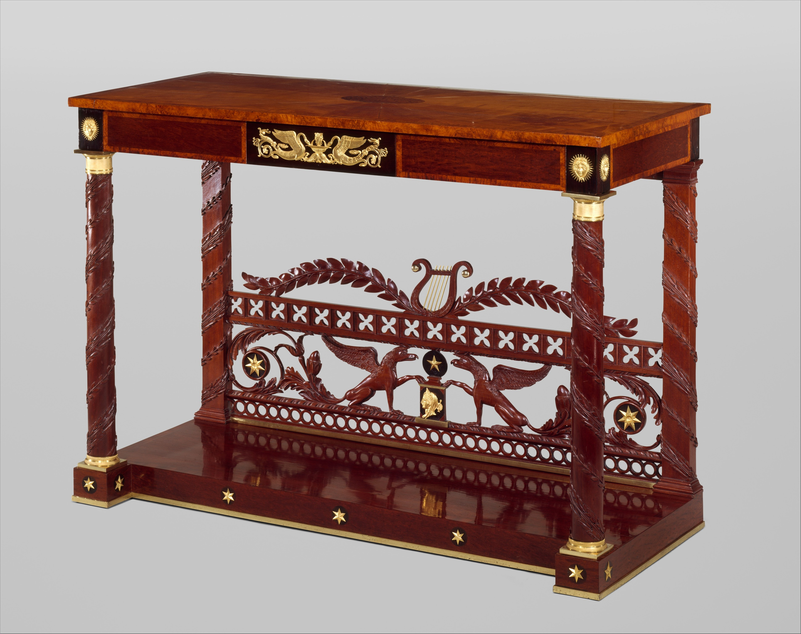

# Baltimore painted dining

<figure class="bbf-figure bbf-figure--plate">
  
  <figcaption>
    <strong>Painted pier table</strong>, c. 1820 — Baltimore painted and gilded furniture at the formal table.
    The Metropolitan Museum of Art, Open Access. CC0 1.0.
  </figcaption>
</figure>

The Met’s Baltimore Room is a parlor dressed as a dining room, Craig woodwork, Gallery 724. The furniture the Museum puts in it has changed with curators. What Baltimore actually made for dining in the Federal years is a split: mahogany tables and sideboards like every other port, and a painted fancy — chairs, settees, sometimes tables — that is the city’s accent. The paint is not a substitute for carving only. It is a school: landscapes, gilt, grisaille, a chair that costs less than a Phyfe reeded mahogany and looks, under candles, like a different kind of money.

Baltimore painted furniture is a collector category that can swallow the dining room. Keep the table honest. Most people in Baltimore ate at mahogany or walnut leaves. They sat, if they were fashionable and not rich in the New York way, on painted chairs.

## The Finlay shop and a destroyed White House set

John and Hugh Finlay, Irish-born, working in Baltimore from the late 1790s, are the named fancy-chair shop. Their advertisement in the *Federal Gazette & Baltimore Daily Advertiser* of 24 October 1803, published by Lance Humphries in Chipstone’s *American Furniture* 2003, shows a side chair and offers furniture “with or without views adjacent to the city.” That clause is the city’s tell. A tablet can carry a house you recognize. Francis Guy’s oil views of Baltimore seats are the comparison pictures Humphries uses for the Morris suite — ten armchairs, two settees, a pier table, country-house medallions, about 1803–1805.

The architect Benjamin Henry Latrobe designed a Grecian painted suite for the White House oval drawing room under the Madisons. John and Hugh Finlay made it. British troops burned the house on 24 August 1814. The chairs are gone. Latrobe’s drawings survive and are the basis for later attributions. The Met’s side chair 65.167.6, attributed to the Finlays, 1815–20, maple, painted and gilded, cane, thirty-four by twenty and five-eighths by twenty-two and a quarter inches, is that language after the fire: a broad klismos crest tablet, turned front legs from Roman prototypes. The Museum owns four chairs from the set (65.167.5, .6, .8, .9). Others are at the High Museum, the Baltimore Museum of Art, and Munson-Williams-Proctor. The set once sat in Arunah S. Abell’s country house Woodbourne. It is parlor seating that tells you what a Baltimore dining chair could look like when the same shop took a dinner order.

Colonial Williamsburg publishes a yellow-ground side chair from a set of twelve the Finlays made in 1815 for Richard Ragan, a Hagerstown merchant: cane seat, gilded eagle, rinceau on the stretcher, Percier and Fontaine in the ornament. A set of twelve is a dining set. A pair is a parlor accent. Inventories are the check.

Montgomery’s *American Furniture: The Federal Period* is still the survey for the mahogany half of the city. Baltimore sideboards with eagles, bellflowers, and a lightness in the stringing are Hepplewhite’s language spoken with a local accent. The sideboard essay owns the form. This page owns the paint.

## Fancy as a product

Fancy chairs — painted, often with cane or rush seats, light, a little Grecian — are an Atlantic type. Baltimore’s versions can be elaborate: simulated rosewood, gilt ornament, views on the tablets. They belong at the wall and at the table. The Hitchcock essay is the New England factory version of this idea, a few years later and much more numerous. Baltimore’s fancy is still closer to a shop than to a mill, though the output is already repetitive. Women painted. Men joined. That gendered split is documented in later Hitchcock more clearly; Baltimore deserves the same question. `[CITE NEEDED: named women ornamenters in a Baltimore fancy-chair shop before 1820.]`

Caning and rushing are the summer seats. Cushions appear in winter. The chairs are light enough to move into the garden or the hall. That mobility is the point of painted seating at dinner: the dining room can change density. Mahogany claw-foot chairs do not stack. Fancy chairs almost do.

## How a painted chair is joined

The wood under the paint is usually maple, sometimes beech or a mixed secondary. Met 1974.102.1, a Finlay-attributed chair from a Buchanan-family suite, lists mahogany, maple, tulip poplar, and cane. The show surface is not the species. The show surface is the ground color, the gilt, the view. Stretchers are turned or rectangular; they take rinceaux because a stretcher is a horizontal canvas at shin height. Crest tablets are wide because the klismos wants a place for a picture. Seats are caned through holes in the rail, or rushed around the frame. A screw through a stile into a rail, as Williamsburg notes on the Ragan chair, is shop practice, not a later repair by default. Look before you condemn it.

Simulated rosewood and mahogany on a maple or beech chair are a finish. They are also a class signal: the look of a tropical wood without the log. Anderson’s mahogany story is the expensive version. The painted chair is the democratic version, with its own labor and its own later chip. Never strip a Baltimore fancy to “find the maple.” The maple was not the point. The paint was the point. A stripped fancy chair is a ruined document.

Gilt that has been later bronzed is a common refresh. Original gilt is thinner, more worn on the high spots. Landscapes on tablets, when original, have a period scale — small, a little naive, not a Hudson River School insert. Replacements are brighter. Look at the craquelure. Theorem-painting skills that young women learned in academies will matter more in Hitchcocksville. In Baltimore the named painters on furniture are still a thin list. Guy’s medallions on the Morris suite are the published exception, and even there Humphries is careful about what the advertisements will bear.

## The table stays wood

Painted dining tables exist. They are not the majority. A fancy chair around a crotch-mahogany pedestal is a normal mixed room. A fully painted dining table with landscapes on the leaves is a special object and should be treated as one. Do not assume the Craig family’s real dining room looked like a single design-directory page.

The table’s joints are the Federal joints: rule joints on drop-leaves, pins and clips on D-ends, a pedestal pin that should not have been glued solid. Baltimore did not invent a new dining-table mechanism. It invented a seating finish. That is why this slug is a paint page and the Federal-table slug is a joint page.

## The Museum’s substitution

The American Wing’s decision to furnish Craig’s parlor as a dining room, because the parlor woodwork was more interesting than the dining room’s, is a 1920s curatorial act. Henry Craig (1767–1832) was a Baltimore merchant and shipowner. The woodwork came from his townhouse on East Pratt Street. The room served his family as a parlor. Since the American Wing opened in 1924 the Museum has set it for dinner. Berman’s inventories are the corrective: look at the room names in the house, not only at the prettiest woodwork.

Dining rooms are often the less architectural room — rear, north, near the kitchen stair. Museums prefer the carving. Readers who learn American dining from period rooms learn a flattering lie about where dinner happened. If you visit Gallery 724, read the current label. It is careful. Then imagine the real dining room downstairs or behind, less photographed, with the working sideboard and the chairs that got kicked. That room is this series’ subject.

## Labor in a paint shop

A fancy chair is a divided object. Someone turned the legs. Someone caned the seat. Someone laid the ground. Someone put the gilt and the view on the tablet. The Finlay advertisement is a shop talking to a city. Latrobe’s drawings are an architect talking to that shop. The destroyed White House set is a reminder that the most famous Baltimore dining-adjacent chairs no longer exist. What survives is the second and third generation of the same language.

Enslaved and free Black labor in Baltimore’s Federal service rooms is the same coastal story as Charleston’s slab and New York’s gradual emancipation, with Maryland’s own statutes. `[CITE NEEDED: named enslaved or free Black workmen in a documented Baltimore fancy-chair or cabinet shop tied to a dining form.]` This page will not invent them. The mahogany table they stood beside, if the house had one, is Anderson’s forest again.

## After the fancy

Empire taste will darken and thicken Baltimore as it thickens everywhere. Painted chairs continue in the kitchen. The dining room of 1840 wants a pillar table and a heavier board. The city’s Federal accent becomes an antique in the same houses that once commissioned it. Colonial Revival will later love the painted chair and misunderstand it as “country.” Baltimore fancy is urban.

If you inherit a painted chair with a cane seat and a Baltimore history, sit on it only if the cane is sound. Then put it at a mahogany table. That combination is the dining room. A matched painted suite in a white room is a shop window. The historical room was darker, mixed, and closer to the kitchen stair than the Met’s parlor will ever be.

## Sources

- Met Baltimore Room, Gallery 724, American Wing; Met 65.167.6 and 1974.102.1.
- Lance Humphries, “Provenance, Patronage, and Perception: The Morris Suite of Baltimore Painted Furniture,” Chipstone *American Furniture* (2003).
- *The Magazine Antiques* on Latrobe and the Finlay White House suite.
- Montgomery, *Federal Period*; Baltimore Museum of Art painted-furniture catalogs.
- Berman (1997) on period-room versus inventory.
- Hitchcock comparison: Henry Ford; this page stays Federal and urban.

See also: [The dining room is invented](the-room-is-invented.md), [Hitchcock chairs at table](hitchcock-fancy-chairs.md), [The sideboard arrives](hepplewhite-sideboard-arrives.md), [Phyfe’s New York dining](phyfe-new-york-dining.md).
