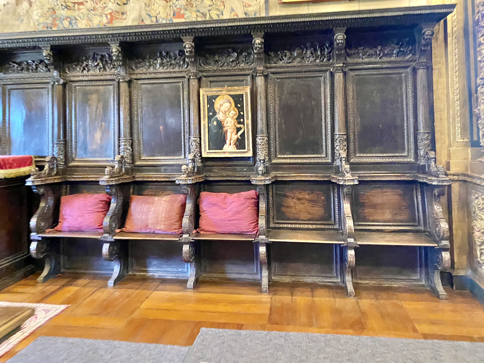

# Colonial Revival dining

<figure class="bbf-figure bbf-figure--plate">
  
  <figcaption>
    <strong>Colonial Revival assembly room</strong>, c. 1930 — Colonial Revival paneling and formal dining in twentieth-century great houses.
    Photo: King of Hearts. Wikimedia Commons. CC BY-SA 2.0.
  </figcaption>
</figure>

The Centennial Exhibition of 1876 in Philadelphia put colonial objects in a national mood. What followed was not a return to 1720. It was a new dining-room style: gateleg tables made yesterday, “Pilgrim” chairs that William and Mary would not have recognized, maple stained to look older than the house, Windsor sets sold as ancestral. Museums and collectors (Wallace Nutting the loud name) photographed and then manufactured a past. The American dining room, tired of walnuts grapes and gilt, put on a costume from its own attic — or from a factory’s idea of an attic.

This page is a warning label for half the “antique” dining tables in the country.

## The Centennial as a mood

The official visitors’ guide to the 1876 exhibition lists, as map number 158, “New England Farmer’s Home of 100 Years Ago, and Modern Kitchen,” Miss Emma Southwick, Boston. The pairing was the point: a log-cabin “farmer’s home” against a modern kitchen, meals cooked and served in old-fashioned style, attendants in “ancient dress.” Frank Leslie’s paper and the *Historical Register* lingered on the quaint structure, the antiquated furniture, the spinning wheel, the costumes. Relics on view — a cradle said to have been Peregrine White’s, a chair tied to Governor John Endecott — did what relics do at a fair. They taught a nation to want the look without requiring the objects to be true.

Furniture classes 217–227 sat in the Main Building as manufactures, not as ancestors. Grand Rapids sent Renaissance suites to the same fair that taught colonial nostalgia. Visitors could eat a Centennial dinner in a log kitchen and then buy a walnut pediment. The Revival is what happened when the log kitchen won the argument at home, years later, after the pediment had become a joke. 1876 invents the mood. It does not yet invent the suburban gateleg in stained maple. That is a twentieth-century product with a nineteenth-century alibi.

Downing’s *Architecture of Country Houses* (1850) is not a Centennial exhibit. It is the earlier moral book that had already told Americans how a dining room ought to feel. The Revival will claim Downing’s honesty and then apply it to a Pilgrim that Downing never drew.

## What they wanted from 1700

A folding table (the hall’s genius), turned legs, a rush seat, pewter, a fireplace. What they often bought: a new gateleg in quarter-sawn oak or stained maple, too regular in the turning, machine-cut pintles, a finish that is nut-brown rather than oxidized. Nutting’s studio photographs taught the pose. Nutting’s furniture company sold the pose in wood. Other factories did it without the photographs.

Butterfly tables multiply. So do chair-tables. So do court cupboards that never saw 1650. The William and Mary essay already said the Pilgrim name is a lie. The Revival is where the lie becomes a product line.

Hepplewhite also revives: the sideboard returns to six tapered legs and inlay, a relief after the monument. That revival can be scholarly (accurate reproductions from measured antiques) or a blurry “Colonial” that mixes a shield-back chair with a gateleg and a brass candlestick from Birmingham, England, 1910. Mixed Colonial is the American suburban dining room of 1925.

The Hepplewhite revival board is a useful test object. Six tapered legs, a straight or slightly bowed front, stringing that wants to be 1790. Open a drawer. If the secondary is plywood and the dovetails are identical machine cuts, you are in the twentieth century. If the inlay is too crisp, with no shrinkage at the string, you are in the twentieth century. A scholarly shop that measured a Winterthur board will still use modern glue and a modern saw. Honesty here is the date on the shop ticket, not a claim of 1795. Factory “Colonial” sideboards often keep a Renaissance depth and only change the legs. Look at the plinth. A leftover plinth under tapered legs is a costume change on last year’s case.

## Nutting’s photograph, then Nutting’s shop

Wallace Nutting (1861–1941), Congregational minister, then photographer, then manufacturer, is the loud name because he did the job twice. He published *American Windsors* in 1917. He began reproducing Windsor chairs about 1917–18 and went on to copy a long list of early American forms — Pilgrim, William and Mary, Queen Anne, Chippendale, Hepplewhite, Sheraton, stopping before he had to love Empire. The shop was not Nutting at a bench. It was craftsmen he hired, woods he specified, and a brand he put on the piece: paper label, script mark, block brand, sometimes an impressed model number. Framingham, Massachusetts, is the later address collectors know.

The photographs came first. Hand-colored colonial interiors, millions of them in the usual estimate, taught a table to be open, a chair to be Windsor, a room to be a stage. Then the furniture company sold the props. A Nutting Windsor at a 1925 dining table is a Revival object. It is not a 1760 Philadelphia bow-back. Construction can be careful. The date is still 1920. Grand Rapids and the mail-order houses sold a cheaper colonial at the same hour: machine turnings, wire nails, a stain that is a color and not an age.

Do not invent a Nutting catalog price you have not read. The 1930 Supreme Edition catalogue exists; quote a number from a page, or mark `[CITE NEEDED]`. The boast in that catalogue — that his branded furniture would not be sold as second-hand — is a manufacturer talking. The dining-room history is that Americans believed him long enough to fill rooms.

## Museums teach, then shops copy

Winterthur, the Met’s American Wing (1924), and the period-room movement freeze dining scenes that this series has already called edited (the Baltimore Room’s parlor-as-dining-room). The public learns a table should be open, a cloth should be white, chairs should match. Households in 1720 did not live in a period room. The Revival dining room is a period room you eat in.

Quality spans from cabinet shops that measured Winterthur pieces to basement stain jobs. Look at the rule joint. Look at the pins. Look at whether the gate’s wear matches the story. A 1920 gateleg can be a good table. It cannot be a 1720 table.

The American Wing opening is a dining-room event as much as a museum event. People went home and bought the suite the galleries had just blessed. House museums and then Colonial Williamsburg thickened the blessing. A scholarly reproduction from measured drawings is one thing. A factory “Colonial” that mixes a 1710 gateleg with a 1790 sideboard and a 1910 candlestick is the ordinary American room. Both called themselves colonial. Only one was trying to be accurate about a single year.

## Why it won

It was cheaper than Gilded Age carving, more “American” than Eastlake’s medieval England, and friendlier than Mission’s sermon. It photographed. It let a new house in Ohio claim a 1776. It is still in dining rooms because it is still being made. Hitchcock’s Kenney revival (1946) is a late chapter of the same hunger.

The damage: original paint stripped, original mixed seating replaced with matched reproductions, kitchen gatelegs promoted to dining-room altars. A 1740 chair that lost its paint in 1922 lost its date. The Revival preferred brown wood to painted wood because photographs of “antiques” had already decided that brown was old. Windsors that were green, red, or black became “oak.” Fancy chairs lost their gilt. A hunt board picked up a fox it never had. The Material Matters essay is the parallel warning for the Southern server. This page’s warning is for the New England table that was a kitchen drop-leaf until someone put a cloth on it and called it Pilgrim.

The gain: people kept eating at wood tables instead of abandoning the room. The open-plan essay is the later abandonment. Factory maple and a matched set of Windsors kept a named dining room in houses that could not have furnished one in 1720. That is not a return. It is a new middle-class room with an old name. Treat it as 1925 and it is an honest object. Treat it as 1720 and you are in the fair’s log kitchen again, paying for a relic.

## How to look

If the tag says “colonial” and the screws are slotted-but-bright or Phillips, walk. If the maple is tiger and the finish is nitrocellulose, you are in the twentieth century. If the inlay on a “Hepplewhite” sideboard is too crisp and the secondary is plywood, you are in the twentieth century. Plywood is not a crime. It is a date.

A Revival dining room that knows it is Revival — a 1920s house with 1920s colonial furniture — is an honest period. A Revival dining room that claims 1740 is a story. This series prefers the honest period. BBF’s Southern vernacular interest is closer to the Piedmont server than to a Nutting butterfly. Do not Colonial-Revival a hunt board. The hunt-board essay already asked.

If you sit at a 1925 gateleg, use it as a 1925 table. Fold it. That is what it was designed to do, twice: once in imitation of 1710, and once because American dining rooms were still not huge. The imitation is the history. The fold still works.

## Sources

- Centennial Exhibition decorative-arts literature; visitors’ guide map no. 158, Emma Southwick’s New England Farmer’s Home; *Magazine Antiques* on 1876 and the Revival.
- Wallace Nutting, *American Windsors* (1917); Nutting furniture marks and catalogs (Framingham).
- Met American Wing, 1924 opening; Winterthur period rooms.
- Kenney / Hitchcock 1946 revival.
- Material Matters hunt-board essay as a parallel Revival invention.

See also: [Gateleg and drop-leaf](gateleg-and-drop-leaf.md), [William and Mary at table](william-and-mary-dining.md), [Hitchcock chairs at table](hitchcock-fancy-chairs.md), [Country and Early American revival](country-early-american-revival.md).
