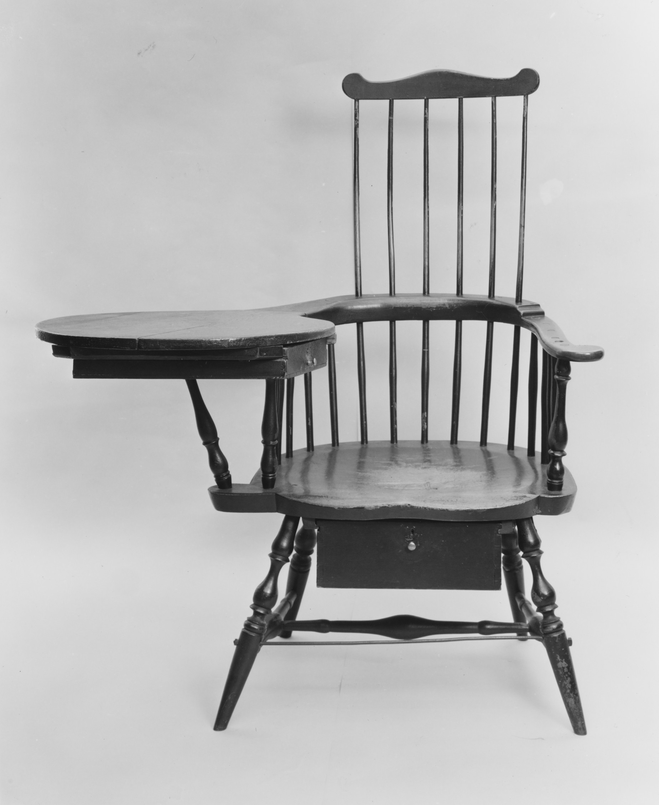

# Country and Early American revival

<figure class="bbf-figure bbf-figure--plate">
  
  <figcaption>
    <strong>Windsor armchair</strong>, c. 1790 — Windsor chairs revived as Early American icons in twentieth-century dining rooms.
    The Metropolitan Museum of Art, Open Access. CC0 1.0.
  </figcaption>
</figure>

The 1970s dining room that was not Mediterranean pecan was often “Early American”: maple or pine, turned legs, a hutch with pewter-looking plates, Windsor or captain’s chairs, a dry-sink in the corner, a wagon-wheel or hurricane fixture. It is Colonial Revival after television. *The Waltons* and a hundred furniture ads taught a dining room that was neither 1720 nor Nutting’s sepia. It was honey maple, plasticized, and available on credit.

This is a second Revival, not a continuation of 1925. The first Revival still knew antiques. The second Revival is a factory finish that does not want to be oiled. Ethan Allen is the name people remember. Other companies sold the same chair. The dry-sink was not a dining form in 1740. It became one on a 1974 showroom floor.

## Not 1876, and not Nutting

The Colonial Revival essay in this series owns 1876–1930: the Centennial, Wallace Nutting’s photographs and factory, Winterthur and the Met’s American Wing teaching a pose. That Revival measured antiques, or pretended to, and sold gatelegs that could still be decent tables. The 1970s room is a grandchild that has forgotten the museum. It wants a matched set from one catalog page. It wants a finish that wipes. It wants a story about ancestors that will fit a split-level.

Bicentennial year, 1976, is a peak. Shelter magazines fill with eagle plaques, pewter, a stencil, a “keeping room” that is a family room with a hutch. Furniture companies print special catalogs. `[CITE NEEDED: a named 1976 manufacturer’s Bicentennial dining promotion, with a page citation.]` The political anniversary is a sales season. The dining table does not become 1776 because a catalog says so.

Ethan Allen’s gallery stores taught a room as a package: table, chairs, hutch, perhaps a dry-sink or a tea table nobody used for tea. Pennsylvania House, Tell City, Temple-Stuart, Cochrane, and a long New England and Midwestern list sold maple and cherry in the same grammar. Some of the older New England factories had been making “colonial” chairs since the first Revival. The 1970s film finish and the captain’s-chair vinyl are the date, not the turning.

## What they borrowed

Windsors, ladders, gatelegs, a trestle that is neither Shaker nor Stickley. Pewter as decoration. Stencils that wish they were Hitchcock. A hutch that is a sideboard plus a china closet in one footprint — useful in a ranch house without a pantry. The butler’s pantry is gone. The hutch is the pantry’s ghost.

The Windsor in this room is often a sack-back or a continuous-arm in maple, factory-turned, a seat that is a plank with a shallow saddle or a vinyl pad. It is not a Philadelphia or Rhode Island Windsor of 1765. The turning is too regular. The stretchers are dowels in drilled holes. The paint, if any, is a factory color, not a period green or a later house paint. Natural maple with a yellow film is more common. Look at the seat’s underside for a stencil.

Captain’s chairs — low-back Windsors with arms — are the dining chair of the den and then of this dining room. Vinyl seats in harvest gold, rust, or avocado are a clock. The vinyl splits. Replacement vinyl in a 1990s oak-brown is a second clock. The maple arms wear pale where hands rest. That wear is honest. The distressed “wear” on a newel-turned leg is not.

Gatelegs appear as small breakfast tables or as the dining table itself, too regular in the turning, a rule joint that is a factory approximation, pintles that are steel pins. A gateleg stored open for thirty years will not close. That is use, not a period feature. The first Revival already sold this form. The second Revival varnished it harder.

The dry-sink is the oddest borrow. A nineteenth-century kitchen or pantry object — a well for a basin, a cupboard below — becomes a dining-room side piece. It holds napkins, a fake plant, a stack of magazines. It is not a hunt board and not a sideboard. Do not let a dealer rename it. The hunt-board myth is already covered in the Southern vernacular essay; this object has its own, smaller myth: that every colonial kitchen displayed one beside the dining chairs.

## What they ignored

Enslaved labor, mixed seating, folding as a daily act, paint as a finish. The 1970s room wants a matched set and a clean grain. It strips the hall’s mess and the Federal lock. It is a comfort story. Country house, as a later fashion brief, is a correction of this hour’s “farmhouse content” — before the word industrial joined it. This hour *is* that content: a factory maple room that wants to look inherited.

Pine “country” with a wiped stain is the cheaper line. Maple is the advertised Early American wood. Both are real woods under a film finish. The film is the date. The USDA *Wood Handbook* will give you maple’s hardness and pine’s denting. The dining-room fact is a casserole ring that the film yellowed around, and a pine top that shows every knife.

Mediterranean and “Spanish” suites of the same years — dark pecan, scrolled chairs, a wrought-iron chandelier — are the rival costume. Broyhill and peers sold them as heavily as anyone sold maple. A neighborhood could split down the street. Both are factory dining. Both will be cheap at estate sales in 2010 and then fashionable again in irony. Pecan, here, is a Southern show wood doing mahogany’s job in a carved suit; the woods essay takes the species. This page takes the costume change.

## How the room was used

The closed dining room of the formal fifties often survives into this hour, restaged. The breakfront comes out. The hutch goes in. The crystal fixture becomes a wagon wheel or a hurricane cluster. The carpet remains off-limits, or it becomes a braided oval. Dinner is still not television, except when it is: a lot of these rooms lose the fight and become homework rooms with a good hutch.

Leaves still exist. The table still grows for Thanksgiving. The extra chairs are captain’s chairs from the same line, or folding chairs from the closet. Mixed seating would be more historical. The catalog forbade it.

Service is family-style. Pewter plates on the hutch are decoration; people eat on stoneware or Corelle. The pewter is a Nutting leftover without Nutting’s photograph. Silver plate from the fifties suite sometimes moves into the hutch’s drawers and stays there.

## How to look

Captain’s chairs with vinyl seats and maple arms: look at the dowels. A hutch with a plate groove and a fluorescent light: 1972. A gateleg that will not close because someone stored it open for thirty years: use. If the finish is sticky, it is failing nitrocellulose or a later smoke film. None of this is 1740. All of it is American dining furniture.

Look under the table for a factory stencil or a paper tag. Ethan Allen and its peers marked more often than a 1925 maple shop. Look at the chair stretchers for a regularity no hand-turner would bother with. Look at the hutch’s back boards: plywood is expected; rough pine is a nicer factory; cardboard is a cheap one. Look at the plate groove. A routed groove with a factory radius is not a cabinetmaker’s scratch stock.

If the “Windsor” has a saddle that is a pressed shape and a splat that is a routed silhouette, you are in a mill. If the dry-sink has a zinc or copper well that has never seen water, you are in a showroom object. If the trestle has a medial stretcher and a two-inch top, do not call it Stickley. Call it 1978 borrowing 1904.

If you eat at a 1970s maple suite without pretending it is antique, you are in an honest period room. The Revival sin is the pretence, not the maple. The open plan and the farmhouse-industrial table will replace this room’s walls and then steal its trestle. You can still sit in the captain’s chair. The vinyl will tell you the decade. The table’s film finish will tell you not to put a hot casserole down without a board. That board is the only colonial thing in the room: a trivet habit older than the suite.

A later owner who painted the maple white has made a 2010s object. The farmhouse essay takes that paint. Under it, if you ever see it, the yellow film and the factory stencil are still 1974.

The hutch’s lighting is a small history of its own. A fixture that was a pair of candle sockets, wired later, wants to be 1925 Revival. A fluorescent tube behind a plastic valance is 1970s. Puck lights on a strip are a 2000s kitchen leftover installed by a later owner. The plate groove and the plate rail are the furniture; the light is the decade. Open the lower doors. Factory maple interiors are often a thinner wood or a plywood. A dust panel between drawers is a nicer shop. No dust panel and a staple in the back is the volume. Neither is 1740. Both held the wedding stoneware that the pewter on the shelf was only pretending to be.

## Sources

- Ethan Allen and competitor catalogs (Pennsylvania House, Tell City, and peers), late 1960s–80s.
- Shelter magazines of the bicentennial years.
- First Colonial Revival essay as the earlier, more antique-aware movement; Hitchcock as the stencil ancestor.
- Farmhouse-industrial essay as the later trestle; USDA *Wood Handbook* for maple and pine as materials, not as romance.

See also: [Colonial Revival dining](colonial-revival-dining.md), [Hitchcock chairs at table](hitchcock-fancy-chairs.md), [Farmhouse and industrial tables](farmhouse-industrial-2010s.md), [Grand Rapids factory dining](grand-rapids-factory-dining.md).
