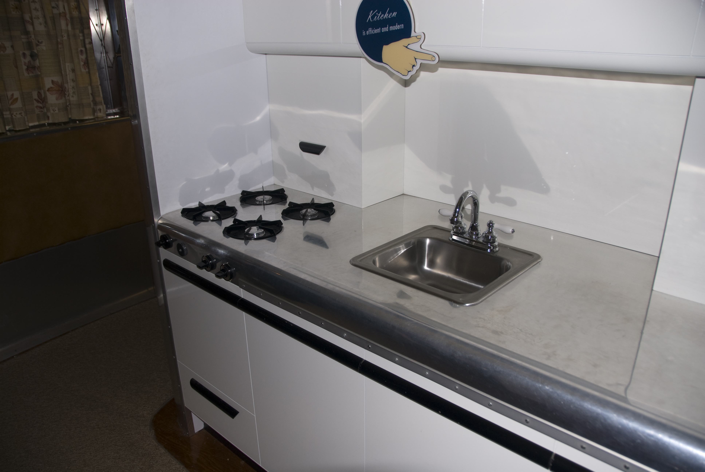

# Depression dinettes

<figure class="bbf-figure bbf-figure--plate">
  
  <figcaption>
    <strong>Dymaxion House kitchen exhibit</strong>, c. 1945 — Compact kitchen and dinette culture between Depression housing and suburban boom.
    Photo: Andrew Balet. Wikimedia Commons. CC BY-SA 4.0.
  </figcaption>
</figure>

The dinette is a dining room that has admitted it lost the room. A table for four, often with a porcelain-enamel or linoleum top, chromium or painted-wood legs, chairs with tubular frames or thin painted wood, sometimes a matching cabinet. It lives in an alcove, a kitchen, or the end of a living room. Catalogs of the 1930s and 1940s sell it without shame. The Grand Rapids oak suite is still in the farmhouse. The city apartment buys this.

Chromium-plated steel — the “chrome dinette” of popular memory — is the loud type. Enameled steel tops wipe. The chairs stack or at least shove. Draw leaves hide under the top. This is Federal ingenuity without mahogany: the table still grows, but it grows from thirty-six inches to forty-eight, not from six to fourteen.

## Apartment plans

Kitchenettes and dining alcoves in 1920s–30s apartment buildings are the architecture. A suite of eight mahogany chairs will not turn. A dinette will. The breakfast nook of the suburban house is the same idea with carpentry instead of chrome. Both are satellite dining. Both train Americans to eat next to the stove again — a hall habit in metal.

Manufacturers in Chicago, Michigan, and the Northeast stamped these out. Names exist for collectors (Daystrom later, and others). `[CITE NEEDED: a leading 1935 dinette maker and a catalog page with prices.]` This page will not invent a brand to sound precise. The type is the history. Sears and the other mail-order books sold breakfast sets and dinette pages through the same years; quote a page you have. Douglas Furniture Corporation of Cicero, Illinois, later advertised porcelain-top breakfast sets under a Kitchen-Master name. That is a postwar catalog voice as much as a Depression one. Do not drag a 1950 claim back onto 1934 without the page.

Painted-wood dinettes — thin legs, a drop-leaf, chairs with stencil or a little turning — are the quieter type. They sit in the Colonial Revival’s cheaper line and in the kitchen of a house that still has a closed dining room. Chrome is the apartment’s declaration. Painted wood is the house’s compromise.

An alcove that will take a thirty-six-inch table and four chairs will not take a Grand Rapids pedestal and six press-backs. That is the brief. Builders drew the alcove. Factories drew the set to the alcove. A suite that cannot turn in the door is not a moral failure. It is a dimension. Measure the alcove before you call a dinette a fallen dining room. It is a dining room that accepted the plan.

## Enamel, linoleum, chrome

Porcelain enamel on steel is the top that made the type possible. It wipes. It takes heat better than a varnish. It chips, and the chips date the use: a black edge, a rust bloom, a later paint-in. Colored trim — red, green, blue, a marbleized center — is the factory’s way to make a small table look like a choice. Linoleum tops are the quieter cousin: cheaper, warmer to the hand, a seam at the edge that lifts. Neither is mahogany. Both are honest about crumbs.

Tubular chromium-plated steel is the frame people remember. Pencil legs, a continuous bend at the chair back, a shine that pits if the plating is thin. Painted steel and wood-and-chrome mixes fill the catalogs. Aluminum lines appear as “Dura-lume” and other trade names in later books. The chair seat is vinyl, a bright color, easy to wash, easy to split. Original seats are a document. Replaced seats are expected. A tubular frame that has been repaired with a wood dowel is a confession.

Look at the underside. Spot welds, a maker’s foil label, a patent number on a hinge that this page will not guess. The patents essay’s nineteenth-century cranks are not these hinges. Draw leaves and folding leaves are older ideas in a new metal.

## Class and chrome

Chrome reads as modern, a little soda-fountain, not quite the dining room your mother wanted. That is why some households kept a closed dining room for Sunday and a dinette for Tuesday. The closed room’s suite gathered dust. The dinette gathered scratches. After the war, the suburban house sometimes restored a dining room *and* kept a dinette in the kitchen. Two tables, two centuries of the split.

Upholstery is vinyl and a bright color. The tubular frame bends at the back. A straight repair in wood is a confession. The sit is more slouched than Phyfe and less of a sermon than Stickley. Dinner is shorter. The radio is on. No one is plating from a sideboard.

Etiquette books of the 1930s still know a dining room. Apartment ads know an alcove. The furniture followed the ad. A household that moved from a farmhouse suite to a walk-up dinette in 1933 did not lose the idea of dinner. It lost the idea that dinner needed a wall of walnut.

Chairs that shove under the top are the type’s other mechanism. They do not always stack. They clear an alcove aisle. A pressed-wood or tubular chair that will not go under the apron is a parlor leftover in a kitchen. The dinette brief is the shove as much as the wipe.

## Draw leaves in metal

The dinette still grows. Draw leaves hide under the top and pull out; folding leaves hinge at the ends; a few sets have a center leaf that is almost a Federal thought in enamel. The growth is a foot or two, not a banquet. Alignment still matters. A leaf that sags is a Thursday problem in an alcove that already has no room to walk. Numbered leaves are rarer than on a mahogany table. Mixed enamel colors on a top and a leaf are a later replacement.

This is the patents essay’s afterlife without the brass boss. Jupe’s circle never lived here. Briggs’s crank is a grandfather. The hardware house that sold wooden slides to Grand Rapids has a cousin that sells a hinge to a Chicago stamper. The genius is still a part. The room is smaller.

A matching cabinet — a small cupboard, sometimes on casters, sometimes with a drop front — is the sideboard the type can afford. Plates for four. A radio on top. No lock that would impress Leslie. The pantry has already died in this floor plan. The cabinet is the pantry’s ghost, the way the 1970s hutch will be the pantry’s next ghost.

Vinyl splits at the welts and at the tacks. A bright original color under a later drab recover is a date. Foam, when it appears, is later than the first enamel sets; early seats can be thin padding over a plywood or metal pan. Sit, then look at the pan. A rusted pan and a perfect vinyl are a chair that has been recovered and a frame that has not. The frame is the document if you care about 1934. The vinyl is the document if you care about 1978. Both meals happened.

## What it refuses

It refuses the sideboard. A small cabinet or a kitchen cupboard holds the plates. It refuses matching monumentality. It refuses the host armchair, usually. Four equal chairs. The Shaker refusal without the theology.

It also refuses wood, sometimes. That refusal will be reversed by Danish teak and by the farmhouse table of the 2010s. The dinette is a trough in the wood story. People still ate.

If you find a chrome set in a basement, look at the top’s chips — they date the use — and at the mechanism of the draw leaf. Then ask where it stood. An alcove shadow on a wall is the period room no museum will build. The American dining-room history that only walks Winterthur has not eaten in 1934. This set is that meal: canned food, a radio, four people, no servant, a table that wipes. The furniture is honest about the century. The mahogany suite was not always.

## The two-table house

After the war the suburban house sometimes restored a formal dining room and kept the dinette in the kitchen anyway. Sunday and Tuesday, mahogany and enamel, a split the butler’s pantry had already taught. The formal suite gathered holidays. The dinette gathered breakfast, homework, and the meal that did not need a cloth. Daystrom’s later chrome-and-laminate sets, the PlayDine and its kin, are the 1950s volume, not the 1933 walk-up. Keep the clocks honest. This slug is the Depression and the alcove. The mid-century essay owns the tulip that will try to make even the kitchen look like sculpture.

The open plan will take both tables’s walls down and put an island in their place. The island is a slab. The dinette was already a slab that wiped. The difference is plumbing and stools. MESDA 3163 would recognize the height and not the chrome. The labor is the owner, washing the enamel the way a servant once washed the marble.

## Sources

- Apartment plan books of the 1920s–30s; kitchen-planning literature.
- Catalog reprints (Sears and others) for dinette pages; Douglas Kitchen-Master catalogs as later porcelain-top volume.
- Daystrom and postwar chrome as the later volume, not the 1933 type specimen.
- Butler’s-pantry essay as the architectural cousin.

See also: [Butler’s pantry and breakfast room](butler-pantry-breakfast-room.md), [Grand Rapids factory dining](grand-rapids-factory-dining.md), [Mid-century: Eames, Saarinen, Knoll](midcentury-eames-saarinen.md), [Open plan and the lost dining room](open-plan-lost-dining-room.md).
