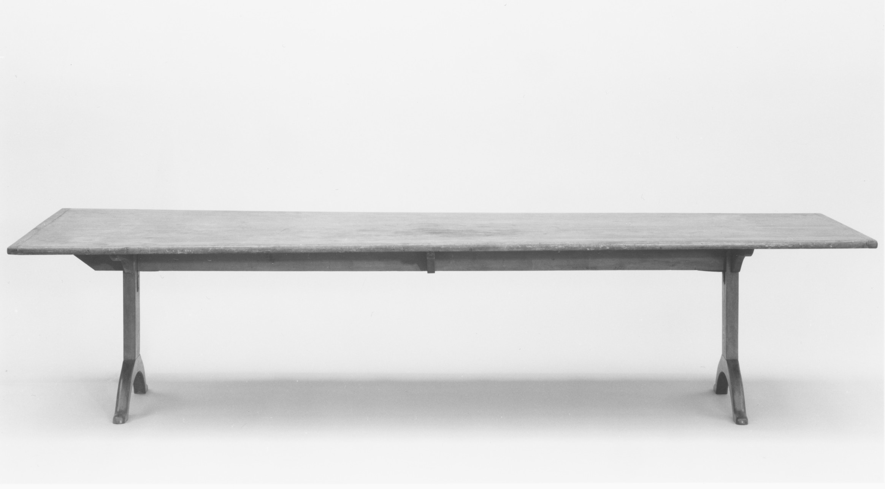

# Federal dining tables

<figure class="bbf-figure bbf-figure--plate">
  
  <figcaption>
    <strong>Federal dining table</strong>, c. 1800 — Federal dining tables with D-ends and resident leaves in the new dining room.
    The Metropolitan Museum of Art, Open Access. CC0 1.0.
  </figcaption>
</figure>

A Federal dining table is a resident. The drop-leaf still exists — the Pembroke, the breakfast oval — but the table that owns the new dining room is a set of parts: two D-shaped ends and a rectangular center, or a pair of pedestals with leaves that store in a closet, or a single pedestal with a round top. When the guests go home the table does not become a console. It becomes a shorter dining table. That is a new idea. It needs a room that keeps its name.

Hepplewhite and Sheraton plates assume mahogany, tapered legs or a turned pillar, and a top that can be extended with leaves. American shops from Salem to Charleston already knew the woods. What they had to learn was the hardware of a table that comes apart on purpose.

## D-ends and the banquet

The D-end table is a three-part thought. Each end can stand alone as a pier or side table. Together with a drop-leaf or solid center they make a long board. The joints are rule joints or dowels and brass forks; later, buttons and pins. Alignment is the craft. A D-end that does not meet its neighbor in a single bead is a shop that rushed or a house that heated the wood after the fact.

Banquet-length tables for twenty are a rich-house problem. Most Federal tables seat eight or twelve when fully mounted and six when the center is stored. The stored leaf is why butler’s pantries and dining-room closets appear in later plans. A leaf standing in a damp passage will warp. The furniture invents the closet.

Square-tapered legs with spade or arrow feet are the Hepplewhite dining language. Reeded legs are the Sheraton and the New York language. A pedestal — a turned pillar on four splayed legs, sometimes with brass lion’s-paw casters — is the late Federal and early Empire answer to the diner’s knee. No swing leg in your shin. The pillar is in the middle. The cloth hides it. The underside is a forest of glue blocks and a pin.

## Pembroke and the small meal

The Pembroke is a small drop-leaf with a drawer, usually with fly rails or lopers, for breakfast and cards and a supper for four. It is not a failed dining table. It is the table that stays in the parlor when the dining room has been invented. The Met’s Phyfe workshop Pembrokes — 31.44.15 (mahogany, brass, tulip poplar, white pine, 1810–20) and 22.98 (mahogany, white pine, cherry) — are New York luxury on that small job. They belong in the Phyfe essay as objects. They belong here as a type: Federal dining culture is a suite of sizes, not one altar.

Breakfast rooms, when they exist, take the Pembroke and the cheaper chairs. The dining room takes the D-ends. The hall, if it still has a gateleg, is yesterday.

## Woods and the secondary contract

Mahogany on top. Poplar, pine, and cherry underneath. Charleston cypress. A Federal dining table with a solid mahogany center and veneered D-ends is already a sandwich; hide glue and a ground that moves. Crotch veneer on a dining top is more Empire than early Federal, but late Federal shops start the habit. The woods-series draft on Federal mahogany in this repo is the species hour. This page is the joint.

Inlay on the table itself is usually a stringing line or a banding, not a full pictorial top. The pictures stay on the sideboard and the card table. A dining top that is a picture is a later taste or a card table someone is trying to eat on.

## Casters, pins, and the floor

Brass casters are not a Victorian addition when the legs are cut for them. Federal tables move for cleaning and for the extra leaf. Look for the original caster plate and a later replacement wheel. Look for a pinned pedestal that has been glued solid by a restorer who hated the wobble. The wobble was seasonal. The glue is forever.

Leaves should be numbered or at least obviously mates. A beautiful center with two D-ends from another marriage is a common antique-trade animal. Check the rule-joint profiles against each other. Check the underside color. Check the screw holes.

## How three parts become one top

Each D can live against a wall as a pier table. The center has to meet both Ds in a single line. If one D has a thumbnail and the center has a cove from another shop, you are looking at a marriage. The antique trade assembles those marriages because three parts sell better as a dining table than as two consoles and a leftover leaf.

Stand at the end and sight down the joint. A single bead is a shop that cared, or a restorer who recut. A step you can catch with a fingernail is seasonal movement, a rushed original, or a bad marriage. Numbered leaves — chiseled Roman numerals, ink, a punch — are a gift. Unnumbered leaves that still match in thickness, species, and oxidation can be original. Beautiful leaves that do not match are a set assembled in 1910.

A leaf standing in a damp passage cups. A leaf stored flat, in the room’s climate, stays a mate. The butler’s-pantry essay takes the later architectural closet. The Federal table invents the need.

## How a pedestal is joined

The pillar is turned. The four splayed legs meet a block under it — mortised, sometimes dovetailed, glue-blocked in a radial pattern. The top is pinned so it can come loose with the season. Restorers who hate a seasonal wobble glue the pin solid. A steel plate under a pillar, a single lag screw up the column, a pedestal that no longer parts from the top — those are repairs. They may keep a table standing. They erase how it was meant to move.

A table that mixes a reeded pedestal with a Hepplewhite D-end inlay may be original (shops were not purists) or a marriage. Construction, not the pattern-book name, decides. A later rubber tire on an old caster plate is a kindness to a floor. A new plate on a leg that never had one is a drill history.

## Reeding as a second operation

The pillar is turned first. Reeding is a second operation — a jig, a scratch stock, or a careful eye — cut after the column has its shape. New York shops made a product of that reed. New England can be as good and quieter: a plain turned pillar, a square-tapered Hepplewhite leg, less theatre under the cloth. A machine-cut reed that is identical on all four faces of a supposedly 1805 pillar wants a second look. Hand reeds are cousins, not twins.

The splayed legs that leave the block have to clear a sitter’s feet and still hold the top. Too flat and the table walks. Too steep and a shin finds them anyway. Brass lion’s-paw sockets are the late Federal and early Empire finish on that problem. They are not automatically Victorian.

## The D as a pier table

Between dinners the ends live against a wall, often under a looking glass. That is a Federal use, not a later apology. A D that has never been a pier table may still be original to a three-part set; a D that has caster wear on only the wall side has been a side table for a long time. Look at the back edge. If it is finished as carefully as the front, the shop expected it to show. If it is raw, someone always meant a wall.

The hardware of a table that comes apart on purpose is brass forks, clips, dowels, later buttons and pins. Alignment is the craft. A fork that no longer finds its mate has been bent by a house that forced the joint.

## Region

New York will own the next two essays — Phyfe and Lannuier — because the city’s shops made the type into a product. New England D-ends can be as good and quieter. Southern Federal tables in walnut and cherry, sometimes with a local pedestal turning, are not failed mahogany. They are a forest. Baltimore’s painted fancy is a chair story more than a table story; the tables stay mahogany.

A Federal dining table in the Ohio valley with no mahogany is not a Boston piece that missed a boat. It is a cherry or walnut table in a different woodshed. Montgomery’s Winterthur survey is coastal-heavy. Inland is a `[CITE NEEDED]` richer than this page can fill. Name it.

Once the table lives in the room, the room’s other furniture has to behave. Chairs stay. The sideboard stays. The carpet becomes a dining carpet. The gateleg’s genius — disappearance — is retired at the high end. It will return as a kitchen table and a Colonial Revival prop. The Federal table’s genius is the opposite: it is still there in the morning, slightly in the way, proving you dine.

If you own D-ends, try them apart for a month as side tables. Then put them together. The click of a good joint is the sound of 1800 deciding the hall was no longer enough.

## Sources

- Hepplewhite, *Guide*; Sheraton, *Drawing-Book*.
- Montgomery, *American Furniture: The Federal Period*.
- Met 31.44.15 and 22.98, Phyfe workshop Pembrokes.
- Berman on the room that can keep a table.
- USDA Forest Products Laboratory, *Wood Handbook*, FPL-GTR-190, for leaf movement in storage.

See also: [The sideboard arrives](hepplewhite-sideboard-arrives.md), [Phyfe’s New York dining](phyfe-new-york-dining.md), [Empire pillar and claw](empire-pillar-and-claw.md), [Extension tables and patents](extension-table-patents.md).
