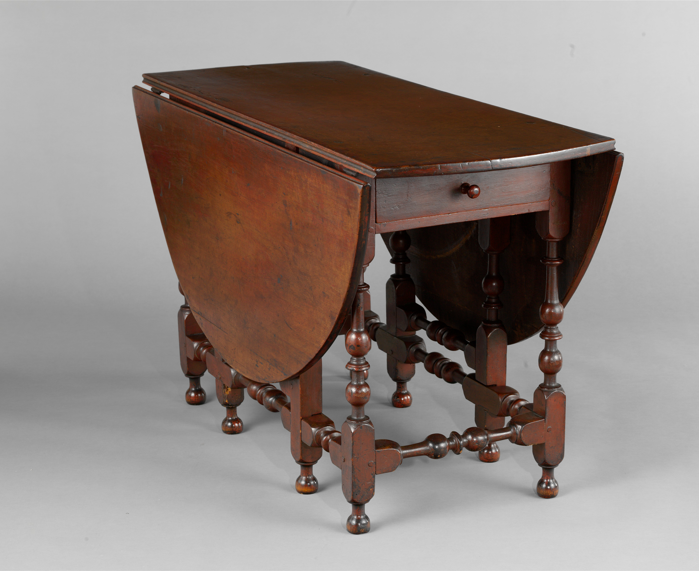

# Gateleg and drop-leaf

<figure class="bbf-figure bbf-figure--plate">
  
  <figcaption>
    <strong>Oval table with falling leaves</strong>, 18th century — Oval drop-leaf geometry and rule joints that American shops copied from English plates.
    The Metropolitan Museum of Art, Open Access. CC0 1.0.
  </figcaption>
</figure>

Turn a gateleg over. The poetry stops. You get a rectangle of rails, two framed gates hinged on pintles, a pair of leaves hanging from a molded joint, and a top that has been scrubbed toward the grain. That underside is the American dining table before the pedestal and before the room. English shops had already perfected the type. American shops copied the geometry in maple, cherry, walnut, and pine, and they kept cutting it long after Philadelphia had learned Chippendale’s Director.

The form solves a problem a hall actually has: dinner is wide, the rest of the day is not. Leaves down, the table is a side piece. Leaves up, it seats six if the chairs are armless and the diners are not wearing 1750 skirts. The conversion is the design. Everything else — trumpet legs, pad feet, a drawer in the rail — is fashion on top of a hinge.

## The gate

A true gate is a hinged frame: two legs, a stretcher, sometimes a small rail, swinging as a unit to get under the leaf. The hinge is usually a wooden pintle or a pair of them, not a steel butt. Wear appears on the inner stile where the gate rubs the fixed frame, and on the floor where the swinging feet have dragged for two hundred years. If those scars are missing and the finish is even, someone has been under there with sandpaper.

One-gate tables exist. They are narrower and meaner. Two-gate tables are the dining type. Four-gate tables, with gates at both ends of a longer frame, turn up in English work and in ambitious American copies; they are harder to keep square. A gate that sags is a mortise that has loosened or a pintle that has worn oval. The repair is a new pin and a sober look at whether the stretchers were ever pegged.

Swing-leg drop-leaves skip the framed gate. A single leg pivots out from the rail on a knuckle or a wooden hinge. The engineering is lighter and the underside cleaner. High-style Queen Anne and Chippendale dining tables often prefer this: cabriole legs want to be seen, not boxed in a gate. The hall table draft treats the everyday gateleg. This page owns the joint family.

Lopers — sliding rails that pull out to hold a leaf — are another solution, common on Pembroke tables and some ovals. A loper that has been waxed for a century still sticks in August. That is humidity, not a moral failure.

## The rule joint

The rule joint is a longitudinal molding: a quarter-round or thumbnail on the fixed top, a matching cove on the leaf, meeting so that the hinge sits in a recess and the open joint looks like a bead. Closed, the hanging leaf’s end grain is partly hidden. Open, crumbs have a harder time falling into the hinge. A shop that can cut a rule joint can also cut a good cornice. It is a bench test.

American rule joints in maple are often a little softer in the profile than London oak joints. Maple takes a clean cut and then dents. Look for a later recut — a shallower cove, a hinge moved — where a restorer “improved” a crushed edge. Look also for a butt joint with surface hinges, a cheap or later conversion that never was a rule joint. Dealers sometimes call every drop-leaf a gateleg. The underside arbitrates.

Butterfly supports — wings pivoting from the stretcher to hold small leaves — are a New England romance. Surviving seventeenth- and early eighteenth-century examples are scarce and argued. Later Colonial Revival shops made thousands. If the wings are fat, the finish is even, and the pins are machine-made, you are in the 1920s. The Colonial Revival dining draft is the place for that factory. Here, name the type and refuse a fake 1690.

## Tops that get washed

Dining tops in this period are often softer than the frames. Pine and maple scrub well. Walnut shows every wet glass. Mahogany, when it appears on a late colonial drop-leaf, is already a show wood and wants oil more than lye. Households scrubbed with sand and a cloth. The resulting dish in the top, lower in the middle, is not damage. It is use. A perfectly flat 1730 top has usually been taken down at a thickness planer.

Breadboard ends — a transverse piece pegged across the end grain — show up on some rectangular leaves. Glued tight, they split the top when the wide board shrinks. Pegged in slotted holes, they do their job. The same rule will still be true for a 2026 oak table in Arkansas. The woods-series drafts in this repo treat movement as numbers. This series treats it as a leaf that no longer meets.

Two-board and three-board tops are normal. A single wide board is a prize and a crack waiting. Glued joints that have opened are not a reason to throw the table out. They are a reason to stop putting a hot pot on the seam.

## Regional habits

New England likes maple and a busy turning. Mid-Atlantic shops, especially Philadelphia as the century goes on, like walnut and then mahogany, and they thin the gate into a swing leg as soon as the cabriole arrives. Southern shops use yellow pine and walnut, sometimes cypress in the hidden parts, and they will put a mahogany leaf on a pine frame if the port can supply the leaf. A “New England gateleg” with tulip-poplar rails wants a second look. Secondary wood is a passport.

Drawers in the rail are English and American. They hold spoons, not leaves. A drawer that is too clean inside, with no spoon scratches and a machine-cut dovetail, is a later addition or a later table. Hand dovetails, slightly drunk, with a pine bottom slid into a groove, are the older sentence.

## How a shop cuts the rule joint

The planes are a matching pair. The fixed top takes the convex — quarter-round, thumbnail, or a fuller bead. The leaf takes the cove. The hinge is let into the underside so the pin sits in the void the two moldings make. A later carpenter who “fixes” a crushed joint with a single modern round-over leaves a gap you can feel with a fingernail. Crumbs find that gap. So does water. The old joint’s virtue was not only looks; it shed.

Cutting the joint in maple is different from cutting it in oak. Maple takes a clean arris and then bruises. Oak fights the plane and holds the edge. American shops working maple often leave a slightly softer profile than a London oak gateleg of the same type. That softness is not a failure. It is the wood. A recut that makes a maple joint look like a drawing-book oak joint is a restorer imposing a plate on a tree.

The USDA *Wood Handbook* will give you movement numbers for the species. The leaf will give you the meeting. If the bead is open on a dry January day and tight in August, the top is still alive. If the bead is open in every season, the hinge has been moved or the leaf has been recut short.

## Pintles, straps, and the floor scar

A wooden pintle — a pin turned or whittled, running through the gate stile into the fixed rail — is the older American hinge for the gate itself. It wears oval. It can be driven out and replaced without taking the table apart if the shop left access. Iron pintles appear. So do iron straps on the leaves, the hinge that actually carries the drop.

Wrought straps are tapered, often with a slightly drunken hole. Cast butts are later and squarer. Surface-mounted decorative straps on the show face are usually a Revival or a country afterthought. The working hinge wants to be hidden in the rule-joint recess.

Walk the floor under a table that has lived in one room. The swinging feet cut arcs. Those arcs are a document. A table on a new oak floor with no scars may still be old. A table whose gates do not reach the scars in the old floor has had its feet tipped or its stretchers reset. Measure the gate’s swing against the leaf’s underside marks — polished patches where the gate’s top rail has rubbed for a century. The two maps should agree.

Six armless chairs will fit an ordinary open gateleg if the gates land between sitters. Armchairs at the ends fight the swing legs. That is why so many hall meals used stools at the sides and saved the two chairs for the heads. The form is a seating diagram, not only a hinge.

## What the form refuses

A gateleg will not give you a silent dining room. It creaks. It pinches fingers. It has a stretcher you kick. It will not extend to twenty for a Gilded Age dinner. It will not take a pedestal’s claw and ball without becoming a different object. Its virtue is that it goes away. Once Americans named a dining room and cut a recess for a sideboard, the gateleg became country, kitchen, or tavern — still made, no longer the high-style answer.

That demotion is why so many survive in farmhouses and so few sit under the chandelier in a period dining room that a 1920s curator dressed. The Met’s Baltimore Room is set with later furniture. A Winterthur hall can still tell the truth if someone will fold the leaves.

If you own one, use both positions. Leave it closed for a week. The room will tell you why the form lasted. Then open it and look down the rule joint. If the bead is a single line, the shop could cut. If the gates hit the floor at the same time, the frame is still honest. That is enough history for a Tuesday night.

## Sources

- Standard accounts of English and American gatelegs in Winterthur and MFA collection essays; Heckscher on late colonial furniture at the Met.
- Shop practice: rule joints, pintles, and breadboard movement — Hoadley and the USDA *Wood Handbook* for the numbers; the leaf for the proof.
- Butterfly tables: treat undocumented “1670” examples as a `[CITE NEEDED]` problem; Colonial Revival production is the later flood.

See also: [The hall table before the room](hall-table-before-the-room.md), [Queen Anne walnut](queen-anne-walnut-dining.md), [Federal dining tables](federal-dining-tables.md), [How to read an American dining table](reading-a-table-now.md).
