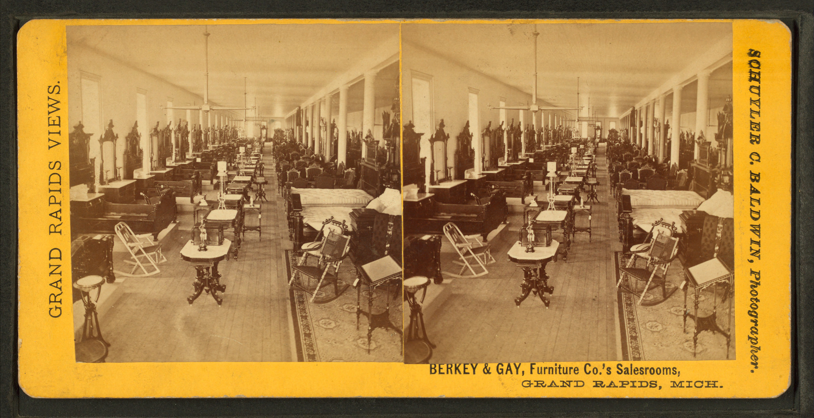

# Grand Rapids factory dining

<figure class="bbf-figure bbf-figure--plate">
  
  <figcaption>
    <strong>Berkey & Gay sales rooms</strong>, c. 1870 — Grand Rapids factory showrooms that fed middle-class dining suites.
    Library of Congress / Wikimedia Commons. Public domain.
  </figcaption>
</figure>

Hitchcock proved a chair could be a mill product. Grand Rapids, Michigan, proved a dining room could be. From the 1870s into the Depression, the city’s factories and the smaller towns around them sold “suits”: table, six chairs, sideboard, sometimes a china closet and serving table, in Renaissance, Eastlake, golden oak, Mission, Colonial Revival, whatever the catalog page needed. The furniture went out by rail. The woods were Midwestern oak, elm, birch, a mahogany veneer when the price allowed. The joinery was dowels, machine dovetails, slides from a hardware supplier. Most American families who owned a matching dining set in 1910 owned this, not Phyfe and not Stickley.

The Public Museum of Grand Rapids and the city’s trade-catalog archive are the pins. Company names — Berkey & Gay, Phoenix, Widdicomb, and a long list — matter to collectors. This page is the system.

## A suit, not a shop table

The word “suit” (later “suite”) is the tell. You buy a room. The table is a pedestal or a four-leg extension with lion feet or a Colonial Revival club foot. The chairs are press-back or splat-back, seats rushed, caned, or upholstered in leatherette. The sideboard has a mirror. The finish is a factory varnish that alligators in a century. None of this is a failure of cabinetmaking. It is a different brief: repeatable, shippable, repairable by a local man with glue.

Mail-order (Sears, Ward) overlaps. Some “Grand Rapids” furniture was not made there; the name became a grade. Some Grand Rapids furniture was excellent. Berkey & Gay at the high end is not a basement oak set. Look at the catalog grade, the veneer thickness, the drawer bottoms.

## The market and the catalog

The city sold at a furniture market: buyers from retail houses came to see the new suits, placed orders, and went home to wait on the railroad. Factory showrooms in Grand Rapids and, for the larger firms, in New York, did the same job as a Phyfe salesroom with a different guest. A catalog page is the document the household saw: a numbered suite, a wood, a finish, a price that this page will not invent. Quote a catalog you have in hand. Mark `[CITE NEEDED]` for a year and a suite number you want to pin.

Berkey & Gay is a useful example and a bad hero. Julius Berkey’s line of shops, later Berkey & Gay Furniture Company, exhibited at the 1876 Centennial and sold chamber and dining suits in the revival styles — Gothic, Renaissance, Eastlake, then golden oak and Colonial. Company histories say they largely passed on Mission. Other Grand Rapids factories did not. The point of naming them is not to crown a maker. It is to show that one city could change a carving without changing a slide, and that the buyer bought a number, not a biography.

Phoenix, Widdicomb, and the long list around them did the same work at different grades. A complete census is a museum job. This page needs the system: rail, catalog, suit, a finish that can be next year’s finish without a new factory.

## Labor in the factory

Men on machines, finishing rooms, upholstery, a workforce that includes immigrants and, in numbers that need a cited study, women in some departments. `[CITE NEEDED: Grand Rapids furniture workforce sex and wage figures for a sample year, e.g. 1900.]` This is not Eastwood’s workshop romance. It is a city industry with strikes and slumps. The dining table at the end is cheap because those rooms existed.

Hardwoods from Michigan and the upper Midwest are the forest. When the easy oak thins, veneer over cheaper cores increases. Plywood cores appear. The woods-series plywood draft, if present, is the technology hour. Here, the dining-room fact is a top that is a skin.

A press-back chair is a labor document you can feel. The pattern on the splat was stamped. The spine of the diner takes the stamp. A carver’s grape on a Renaissance board was already, often, a glued bun. The press-back drops the bun and keeps the idea of ornament as a machine act. Hitchcock’s stencil was an earlier machine act in paint. Grand Rapids does it in wood.

Suits traveled in crates, often as knockdowns: table pedestals unbolted, chairs nested, a sideboard in two lifts. Rail freight is the condition of the form. A board that will not come apart at the pedestals was a headache in a boxcar and a headache on a farmhouse stair. Look for shipping numbers in pencil, a paper label with a destination, a bolt that is a carriage bolt and not a period screw. Local men glued what the trip had loosened. That repair is part of the industry, not a fall from a shop ideal. Hitchcock had already learned knockdown on the Farmington. Grand Rapids learned it for a whole room.

## Golden oak as a finish

Golden oak is a color before it is a species. Quartersawn oak with a yellow-brown factory finish, late 1890s into the 1910s, is the American dining room that was not Mission and not yet Colonial Revival. Lion feet leftover from Empire, a pedestal that splits when the leaves go in, a sideboard with a beveled mirror — that is the Gilded Age echo in a town that never saw Hunt. The finish oxidizes. It alligators. Later owners strip it to “natural” and lose the date.

Mahogany veneer is the other catalog wood, a skin over a cheaper core, a redder dining room for the household that wanted Phyfe’s word without Phyfe’s shop. Birch and maple take stain and become either. Elm appears in cheaper chairs. Look at a break. The core tells the grade. The catalog word tells the wish.

Veneer thickness is a grade you can measure. A thick face on a drawer front, with a secondary that is still solid wood, is a better line. A paper-thin face on a plywood core is later or cheaper, sometimes both. Do not invent a year from a core alone; plywood arrives on a schedule this series will date in the woods drafts. Here, say what you see. A golden-oak table whose top is a skin will telegraph every hot dish in twenty years. A solid quartersawn top of the same color is a different object under the same catalog word.

## Taste on a schedule

A factory can change a carving without changing a slide. That is why the same extension mechanism wears Gothic, then Eastlake, then lion, then Colonial ball-and-claw. The patents essay owns the mechanism. Grand Rapids owns the costume change. Consumers updated chairs more often than tables. A 1890 table with 1925 chairs is a document of that.

Designers existed. Most were anonymous to the buyer. A few names (the later modern shops in the city) belong to mid-century, not this hour. Do not make a hero where the catalog had a number.

Finishing rooms did as much work as the carving machines. A golden-oak varnish, a mahogany stain on birch, a rubbed effect that photographs as handwork — those are factory hours. The alligator you see now is that film failing. A later “natural oak” strip is a lost date. Keep the film if you want the year.

## How to read a stencil

If you pull out the slides, look for a maker’s stencil on the underside. A city name, a company name, a suite number. Then look at the dowels: machine-cut, even, a little proud if someone reglued them. Then sit in a press-back and feel the pattern on your spine. That pattern was stamped. Then look at the sideboard’s backboards — pine, often — and at the mirror’s plate. A replaced mirror is common. A replaced marble on a Renaissance board is common. The stencil, if it survives, is the date the factory wanted you to have.

Some “Grand Rapids” stencils are on furniture made in Holland, Michigan, or in a smaller town that sold through the city’s market. The name is a system. It is not a single mill. Mail-order houses put their own brands on the same grades. A Sears suite and a Berkey & Gay suite can share a slide supplier and not share a finish. Construction is the check, not the romance of a city.

## After the peak

The Depression hurts. Dinette and chromium (next essays) take the small apartment. Southern and Carolina factories later take some of the volume. Grand Rapids remains a furniture word. The dining suit in an Iowa farmhouse is still there, golden oak, a little loose in the slides, a sideboard full of unused silver plate. That survival is the industry’s monument — not Herter’s, not Wright’s.

The dinner it held was real. BBF’s one-off tables exist because this industry exists: a contrast, not a purity. The pillar map asked for factory versus one-off. This slug is the factory. The studio essay is the other pole. A town that only has one of those stories is lying.

## Sources

- Grand Rapids Public Museum; furniture trade catalogs 1870–1930.
- Company histories of Berkey & Gay and others — use as examples, not a complete census; Furniture City History notes on Mission as a style they largely passed on.
- Sears and Ward catalog reprints for the mail-order overlap.
- Hitchcock as the earlier mill; dinette as the later small set.

See also: [Hitchcock chairs at table](hitchcock-fancy-chairs.md), [Renaissance Revival sideboards](renaissance-revival-sideboards.md), [Depression dinettes](depression-dinette.md), [Studio furniture after Nakashima](studio-furniture-nakashima.md).
